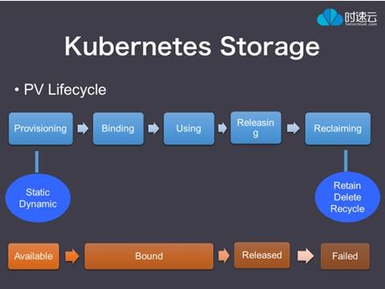

# 存储介绍
##  认证要求
  -  理解持久化卷（pv），并知道如何创建它们
  -  理解卷（volumes）的access mode
  -  理解持久化卷声明（pvc）的原语
  -  理解k8s的存储对象（kubernetes storage objects）
  -  知道如何为应用配置持久化存储

## 要点摘录
>  参考 [官方文档之持久化存储](https://kubernetes.io/docs/concepts/storage/persistent-volumes/) 

###  三个概念： pv ，storageclass，  pvc 

- pv － 持久化卷， 支持本地存储和网络存储， 例如hostpath，ceph rbd， nfs等，只支持两个属性， capacity和accessModes。其中capacity只支持size的定义，不支持iops等参数的设定，accessModes有三种，ReadWriteOnce（被单个node读写）， ReadOnlyMany（被多个nodes读）， ReadWriteMany（被多个nodes读写）
- storageclass－另外一种提供存储资源的方式， 提供更多的层级选型， 如iops等参数。 但是具体的参数与提供方是绑定的。 如aws和gce它们提供的storageclass的参数可选项是有不同的。 
- pvc － 对pv或者storageclass资源的请求， pvc 对 pv 类比于pod 对不同的cpu， mem的请求。 

### 六个生命周期： Provisioning, Binding, Using, Releasing, Reclaiming, Recycling

k8s对pv和pvc之间的交互的生命周期进行管理。 
- provisioning－  配置阶段， 分为static， dynamic两种方式。静态的方式是创建一系列的pv，然后pvc从pv中请求。 动态的方式是基于storageclass的。 

- Binding － 绑定阶段， pvc根据请求的条件筛选并绑定对应的pv。 一定pvc绑定pv后， 就会排斥其它绑定，即其它pvc无法再绑定同一个pv，即使这个pv设定的access mode允许多个node读写。 此外 ，pvc 如何匹配不到相应条件的pv， 那么就会显示unbound状态， 直到匹配为止。 需要注意的是，pvc请求100Gi大小的存储，即使用户创建了很多50Gi大小的存储， 也是无法被匹配的。 

- Using－ 使用阶段， pods 挂载存储， 即在pod的template文件中定义volumn使用某个pvc。 

- Releasing － 释放阶段， 当pvc对象被删除后， 就处于释放阶段。 在这个阶段， 使用的pv还不能被其它的pvc请求。 之前数据可能还会留存下来， 取决于用户在pv中设定的policy， 见persistentVolumeReclaimPolicy。 

- Reclaiming － 重声明阶段。 到这个阶段， 会告诉cluster如何处理释放的pv。 数据可能被保留（需要手工清除）， 回收和删除。动态分配的存储总是会被删除掉的。 

- Recycling － 回收阶段。回收阶段会执行基本的递归删除（取决于volumn plugins的支持），把pv上的数据删除掉， 以使pv可以被新的pvc请求。 用户也可以自定义一个 recycler pod ， 对数据进行删除。 

### 三种PV的访问模式

- ReadWriteOnce：是最基本的方式，可读可写，但只支持被单个Pod挂载。
- ReadOnlyMany：可以以只读的方式被多个Pod挂载。
- ReadWriteMany：这种存储可以以读写的方式被多个Pod共享。
不是每一种存储都支持这三种方式，像共享方式，目前支持的还比较少，比较常用的是NFS。在PVC绑定PV时通常根据两个条件来绑定，一个是存储的大小，另一个就是访问模式。

### 九个PV Plugins 

pv是以plugin的形式来提供支持的， 考虑到私有云的使用场景， 排除掉azure， aws，gce等公有云厂商绑定的plugin， 有9个插件值得关注。这些plugin所支持的accessmode是不同的。  分别是：
```table
存储Plugin   |   ReadWriteOnce   |   ReadOnlyMany   |   ReadWriteMany   |   备注
FC (Fibre Channel)   |   支持   |   支持   |   不支持   |   
NFS   |   支持   |   支持   |   支持   |   
iSCSI   |   支持   |   支持   |   不支持   |   
RBD (Ceph Block Device)   |   支持   |   支持   |   不支持   |   
CephFS   |   支持   |   支持   |   支持   |   
Cinder (OpenStack block storage)   |   支持   |   不支持   |   不支持   |   
Glusterfs   |   支持   |   支持   |   支持   |   
VsphereVolume   |   支持   |   不支持   |   不支持   |   
HostPath   |   支持   |   不支持   |   不支持   |   只支持单节点， 不支持跨节点
```


### 三个重声明策略(reclaim policy)

- Retain –  手动重新使用
- Recycle – 基本的数据擦除 (“rm -rf /thevolume/*”)
- Delete – 相关联的后端存储卷删除， 后端存储比如AWS EBS, GCE PD, Azure Disk, or OpenStack Cinder
需要特别注意的是只有本地盘和nfs支持数据盘Recycle 擦除回收， AWS EBS, GCE PD, Azure Disk, and Cinder 存储卷支持Delete策略


###  四个阶段(volumn  phase)

一个存储卷会处于下面几个阶段中的一个阶段：
- Available –资源可用， 还没有被声明绑定
- Bound –  被声明绑定
- Released – 绑定的声明被删除了，但是还没有被集群重声明
- Failed – 自动回收失败

###  四个PV选择器
在PVC中绑定一个PV，可以根据下面几种条件组合选择
- Access Modes， 按照访问模式选择pv
- Resources， 按照资源属性选择， 比如说请求存储大小为8个G的pv
- Selector， 按照pv的label选择
- Class， 根据StorageClass的class名称选择, 通过annotation指定了Storage Class的名字, 来绑定特定类型的后端存储

关于根据class过滤出pv的说明：
> 所有的 PVC 都可以在不使用 StorageClass 注解的情况下，直接使用某个动态存储。把一个StorageClass 对象标记为 “default” 就可以了。StorageClass 用注解storageclass.beta.kubernetes.io/is-default-class 就可以成为缺省存储。
有了缺省的 StorageClass，用户创建 PVC 就不用 storage-class 的注解了，1.4 中新加入的DefaultStorageClass 准入控制器会自动把这个标注指向缺省存储类。
>  PVC 指定特定storageClassName，如fast时， 绑定名称为fast的storageClass
>  PVC中指定storageClassName为“”时， 绑定no class的pv（pv中无class annotation， 或者其值为“”）
> PVC不指定storageClassName时， DefaultStorageClass admission plugin 开启与否（在apiserver启动时可以指定）， 对default class的解析行为是不同的。 
当DefaultStorageClass admission plugin启用时， 针对没有storageClass annotation的pvc，DefaultStorageClass会分配一个默认的class， 这个默认的class需要用户指定，比如在创建storageclass对象时加入annotation,如  storageclass.beta.kubernetes.io/is-default-class:  “true” 。如果有多个默认的class， 则pvc会被拒绝创建， 如果用户没有指定默认的class， 则这个DefaultStorageClass admission plugin不会起任何作用。 pvc会找那些no class的pv做绑定。 
当DefaultStorageClass admission plugin没有启用时， 针对没有storageClass annotation的pvc， 会绑定no class的pv（pv中无class annotation， 或者其值为“”） 


### 五个可移植性建议
1. 把你的 pvc，和 其它一系列配置放一起， 比如说deployment，configmap
2. 不要把你的pv放在其它配置里， 因为用户可能没有权限创建pv
3. 初始化pvc 模版的时候， 提供一个storageclass
4. 在你的工具软件中，watch那些没有bound的pvc，并呈现给用户
5. 集群启动的时候启用DefaultStorageClass， 但是不要指定某一类特定的class， 因为不同provisioner的class，参数很难一致


## Volume， Persistent Volume， 以及StorageClass

K8S 的存储系统从基础到高级又大致分为三个层次：普通 Volume，Persistent Volume 和动态存储供应。


1、普通 Volume

最简单的普通 Volume 是单节点 Volume。它和 Docker 的存储卷类似，使用的是 Pod 所在 K8S 节点的本地目录。

第二种类型是跨节点存储卷，这种存储卷不和某个具体的 K8S 节点绑定，而是独立于 K8S节点存在的，整个存储集群和 K8S 集群是两个集群，相互独立。

跨节点的存储卷在 Kubernetes 上用的比较多，如果已有的存储不能满足要求，还可以开发自己的 Volume 插件，只需要实现 Volume.go 里定义的接口。如果你是一个存储厂商，想要自己的存储支持 Kubernetes 上运行的容器，就可以去开发一个自己的 Volume 插件。


2、persistent volume

它和普通 Volume 的区别是什么呢？

普通 Volume 和使用它的 Pod 之间是一种静态绑定关系，在定义 Pod 的文件里，同时定义了它使用的 Volume。Volume 是 Pod 的附属品，我们无法单独创建一个 Volume，因为它不是一个独立的 K8S 资源对象。

而 Persistent Volume 简称 PV 是一个 K8S 资源对象，所以我们可以单独创建一个 PV。它不和 Pod 直接发生关系，而是通过 Persistent Volume Claim，简称 PVC 来实现动态绑定。Pod 定义里指定的是 PVC，然后 PVC 会根据 Pod 的要求去自动绑定合适的 PV 给 Pod 使用。

PV 的访问模式有三种：

第一种，ReadWriteOnce：是最基本的方式，可读可写，但只支持被单个 Pod 挂载。

第二种，ReadOnlyMany：可以以只读的方式被多个 Pod 挂载。

第三种，ReadWriteMany：这种存储可以以读写的方式被多个 Pod 共享。不是每一种存储都支持这三种方式，像共享方式，目前支持的还比较少，比较常用的是 NFS。在 PVC 绑定 PV 时通常根据两个条件来绑定，一个是存储的大小，另一个就是访问模式。

刚才提到说 PV 与普通 Volume 的区别是动态绑定，我们来看一下这个过程是怎样的。


这是 PV 的生命周期，首先是 Provision，即创建 PV，这里创建 PV 有两种方式，静态和动态。所谓静态，是管理员手动创建一堆 PV，组成一个 PV 池，供 PVC 来绑定。动态方式是通过一个叫 Storage Class 的对象由存储系统根据 PVC 的要求自动创建。

一个 PV 创建完后状态会变成 Available，等待被 PVC 绑定。

一旦被 PVC 邦定，PV 的状态会变成 Bound，就可以被定义了相应 PVC 的 Pod 使用。

Pod 使用完后会释放 PV，PV 的状态变成 Released。

变成 Released 的 PV 会根据定义的回收策略做相应的回收工作。有三种回收策略，Retain、Delete 和 Recycle。Retain就是保留现场，K8S 什么也不做，等待用户手动去处理 PV 里的数据，处理完后，再手动删除 PV。Delete 策略，K8S 会自动删除该 PV 及里面的数据。Recycle 方式，K8S 会将 PV 里的数据删除，然后把 PV 的状态变成 Available，又可以被新的 PVC 绑定使用。

在实际使用场景里，PV 的创建和使用通常不是同一个人。这里有一个典型的应用场景：管理员创建一个 PV 池，开发人员创建 Pod 和 PVC，PVC 里定义了Pod所需存储的大小和访问模式，然后 PVC 会到 PV 池里自动匹配最合适的 PV 给 Pod 使用。

前面在介绍 PV 的生命周期时，提到 PV 的供给有两种方式，静态和动态。其中动态方式是通过 StorageClass 来完成的，这是一种新的存储供应方式。

使用 StorageClass 有什么好处呢？除了由存储系统动态创建，节省了管理员的时间，还有一个好处是可以封装不同类型的存储供 PVC 选用。在 StorageClass 出现以前，PVC 绑定一个 PV 只能根据两个条件，一个是存储的大小，另一个是访问模式。在 StorageClass 出现后，等于增加了一个绑定维度。

比如这里就有两个 StorageClass，它们都是用谷歌的存储系统，但是一个使用的是普通磁盘，我们把这个 StorageClass 命名为 slow。另一个使用的是 SSD，我们把它命名为 fast。

在 PVC 里除了常规的大小、访问模式的要求外，还通过 annotation 指定了 Storage Class 的名字为 fast，这样这个 PVC 就会绑定一个 SSD，而不会绑定一个普通的磁盘。

到这里 Kubernetes 的整个存储系统就都介绍完了。总结一下，两种存储卷：普通 Volume  和 Persistent Volume。普通 Volume 在定义 Pod 的时候直接定义，Persistent Volume 通过 Persistent Volume Claim 动态绑定。PV 可以手动创建,也可以通过 StorageClass 来动态创建。

>  参考 [K8S 弹药库 | Kubernetes 有状态集群服务部署与管理（上）](http://mp.weixin.qq.com/s?__biz=MzU1OTAzNzc5MQ==&amp;mid=2247483722&amp;idx=2&amp;sn=a8ec119efcf1a5a9c8ab9c04185df1e1&amp;chksm=fc1c2d7acb6ba46cffa1e1c77ac632aa4661de1fd1c48323986463882c971e6a2922a4bc2aa0&amp;mpshare=1&amp;scene=1&amp;srcid=04212ZmcJoz5fSQhSljVunu4#rd)

## 如何创建和使用PV， PVC
pv示例：
```yml
apiVersion: v1
kind: PersistentVolume
metadata:
  name: pv0003
spec:
  capacity:
    storage: 5Gi
  accessModes:
    - ReadWriteOnce
  persistentVolumeReclaimPolicy: Recycle
  storageClassName: slow
  nfs:
    path: /tmp
    server: 172.17.0.2
```

pvc示例：
```yml
kind: PersistentVolumeClaim
apiVersion: v1
metadata:
  name: myclaim
spec:
  accessModes:
    - ReadWriteOnce
  resources:
    requests:
      storage: 8Gi
  storageClassName: slow
  selector:
    matchLabels:
      release: "stable"
    matchExpressions:
      - {key: environment, operator: In, values: [dev]}
```

在pod中使用pvc，示例
```yml
kind: Pod
apiVersion: v1
metadata:
  name: mypod
spec:
  containers:
    - name: myfrontend
      image: dockerfile/nginx
      volumeMounts:
      - mountPath: "/var/www/html"
        name: mypd
  volumes:
    - name: mypd
      persistentVolumeClaim:
        claimName: myclaim
```

# 存储方案
# 参考文献
- [官方文档之持久化存储](https://kubernetes.io/docs/concepts/storage/persistent-volumes/) 
- [K8S 弹药库 | Kubernetes 有状态集群服务部署与管理（上）](http://mp.weixin.qq.com/s?__biz=MzU1OTAzNzc5MQ==&amp;mid=2247483722&amp;idx=2&amp;sn=a8ec119efcf1a5a9c8ab9c04185df1e1&amp;chksm=fc1c2d7acb6ba46cffa1e1c77ac632aa4661de1fd1c48323986463882c971e6a2922a4bc2aa0&amp;mpshare=1&amp;scene=1&amp;srcid=04212ZmcJoz5fSQhSljVunu4#rd)
- [官方文档之存储方案](http://kubernetes.io/docs/user-guide/volumes/)
- [flocker get started guide](https://clusterhq.com/flocker/getting-started/)
- [k8s-flocker-example](https://github.com/kubernetes/kubernetes/tree/master/examples/volumes/flocker)
- [Docker容器的持久存储模式介绍](http://www.dockerinfo.net/1000.html)
- [开源数据卷管理工具flocker](http://dockone.io/article/1549)
- [flcoker 支持的后端列表](https://docs.clusterhq.com/en/latest/supported/index.html)
- [Docker容器对存储的定义（Volume 与 Volume Plugin）](http://dockone.io/article/1257)
- [典型容器存储项目揭密：Flocker，Portworx和VSAN](http://mp.weixin.qq.com/s?__biz=MzAwNzUyNzI5Mw==&mid=2730790315&idx=1&sn=01fff8ee701b99dbe64eb004e0a1cb46&scene=1&srcid=0919gZliDxa3HMA8vptYv5LX#rd)
- [官方文档之持久化存储](http://kubernetes.io/docs/user-guide/persistent-volumes/)
- [探讨容器中使用块存储](https://www.kubernetes.org.cn/914.html)
- [Configuring a Pod to Use a PersistentVolume for Storage](https://kubernetes.io/docs/tasks/configure-pod-container/configure-persistent-volume-storage/)
- [Rook存储：Kubernetes中最优秀的存储](http://www.dockone.io/article/2156)
- [基于docker部署ceph以及修改docker image](http://www.dockerinfo.net/4440.html)
- [Kubernetes集群安装文档-v1.6版本](https://www.kubernetes.org.cn/1870.html)
- [K8S 老司机 | Kubernetes 有状态集群服务部署与管理（下）](http://mp.weixin.qq.com/s?__biz=MzU1OTAzNzc5MQ==&amp;mid=2247483727&amp;idx=3&amp;sn=485f783756f9539ba8659ee265d2905f&amp;chksm=fc1c2d7fcb6ba46908b2078bed06b34a6aafeb67d2fe50bde3979baaa4d60eaaa67bf7bc2da9&amp;mpshare=1&amp;scene=1&amp;srcid=0424tZbUNKEy8lozNbfHnwEv#rd)
