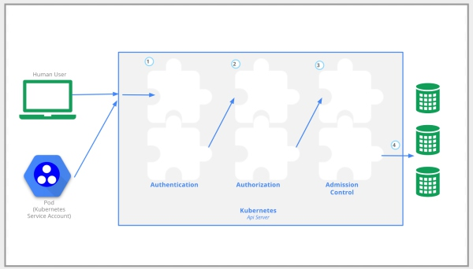

# 认证要求
- Security 安全 12%
  -  知道如何配置认证和授权
  -  理解k8s安全相关概念
  -  理解如何配置网络策略（network policies）
  -  配合使用镜像的安全性
  -  定义安全上下文(Security Context)
  -  安全的持久化保存键值

# 名词解释

# 认证和授权
用户可以通过kubectl命令, 客户端库， 或者发送REST请求来[访问API](/docs/user-guide/accessing-the-cluster) 。kubernetes用户和[服务账号](/docs/tasks/configure-pod-container/configure-service-account/)都可以用于API访问时的授权。 当请求到达API时， 它会经历几个阶段，如下图所示：



##  传输安全
在一个典型的 Kubernetes集群里， API 的侦听端口是443， TLS连接会被建立。 API server会提供一个证书。 这个证书是自签名的， 因此在`$USER/.kube/config`路径下会包含API server证书的根证书，你可以指定这个证书用来替换系统默认的根证书。 当你使用`kube-up.sh`来创建集群时，这个证书会自动写入到`$USER/.kube/config`目录下。 如果集群有多个用户， 那么集群创建者需要和其它用户共享这个证书。

## 认证
 TLS一旦建立连接， HTTP请求就会转到认证这一步， 即图示中标注的步骤1.
集群创建脚本或者集群的管理者通过配置API server可以加载一个或多个认证模块。 认证模块的更多描述信息参考[这里](/docs/admin/authentication/)。
认证这一步骤的输入就是整个HTTP的请求， 然而，整个认证步骤也是只是检查了HTTP的header信息，和/或者 客户端证书。
认证模块包括客户端证书， 密码，明文token， 初始token， 和JWT token（用于服务账号）。
可以同时指定多个认证模块，对于这种情况， 会按照指定的顺序一个个尝试认证，直到有一个认证成功为止。
在GCE上，  客户端证书， 密码，明文token， 初始token， 和JWT token这几个认证模块都是打开的。
如果请求不能被认证成功， 那么它会被拒绝，并收到401的状态码。
如果认证成功， 用户会被指定一个用户名做认证， 这个用户名会被下一个步骤用于下一轮判断。有 一些验证模块还会为该用户提供组成员资格，有些则不会 。
当Kubernetes将“用户名”用于准入控制的决定和请求日志的记录过程，在它的对象存储中就不会出现`user`对象， 也不会存储有关用户的用户名和其它信息。
## 授权
当一个请求被验证来自指定用户时，  这个请求紧接着必须被授权， 即如图示中的步骤**2**所示.
一个请求必须包含请求者的用户名， 请求的动作， 影响动作的对象。 如果有存在的策略声明这个用户有权限完成这个动作，那么该请求就会被授权。
举个例子， 如果Bob用户有这样一条策略， 那么他可以从命名空间 `projectCaribou`中读取pod信息:
```json
{
    "apiVersion": "abac.authorization.kubernetes.io/v1beta1",
    "kind": "Policy",
    "spec": {
        "user": "bob",
        "namespace": "projectCaribou",
        "resource": "pods",
        "readonly": true
    }
}
```
如果Bob发送这样一个请求， 他可以被成功授权， 因为他读取命名空间 `projectCaribou`里的对象信息的动作是被允许的：
```json
{
  "apiVersion": "authorization.k8s.io/v1beta1",
  "kind": "SubjectAccessReview",
  "spec": {
    "resourceAttributes": {
      "namespace": "projectCaribou",
      "verb": "get",
      "group": "unicorn.example.org",
      "resource": "pods"
    }
  }
}
```
如果Bob发送往 `projectCaribou`命名空间写（`create` 或者 `update`）对象信息的请求， 那么他会被拒绝授权。 如果发送从一个不同的命名空间， 比如`projectFish`  读取(`get`)对象信息的请求，那么他的授权也会被拒绝。 Kubernetes的授权要求你和已存在的组织范畴或者云供应商范畴的访问控制系统进行交互时， 要使用通用的REST属性。使用REST的格式是非常重要的， 因为这些控制系统也可能会和包括Kubernetes API在内的其它API进行交互。
Kubernetes支持多个授权模块， 比如ABAC模式， RBAC模式， Webhook模式。
当一个管理员创建了集群， 他们会配置API server会启用哪些授权模块。 如果配置了多于1个的授权模块， Kubernetes会检查每个模块， 如果其中任何模块授权的请求， 请求会被处理， 如果所有的模块都拒绝了请求， 那么请求会被拒绝掉（返回403状态码）。
要了解更多关于Kubernetes授权的信息， 包括使用支持的授权模块来创建策略的细节信息，可以参见 [授权概览](/docs/admin/authorization)。
## 准入控制
准入控制模块是可以修改或者拒绝请求的模块。
作为授权模块的补充， 准入控制可以访问一个正在被创建或更新的对象的内容，
它们在对象创建， 删除，更新， 连接（代理）期间起作用，在读取对象时它们不起作用。
可以配置多个准入控制器， 每个准入控制器会按照顺序被调用。
如图示中的步骤**3**所示。
跟认证和授权模块不同的时，如果任何一个准入控制模块拒绝了请求， 那么请求就会立马被拒绝掉。
除了拒绝对象之外， 准入控制器还可以为字段设置复杂的默认值。

可用的准入控制模块的详情请参考[这里](/docs/admin/admission-controllers/)。

一但一个请求通过了所有的准则控制器的批准， 那么这个请求会被对应的API对象验证程序证实为有效请求， 然后会被写入到对象存储里（如图中步骤 **4**所示）
##  API Server 的端口和IP
之前的讨论的都是请求发往API Server的安全端口的情况（这个也是最典型的情况）。 事实上， API Server可以侦听两个端口：
默认情况下， API Server启动时侦听两个端口：
  1. `本地端口`:

          - 用于测试或者启动集群， 还有master 节点的其它组件跟API的交互
          - 没有TLS
          - 默认的侦听端口是8080，可以通过参数 `--insecure-port` 指定别的端口
          - 默认绑定的IP是localhost， 可以通过参数 `--insecure-bind-address`指定别的地址
          - 请求会绕过认证和授权模块
          - 请求会经过准入控制模块处理
          - 通过对主机进行访问控制保护接口

  2. `安全端口`:

          - 按需启用
          - 使用 TLS.  通过 `--tls-cert-file`参数指定证书路径，  `--tls-private-key-file` 参数指定证书的私钥
          - 默认侦听6443端口， 可以通过`--secure-port`指定别的端口
          - 默认IP绑定在第一个非localhost的网络接口， 可以通过`--bind-address`指定IP地址
          - 请求会经过认证和授权模块的处理
          - 请求会经过准入控制模块的处理
          - 认证和授权模块会运行
如果在谷歌计算引擎平台(GCE)或者其他一些云提供商上用`kube-up.sh`创建集群的话， API Server会侦听443端口。 在GCE上， 默认会开放防火墙策略允许从外部通过HTTPS访问集群的API. 其它云供应商的策略不尽相同。

## 配置认证和授权
# 网络策略
网络策略（Network Policy）是一个特定的配置， 用于限制一组pod如何和另外一个pod或网络endpoint进行通信。 
网络策略使用标签(label)来选择pods，并定义规则， 指定那些流量可以达到哪些pods。 
前提： **要是网络策略生效， 必须要安装支持网络策略的网络插件，否则网络策略不会生效**

默认情况下， 所有的pod都是非隔离，意味着它会放行所有来源的流量。 但是对于应用了网络策略的pod。它就变成隔离的， 它会拒绝所有没有被网络策略放行的连接。 

示例：
```yml 
apiVersion: networking.k8s.io/v1
kind: NetworkPolicy
metadata:
  name: test-network-policy
  namespace: default
spec:
  podSelector:
    matchLabels:
      role: db
  policyTypes:
  - Ingress
  - Egress
  ingress:
  - from:
    - ipBlock:
        cidr: 172.17.0.0/16
        except:
        - 172.17.1.0/24
    - namespaceSelector:
        matchLabels:
          project: myproject
    - podSelector:
        matchLabels:
          role: frontend
    ports:
    - protocol: TCP
      port: 6379
  egress:
  - to:
    - ipBlock:
        cidr: 10.0.0.0/24
    ports:
    - protocol: TCP
      port: 5978
```
下面对这个网络策略进行说明：
强制必须有的字段： apiVersion，kind，  metadata
spec: 包含定义网络策略的所有相关信息
podSelector： 选择目的pods， 如果为空， 则选择所有的pods
policyTypes： 可选值为Ingress, Egress或二者， 如果为空， 则Ingress会被设定， 当有egress规则时， Egress类型也会被设定
ingress：入向规则的白名单规则列表， 每条规则放行匹配到from和ports的流量。流量的源要么要么来自namespaceSelector或者来自podSelector的pod， 都会被匹配到。 
egress： 出向规则的白名单规则列表。 每条规则放行匹配到to和ports的流量
ipBlock： ip块定义CIDR， except则把某段ip， 从大的ip 网段里排除掉
上述示例中的规则整体的意思是：
1. 隔离pod标签为“role=db”， 命名空间为default的pods的入向和出向流量
2. 允许pod标签为“role=frontend”， 命名空间为default的pods访问pod标签为“role=db”， 命名空间为default的pods的6379的TCP端口
3. 允许namespace标签为“project=myproject”的pods访问pod标签为“role=db”， 命名空间为default的pods的6379的TCP端口
4. 允许pod标签为“role=db”， 命名空间为default的pods访问10.0.0.0/24网段的TCP端口5978


当命名空间里没有任何的网络策略时， 默认情况下，所有pods的出流量和入流量都会被放行。 

你可以可以定义一些规则来修改默认行为，比如：
- 默认拒绝所有的入流量
- 默认允许所有的入流量
- 默认拒绝所有的出流量
- 默认允许所有的出流量
- 默认拒绝所有的出流量和入流量

>  参考 [官方文档之Network Policies](https://kubernetes.io/docs/concepts/services-networking/network-policies/)
# Secret
>  参考 [官方文档之Secrets](https://kubernetes.io/docs/concepts/configuration/secret/)

##  secret概览
secret是k8s里的一个对象， 它用于存储一些敏感数据，比如说密码， token， 密钥等等。这类信息如果直接明文放在镜像或者pod里， 比较不安全。 用secret来保存会更加安全，可以防止意外泄露。
secret如何被使用？
> 有两种使用方式： 1.  作为一个卷被pod挂载  2. kubelet 为pod拉取镜像的时候使用

内置的secret
>   Service Account创建时会自动secret，供集群访问API时使用

使用kubectl命令创建secret
1. 先在本地创建两个文本用于存放username和password
```shell
# Create files needed for rest of example.
$ echo -n "admin" > ./username.txt
$ echo -n "1f2d1e2e67df" > ./password.txt
```
2. 用 kubectl命令创建Secret，把这两个文件的内容打包进Secret， 并在apiserver中创建API 对象
```shell
$ kubectl create secret generic db-user-pass --from-file=./username.txt --from-file=./password.txt
secret "db-user-pass" created
```
3. 查看secret
```shell
$ kubectl get secrets
NAME                  TYPE                                  DATA      AGE
db-user-pass          Opaque                                2         51s

$ kubectl describe secrets/db-user-pass
Name:            db-user-pass
Namespace:       default
Labels:          <none>
Annotations:     <none>

Type:            Opaque

Data
====
password.txt:    12 bytes
username.txt:    5 bytes
```
4. 解码secret的加密内容
```shell
$ kubectl get secret mysecret -o yaml
apiVersion: v1
data:
  username: YWRtaW4=
  password: MWYyZDFlMmU2N2Rm
kind: Secret
metadata:
  creationTimestamp: 2016-01-22T18:41:56Z
  name: mysecret
  namespace: default
  resourceVersion: "164619"
  selfLink: /api/v1/namespaces/default/secrets/mysecret
  uid: cfee02d6-c137-11e5-8d73-42010af00002
type: Opaque
$ echo "MWYyZDFlMmU2N2Rm" | base64 --decode
1f2d1e2e67df
```

通过yaml编排文件来创建secret
```shell
# 先把内容用base64转换一下
$ echo -n "admin" | base64
YWRtaW4=
$ echo -n "1f2d1e2e67df" | base64
MWYyZDFlMmU2N2Rm
```
然后创建如下yaml文件
```yml
apiVersion: v1
kind: Secret
metadata:
  name: mysecret
type: Opaque
data:
  username: YWRtaW4=
  password: MWYyZDFlMmU2N2Rm
```
用kubectl创建secret
```shell
$ kubectl create -f ./secret.yaml
secret "mysecret" created
```

在pod中使用secret
```yml
apiVersion: v1
kind: Pod
metadata:
  name: mypod
spec:
  containers:
  - name: mypod
    image: redis
    volumeMounts:
    - name: foo
      mountPath: "/etc/foo"
      readOnly: true
  volumes:
  - name: foo
    secret:
      secretName: mysecret
```
username.txt和password.txt会出现在/etc/foo/username.txt, /etc/foo/password.txt路径下
你也可以为username指定不同的路径，用法如下(spec.volumes[].secret.items)
```yml
apiVersion: v1
kind: Pod
metadata:
  name: mypod
spec:
  containers:
  - name: mypod
    image: redis
    volumeMounts:
    - name: foo
      mountPath: "/etc/foo"
      readOnly: true
  volumes:
  - name: foo
    secret:
      secretName: mysecret
      items:
      - key: username
        path: my-group/my-username
```
此时， username的值会出现在/etc/foo/my-group/my-username下，而不是/etc/foo/username路径
为secret文件分配读写权限(spec.volumes[].secret.defaultMode)
```yml
apiVersion: v1
kind: Pod
metadata:
  name: mypod
spec:
  containers:
  - name: mypod
    image: redis
    volumeMounts:
    - name: foo
      mountPath: "/etc/foo"
  volumes:
  - name: foo
    secret:
      secretName: mysecret
      defaultMode: 256

```
注意这里的256，转成8进制就是0400， JSON不支持8进制，所以在指定值得时候要转换成10进制
如何在pod里读取挂载的secret的内容,  secret的内容挂载到pod里之后变成了文件，直接在挂载的对应路径下读取即可
```shell
$ ls /etc/foo/
username
password
$ cat /etc/foo/username
admin
$ cat /etc/foo/password
1f2d1e2e67df
```

挂载到pod里的secret的内容， 会进行自动更新， 如果你更新了secret对象的内容， pod里对应的内容也会更新。 内容更新的时间为kubelet 的sync周期 + secret cache的ttl时间。 

将Secret作为环境变量使用(env[x].valueFrom.secretKeyRef)
```yml
apiVersion: v1
kind: Pod
metadata:
  name: secret-env-pod
spec:
  containers:
  - name: mycontainer
    image: redis
    env:
      - name: SECRET_USERNAME
        valueFrom:
          secretKeyRef:
            name: mysecret
            key: username
      - name: SECRET_PASSWORD
        valueFrom:
          secretKeyRef:
            name: mysecret
            key: password
  restartPolicy: Never
```
从环境变量中获取Secret的值
```shell
$ echo $SECRET_USERNAME
admin
$ echo $SECRET_PASSWORD
1f2d1e2e67df
```

使用 imagePullSecrets 
>  imagePullSecret是一个secret， 它会把docker registry的密码传递给kubelet，让kubelet代表pod下载镜像
> 你可以从创建一个imagePullSecrets， 并在serviceaccount中指向这个imagePullSecrets，所有使用这个serviceaccount的pod， 会自动设置它的imagePullSecret 字段

一些限制
1. secret需要先于使用它的pod创建， 否则pod的启动不会成功
2. secret只能被相同namespace的pod使用
3. 单个secret的大小最大为1MB， 这个限制的出发点是为了避免过大的secret的会耗尽apiserver和kubelet的内存， 因此不建议创建非常大的secret。 然而创建大量小的secret对象仍然会耗尽内存。 这个目前无法对其限制。 对secret使用内存的复杂限制是规划中的一个特性。 
4. kubelet目前只支持从apiserver创建的pod使用secret， 包括kubectl直接创建或者从复制控制器中的非直接创建方式。 其它方式，如使用 kubelet的 --manifest-url或 --config参数创建的pod，不能使用secret。 
5. secretKeyRef指定的key如果不存在， 那么pod的启动不会成功

secret和pod的生命周期的交互
1. pod通过api创建时， 这时不会检查引用的secret是否存在
2. 当pod被调度时，宿主机上的kubelet就会检查secret的值
3. 当secret不能被获取时， kubelet会做周期性的尝试， 并会记录一个event说明为什么没有启动
4. 当secret被获取时， kubelet就会创建和挂载一个包含这个secret的存储卷
5. 在所有的卷被创建和挂载之前， pod不会启动

##  secret使用场景

# 容器安全
>  参考 [容器安全](https://feisky.gitbooks.io/kubernetes/practice/security.html)

Kubernetes提供了多种机制来限制容器的行为，减少容器攻击面，保证系统安全性。

- Security Context：限制容器的行为，包括Capabilities、ReadOnlyRootFilesystem、Privileged、RunAsNonRoot、RunAsUser以及SELinuxOptions等
- Pod Security Policy：集群级的Pod安全策略，自动为集群内的Pod和Volume设置Security Context
- Sysctls：允许容器设置内核参数，分为安全Sysctls和非安全Sysctls
- AppArmor：限制应用的访问权限
- Seccomp：Secure computing mode的缩写，限制容器应用可执行的系统调用

## Security Context 安全上下文
Security Context的目的是限制不可信容器的行为，保护系统和其他容器不受其影响。
Kubernetes提供了三种配置Security Context的方法：
- Container-level Security Context：仅应用到指定的容器
- Pod-level Security Context：应用到Pod内所有容器以及Volume
- Pod Security Policies（PSP）：应用到集群内部所有Pod以及Volume
###  Container-level Security Context
Container-level Security Context仅应用到指定的容器上，并且不会影响Volume。比如设置容器运行在特权模式：
```yml
apiVersion: v1
kind: Pod
metadata:
  name: hello-world
spec:
  containers:
    - name: hello-world-container
      # The container definition
      # ...
      securityContext:
        privileged: true
```
### Pod-level Security Context
Pod-level Security Context应用到Pod内所有容器，并且还会影响Volume（包括fsGroup和selinuxOptions）。

```yml
apiVersion: v1
kind: Pod
metadata:
  name: hello-world
spec:
  containers:
  # specification of the pod's containers
  # ...
  securityContext:
    fsGroup: 1234
    supplementalGroups: [5678]
    seLinuxOptions:
      level: "s0:c123,c456"

```
### Pod Security Policies（PSP）
Pod Security Policies（PSP）是集群级的Pod安全策略，自动为集群内的Pod和Volume设置Security Context。
使用PSP需要API Server开启extensions/v1beta1/podsecuritypolicy，并且配置PodSecurityPolicy admission控制器。
支持的控制项
```table
控制项	| 说明
privileged	| 运行特权容器
defaultAddCapabilities	| 可添加到容器的Capabilities
requiredDropCapabilities	|会从容器中删除的Capabilities
volumes|	控制容器可以使用哪些volume
hostNetwork|	host网络
hostPorts	|允许的host端口列表
hostPID|	使用host PID namespace
hostIPC|	使用host IPC namespace
seLinux	| SELinux Context
runAsUser|	user ID
supplementalGroups	|允许的补充用户组
fsGroup|	volume FSGroup
readOnlyRootFilesystem	|只读根文件系统
```
示例

限制容器的host端口范围为8000-8080：
```yml
apiVersion: extensions/v1beta1
kind: PodSecurityPolicy
metadata:
  name: permissive
spec:
  seLinux:
    rule: RunAsAny
  supplementalGroups:
    rule: RunAsAny
  runAsUser:
    rule: RunAsAny
  fsGroup:
    rule: RunAsAny
  hostPorts:
  - min: 8000
    max: 8080
  volumes:
  - '*'
```

### SELinux
SELinux (Security-Enhanced Linux) 是一种强制访问控制（mandatory access control）的实现。它的作法是以最小权限原则（principle of least privilege）为基础，在Linux核心中使用Linux安全模块（Linux Security Modules）。SELinux主要由美国国家安全局开发，并于2000年12月22日发行给开放源代码的开发社区。
可以通过runcon来为进程设置安全策略，ls和ps的-Z参数可以查看文件或进程的安全策略。

开启与关闭SELinux

修改/etc/selinux/config文件方法：
开启：SELINUX=enforcing
关闭：SELINUX=disabled
通过命令临时修改：
开启：setenforce 1
关闭：setenforce 0
查询SELinux状态：getenforce

示例
```yml
apiVersion: v1
kind: Pod
metadata:
  name: hello-world
spec:
  containers:
  - image: gcr.io/google_containers/busybox:1.24
    name: test-container
    command:
    - sleep
    - "6000"
    volumeMounts:
    - mountPath: /mounted_volume
      name: test-volume
  restartPolicy: Never
  hostPID: false
  hostIPC: false
  securityContext:
    seLinuxOptions:
      level: "s0:c2,c3"
  volumes:
  - name: test-volume
    emptyDir: {}
```

这会自动给docker容器生成如下的HostConfig.Binds:
```text
/var/lib/kubelet/pods/f734678c-95de-11e6-89b0-42010a8c0002/volumes/kubernetes.io~empty-dir/test-volume:/mounted_volume:Z
/var/lib/kubelet/pods/f734678c-95de-11e6-89b0-42010a8c0002/volumes/kubernetes.io~secret/default-token-88xxa:/var/run/secrets/kubernetes.io/serviceaccount:ro,Z
/var/lib/kubelet/pods/f734678c-95de-11e6-89b0-42010a8c0002/etc-hosts:/etc/hosts
```
对应的volume也都会正确设置SELinux：
```shell
$ ls -Z /var/lib/kubelet/pods/f734678c-95de-11e6-89b0-42010a8c0002/volumes
drwxr-xr-x. root root unconfined_u:object_r:svirt_sandbox_file_t:s0:c2,c3 kubernetes.io~empty-dir
drwxr-xr-x. root root unconfined_u:object_r:svirt_sandbox_file_t:s0:c2,c3 kubernetes.io~secret
```

>  关于SELinux的介绍可以参考： [图文教程：SELinux政策实施详解](http://os.51cto.com/art/201311/418176.htm)  这篇文章以漫画的形式来讲解 , 深入浅出
## Sysctls 
sysctl接口允许允许管理员在系统运行的状态下动态修改内核参数。 设置的参数在/proc/sys下可以看到。 其配置参数包含了多个Linux的多个子系统，比如：
- kernel(以kernel.开头的参数)
- networking（以net.开头的参数）
- virtual memory （以vm.开头的参数）
- MDADM （以dev.开头的参数）

namespaced 和 node-level 的sysctl参数：
namespaced级别的sysctl参数运行每个pod各自配置而不冲突。 要在pod的语境里(编排文件中)使用， 必须namespaced级别的sysctl, 这些sysctl参数包括：
- kernel.shm*,
- kernel.msg*,
- kernel.sem,
- fs.mqueue.*,
- net.*.
对于node-level级别的sysctl参数，比如vm.开头，dev.开头的参数， 如果要进行设置，需要管理员在node节点上配置（比如写node的/etc/sysctl.conf文件），或者用DaemonSet启动一个有系统特权的容器来进行设置。 
Sysctls允许容器设置内核参数，分为安全Sysctls和非安全Sysctls
- 安全Sysctls：即设置后不影响其他Pod的内核选项，只作用在容器namespace中，默认开启。包括以下几种
 - kernel.shm_rmid_forced ：  这个参数启用后，会销毁未被使用的共享内存， 不要轻易开启
 - net.ipv4.ip_local_port_range： 表示用于向外连接的端口范围。缺省情况下很小：32768到61000
 - net.ipv4.tcp_syncookies： 表示开启SYN Cookies。当出现SYN等待队列溢出时，启用cookies来处理，可防范少量SYN攻击，默认为0，表示关闭
- 非安全Sysctls：即设置好有可能影响其他Pod和Node上其他服务的内核选项，默认禁止。如果使用，需要管理员在配置kubelet时开启，如kubelet --experimental-allowed-unsafe-sysctls 'kernel.msg*,net.ipv4.route.min_pmtu'
Sysctls还在alpha阶段，需要通过Pod annotation设置，如：
```yml
apiVersion: v1
kind: Pod
metadata:
  name: sysctl-example
  annotations:
    security.alpha.kubernetes.io/sysctls: kernel.shm_rmid_forced=1
    security.alpha.kubernetes.io/unsafe-sysctls: net.ipv4.route.min_pmtu=1000,kernel.msgmax=1 2 3
spec:
  ...
```

>  关于sysctl的介绍可以参考[sysctl.conf学习和调优](https://wsgzao.github.io/post/sysctl/) 和 [设置Linux内核参数 /etc/sysctl.conf](http://linxucn.blog.51cto.com/1360306/740130)
## AppArmor

AppArmor(Application Armor)是Linux内核的一个安全模块，允许系统管理员将每个程序与一个安全配置文件关联，从而限制程序的功能。通过它你可以指定程序可以读、写或运行哪些文件，是否可以打开网络端口等。作为对传统Unix的自主访问控制模块的补充，AppArmor提供了强制访问控制机制。
在使用AppArmor之前需要注意
- Kubernetes版本>=v1.4
- apiserver和kubelet已开启AppArmor特性，--feature-gates=AppArmor=true
- 已开启apparmor内核模块，通过cat /sys/module/apparmor/parameters/enabled查看
- 仅支持docker container runtime
- AppArmor profile已经加载到内核，通过cat /sys/kernel/security/apparmor/profiles查看
AppArmor还在alpha阶段，需要通过Pod annotation container.apparmor.security.beta.kubernetes.io/<container_name>来设置。可选的值包括
- runtime/default: 使用Container Runtime的默认配置
- localhost/<profile_name>: 使用已加载到内核的AppArmor profile
```shell
$ sudo apparmor_parser -q <<EOF
#include <tunables/global>

profile k8s-apparmor-example-deny-write flags=(attach_disconnected) {
  #include <abstractions/base>

  file,

  # Deny all file writes.
  deny /** w,
}
EOF'

$ kubectl create -f /dev/stdin <<EOF
apiVersion: v1
kind: Pod
metadata:
  name: hello-apparmor
  annotations:
    container.apparmor.security.beta.kubernetes.io/hello: localhost/k8s-apparmor-example-deny-write
spec:
  containers:
  - name: hello
    image: busybox
    command: [ "sh", "-c", "echo 'Hello AppArmor!' && sleep 1h" ]
EOF
pod "hello-apparmor" created

$ kubectl exec hello-apparmor cat /proc/1/attr/current
k8s-apparmor-example-deny-write (enforce)

$ kubectl exec hello-apparmor touch /tmp/test
touch: /tmp/test: Permission denied
error: error executing remote command: command terminated with non-zero exit code: Error executing in Docker Container: 1
```

## Seccomp
Seccomp是Secure computing mode的缩写，它是Linux内核提供的一个操作，用于限制一个进程可以执行的系统调用．Seccomp需要有一个配置文件来指明容器进程允许和禁止执行的系统调用。
在Kubernetes中，需要将seccomp配置文件放到/var/lib/kubelet/seccomp目录中（可以通过kubelet选项--seccomp-profile-root修改）。比如禁止chmod的格式为
```shell
$ cat /var/lib/kubelet/seccomp/chmod.json
{
    "defaultAction": "SCMP_ACT_ALLOW",
    "syscalls": [
        {
            "name": "chmod",
            "action": "SCMP_ACT_ERRNO"
        }
    ]
}
```
Seccomp还在alpha阶段，需要通过Pod annotation设置，包括
- security.alpha.kubernetes.io/seccomp/pod：应用到该Pod的所有容器
- security.alpha.kubernetes.io/seccomp/container/<container name>：应用到指定容器
而value有三个选项
- runtime/default: 使用Container Runtime的默认配置
- unconfined: 允许所有系统调用
- localhost/<profile-name>: 使用Node本地安装的seccomp，需要放到/var/lib/kubelet/seccomp目录中
比如使用刚才创建的seccomp配置：
```yml
apiVersion: v1
kind: Pod
metadata:
  name: trustworthy-pod
  annotations:
    seccomp.security.alpha.kubernetes.io/pod: localhost/chmod
spec:
  containers:
    - name: trustworthy-container
      image: sotrustworthy:latest
```

# 参考文献
- [容器安全](https://feisky.gitbooks.io/kubernetes/practice/security.html)
- [官方文档之Network Policies](https://kubernetes.io/docs/concepts/services-networking/network-policies/)
- [官方文档之Secrets](https://kubernetes.io/docs/concepts/configuration/secret/)
[Kubernetes集群安全配置案例](http://www.cnblogs.com/breg/p/5923604.html)
[轻松了解Kubernetes认证功能](http://qinghua.github.io/kubernetes-security/)
[Kubernetes技术分析之安全](http://dockone.io/article/599)
[Kubernetes双向TLS配置-Centos7](http://www.pangxie.space/docker/1164)