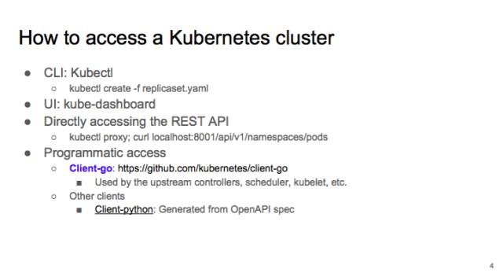
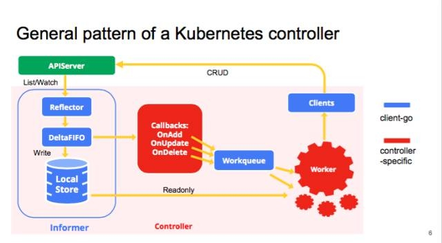
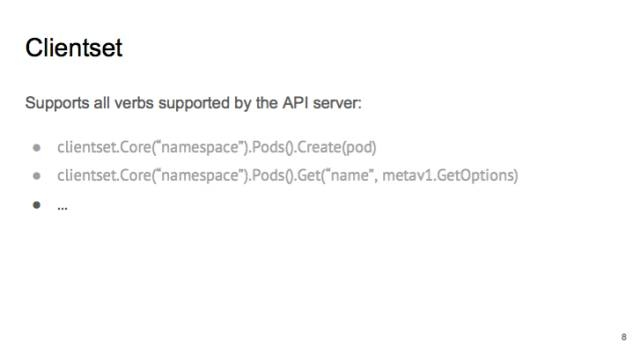
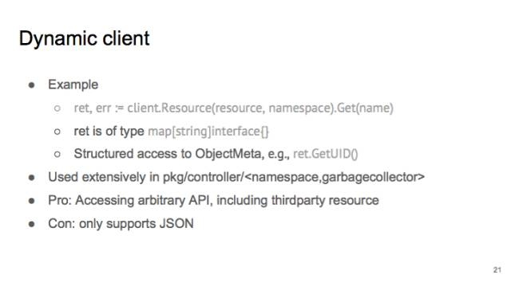
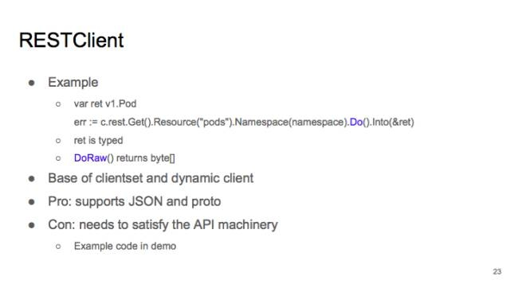
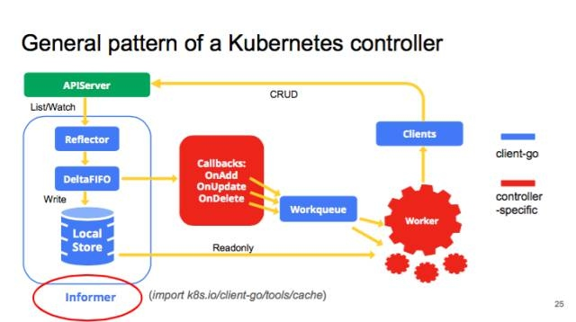
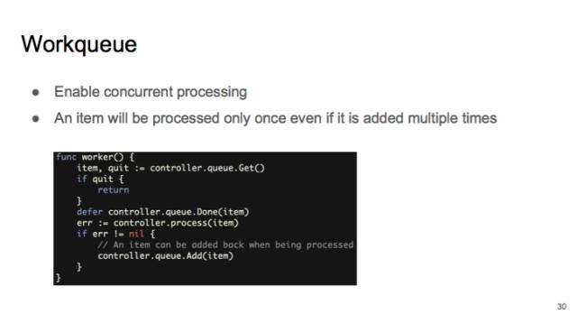
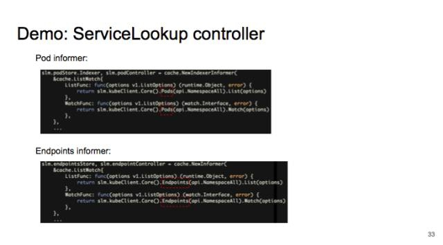
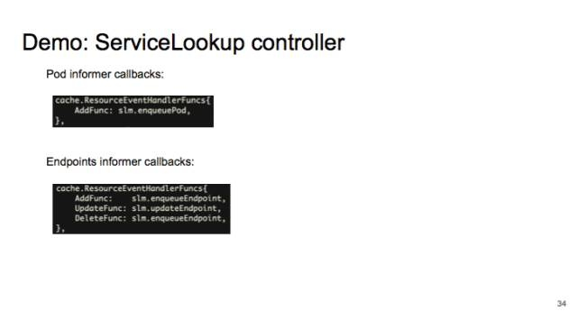
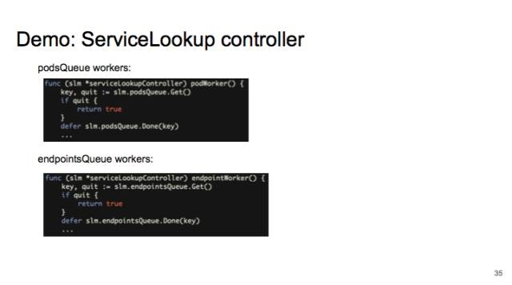

# API列表
# 二次开发
##  访问集群的方式

###  client-go 
项目地址： https://github.com/kubernetes/client-go
我们先看一下 client library 的内容。它主要包括各种 clients：**clientset、DynamicClient 和 RESTClient**。还有帮助你写 Controller 时用到的 utilities：**Workqueue 和 Informer**。

我们先看一下 kube－controller 的大致结构，典型的 controller 一般会有 1 个或者多个 informer，来跟踪某一个 resource，跟 APIserver 保持通讯，把最新的状态反映到本地的 cache 中。只要这些资源有变化，informal 会调用 callback。这些 callbacks 只是做一些非常简单的预处理，把不关心的的变化过滤掉，然后把关心的变更的 Object 放到 workqueue 里面。其实真正的 business logic 都是在 worker 里面， 一般 1 个 Controller 会启动很多 goroutines 跑 Workers，处理 workqueue 里的 items。它会计算用户想要达到的状态和当前的状态有多大的区别，然后通过 clients 向 APIserver 发送请求，来驱动这个集群向用户要求的状态演化。图里面蓝色的是 client-go 的原件，红色是自己写 controller 时填的代码。

先讲最常见的 Clientset，它是 k8s 中出镜率最高的 client，用法比较简单。先选 group，比如 core，再选具体的 resource，比如 pod 或者 job，最后在把动词（create、get）填上。

clientset 的使用分两种情况：集群内和集群外。

集群内：将 controller 容器化后以 pod 的形式在集群里跑，只需调用 rest.InClusterConfig()，默认的 service accounts 就可以访问 apiserver 的所有资源。

集群外，比如在本地，可以使用与 kubectl 一样的 kube-config 来配置 clients。如果是在云上，比如 gke，还需要 import Auth Plugin。

对于其各种options的讲解， 如Get, List, Watch, Update, Patch, Delete的讲解， 可以参考 [使用 client-go 控制原生及拓展的 Kubernetes API](https://my.oschina.net/caicloud/blog/829365)

现在讲一下另外一种 client，叫做 dynamic client。

dynamic client 用法比较灵活。因为你可以任意设置要操作的 resource。它的 return value，不是一个 structure，而是 map[string]interface{}。如果一个 controller 需要控制所有 API，比如 namespace controller 或者 garbage collector，那就用 dynamic client。使用时可以先通过 discovery，发现有哪些 API，再通过使用 dynamic client access 所有的 api。dynamic client 也支持 third party resources。

dynamic client 的缺点是它只支持 JSON 一种序列化。而 JSON 的效率远远低于 proto buf。

现在我们讲一下 rest client。

Rest Client 是 client 和 dynamic client 的基础。属于比较底层的，跟 dynamic client 一样，你可以使用它操作各种 resource。支持 Do() 和 DoRaw。

相比 dynamic client，支持 protobuf 和 json。效率会比较高。

但是问题就是，如果你要 access third party resource，需要自己写反序列化，不能直接 decode 到 type。在 demo 里会进行演示。

现在我们讲 informer，它的 input 其实就两个，一是要 list function 和 watch function，二是你要给 informer 提供一些 callback。informer 跑起来后，它会维护 localstore。你之后就可以直接访问 localstore，而不用跟 APIserver 通讯。提高一些 performance。

使用 informer 的好处一个是性能比较好，还有一个是可靠性。如果有 network partition，informer 后会从断点开始继续 watch，它不会错过任何 event 的。

Informer 也有一些 best practice，第一点，在 controller run 之前，最好等这些 informer 都 sync 了（初始化）。这样做，一是可以避免 controller 初始化时的 churn：比如 replica set controller 要 watch replica set 和 pod，如果不 sync 就开始 run，controller 会以为现在没有任何 pod，会创建很多不必要的 pod，之后还要删除。二来就是会避免很多很诡异的 bug。我在写 garbage collector 的时候就遇到过不少。

另外 informer 提供的 localcache 是 read-only 的。如果要修改，先用 DeepCopy 拷贝出来，否则可能有 read-write race。并且你的 cache 可能是和其他 controller 共享的，修改 cache 会影响其他 controller。

第三个要注意的地方就是，informer 传递给 callbacks 的 object 不一定是你所期待的 type。比如 informer 追踪所有 pod，返回的 Object 可能不是 pod，而是 DeletedFinalStateUnknown。所以在处理 delete 的时候，除了要处理原来跟踪的 object，还要处理 DeletedFinalStateUnknown。

最后要讲一下的就是，informer 的 resyncoption。它只是周期性地把所有的 local cache 的东西重新放到 FIFO 里。并不是说把 APIserver 上所有的最新状态都重新 list 一遍。这个 option 大家一般都是不会用到的，可以放心大胆地把这个 resync period 设成 0。

最后再讲一下这个 workqueue。

其实主要是为了可以 concurrent processing，可以并行地让 Callbacks 把状态加到 workqueue 里，然后起一大堆的 worker。

workqueue 提供的一个保障就是，如果是同一个object，比如同一个 pod，被多次加到 workqueue 里，在 dequeue 时，它只会出现一次。防止会有同一个 object 被多个 worker 同时处理。
另外 workqueue 还有一些非常有用的 feature。比如说 rate limited:  如果你从 workqueue 里面拿出一个 object，处理时发生了错误，重新放回了 workqueue。这时，workqueue 保证这个 object 不会被立刻重新处理，防止 hot loop。

另外的一个 feature 就是**提供 prometheus 监控。你可以实时监控 queue 的长度，延迟等。你可以监控 queue 的处理速度是否跟得上**。

Demo 

Demo 的代码在 github 上，https://github.com/caesarxuchao/servicelookup。

>   参考[使用 client-go 控制原生及拓展的 Kubernetes API](https://my.oschina.net/caicloud/blog/829365)

# 源码解读

# 原理分析

架构设计

以下是《kubernetes权威指南》的学习笔记，我 对书中的内容做了总结和提炼。 如有谬误之处， 还望各位指出。
## Apiserver原理分析
### 概述
整个系统的数据总线。 
提供以下功能特性：
1. 集群管理的api入口
2. 资源配额控制的入口
3. 提供完善的集群安全机制

### api 访问
访问api的三种方式：
1. 直接curl调用api
2. 启动内部代理（kubectl proxy ），然后访问内部代理进行调用，可以进行访问控制，如限制要访问的接口，增加允许访问的client的白名单
3. 使用k8s提供的client lib ，通过编程的方式访问，这种方式有两种使用场景，一是pod需要发现同属于一个service的其它pod副本的信息来组建集群（如elasticsearch集群）， 二是需要通过调用api来我开发基于k8s的管理平台

独特的k8s proxy api：

这种api可以用来代理rest请求， 把收到的请求转发到某一个node上的kubelet进程的端口上，由kubelet进行响应 
示例： curl  127.0.0.1:8080/api/v1/proxy/nodes/node-1/pods
这里返回的pods的信息是由node上的kubelet进程收集的， 而不是从etcd的数据库获取， 二者的信息可能在某个时间点会有偏差。 
这种特殊的api的应用场景是： 通过这类api来直接访问pods上的应用， 可以用来逐一排查同一service的多个pod副本上的应用是否有异常。 
示例一： curl  127.0.0.1:8080/api/v1/proxy/namespaces/default/pods/xxxx-pod-1
示例二： curl  127.0.0.1:8080/api／v1/proxy/namespaces/default/services/xxxx-svr-1

### 集群之间功能模块的通信
kubelet  --> apiserver (汇报自身状态， 侦听pod信息)
controller-manager --> apiserver (实时监控node信息，并做处理)
scheduler --> apiserver （侦听新建pod的信息， 检索符合要求的node列表，并进行调度逻辑的执行）

为缓解apiserver的压力， 各个模块会缓存从apiserver获取的数据， 某些情况下会直接使用缓存的数据（**什么情况使用缓存， 如何保证数据的一致性？**）

##  controller manager原理分析
集群内部的管理控制中心，是一个“修正系统”。 
负责以下对象的管理：
- node
- pod副本
- endpoint
- namespace
- service accout
- resource quota

包含了以下controller：
- replication controller
- node controller
- resourcequota controller
- namespace controller
- serviceaccount controller
- token controller
- service controller
- endpoint controller

### replication controller
职责是： 保证pod副本数量始终保持预设值
应用场景：
1. 确保pod数量， 以保证高可用要求
2. 系统扩容和缩容
3. 滚动更新

只有当pod的重启策略是Always时（RestartPolicy=Always）时， replication controller 才会管理该pod的操作（例如创建， 销毁， 重启等）

pod通过修改标签可以脱离replication controller的控制
### node controller
通过apiserver获取node的信息，实现管理和监控集群的各个node节点的相关控制功能。 
节点的健康状态有三种： 就绪（true）， 未就绪（false）， 未知（unknown）
master节点的系统时间作为探测时间， 状态变化的时间可能是上一次保存的状态时间，或者本次节点变化的时间。 
如果有段时间没有收到节点信息，则状态设置为unknown. 
当状态为非就绪状态时， 将节点加入待删除队列。

### resourcequota controller
资源配额管理， 确保指定的资源对象在任何情况下都不会超量占用系统资源，避免业务进程的设计和实现的缺陷导致整个系统的紊乱， 对整个集群的平稳运行起着重要作用。 

k8s集群对资源配额的管理有三个维度： 容器级别， pod级别， namespace级别。 
容器级别： cpu & memory
pod级别： 所有容器的可用资源
namespace级别： pod数量， rc数量， svr数量， resourcequota数量， secret数量，  pv数量

配额管理的控制：
由apiserver中的admission control来控制， 实际上apiserver是配额控制的一个入口。 
两种配额约束方式： limitranger（容器级别， pod级别）， resourcequota（namespace级别）

resourcequota controller组件负责定期统计namespace下pod， rc， svr， resourcequota， secret，  pv等资源对象的数量， 还有container实例使用的资源，将统计结果写入etcd。 
这些信息会被admission controller使用， 如果不符合配额约束， 则创建对象失败。 
如果既在namespace上命名了resourcequota约束， 又在pod级别声明了limitranger，admission control 会同时计算二者的情况， 需要同时满足才会创建对象。 

### namespace controller
用户通过api server创建新的namespace， 并保存在etcd中。 而这个controller可以通过api server读取namespace的相关信息。 
当namespace的状态被设置为terminating时， 这个controller会删除改namespace下的所有对象资源。 
admission controller会通过namespacelifecycle插件来阻止为该namespace创建新的资源。 

### serviceaccount controller
### token controller
### service controller
k8s集群和外部云平台的一个接口控制器，负责侦听service的变化。如果service的type是loadbalancer， 那么service controller就会负责动态更新创建对于的loadbalancer实例， 和路由转发表等
### endpoint controller
负责侦听service和相应的pod副本的变化，以及生成和维护所有endpoints对象。 当service被删除时，该controller会负责删除该service同名的endpoints对象。 当新的service被创建或修改， pod产生相关事件时， 该controller就会更新对应service的endpoints对象（更改对应的endpoint条目）。

注： endpoints对象维护一个service对应的所有pod副本的访问地址。 

## scheduler 原理分析
scheduler是负责pod调度的重要组件。起着承上启下的作用， 从上游接收controller manager 创建的pod， 为起安排node落脚， 然后交给目标node上的kubelet进程， 由其负责pod的“下半生”的生命周期管理。 

默认调度流程分两步：
1. 预选（predicates）： 遍历所有node， 先根据预选策略初步筛选出符合条件的node
2. 优选（priority）： 从预选的node中挑出最优的选择

调度流程是通过插件的方式加载调度算法提供者。 每个algorithmprovider都要提供3个参数， 算法名称name， 预选策略集合predicatekeys， 优选策略集合prioritykeys

7个可用的预选策略：
- NoDiskConflict
- PodFirstResources
- PodSelectorMatches
- PodFitsHost
- CheckNodeLablePresence
- CheckServiceAffinity
- PodFitsPorts

默认的algorithmprovider加载的预选策略：
- NoDiskConflict
- PodFirstResources
- PodSelectorMatches
- PodFitsHost
- PodFitsPorts

所有预选策略的说明
- NoDiskConflict
>  判断备选pod的gcepersistentdisk或者awselasticblockstore和备选的节点已存在的pod是否存在冲突
- PodFirstResources
>  node的资源是否满足备选pod的需求。需要对备选pod和node上已有pod的资源进行求和，看是否超过node所能提供的资源
- PodSelectorMatches
>  node是否有pod的标签选择器所指定的标签， 即nodeselector所指定的标签
- PodFitsHost
>  node的名称是否和pod所指定的node名称一致， 即nodename所指定的名称
- CheckNodeLablePresence
>  用于判断当策略列出的标签在备选节点存在是， 是否选择该备选节点
- CheckServiceAffinity
>  用于判断备选节点是否包含策略指定的标签
- PodFitsPorts
>   判断备选pod所用的端口是否在备选的node中被占用

3个优选策略：
- LeastRequestedPriority
- CalculateNodeLabelPriority
- BalancedResourceAllocation

注：每个节点通过优选策略会算出一个得分， 得分最大的节点作为最终的优选结果。 

问题：   ** 所有的优选策略都要计算一遍么？还是只是挑选其中的一个？如果挑选其中一个，又是如何挑选？**

所有优选策略的说明：
- LeastRequestedPriority
>  选出资源消耗最少的节点， 即资源最充足的节点（cpu， mem两个维度）， 有对应的计算公式
- CalculateNodeLabelPriority
 >  判断策略列出的标签在备选节点出现时，是否选择该备选节点
- BalancedResourceAllocation
>  从备选节点中选出各项资源使用率最均衡的方法， 与1类似，但是计算公式又不同

##  kubelet原理分析
kubelet是k8s集群node端一个服务进程。 主要负责三个任务：
1. 处理master下发到本节点的任务，管理pod和pod中的容器，如启动，删除等
2. 向apiserver注册节点信息， 定期向apiserver汇报节点资源的使用情况
3. 使用cAdvisor监控容器和节点资源

###  节点管理
在1.3.6版本中kubelet有130个参数。 下面介绍和节点管理相关的几个参数：
- - api-servers 告诉到哪里去注册和上报信息， 可以支持多个apiserver地址（ip ＋ port）， 以逗号分隔
- - register-node 是否启用上报信息的功能
- - node-ip 汇报的节点ip地址，汇报给apiserver的是网卡地址，  如果是有NAT IP的机器想要向apiserver注册NAT IP， 需要在这个参数指定

###  Pod管理

####  容器健康检查
####  cAdvisor资源监控

# 参考文献
- [Accessing Clusters](https://kubernetes.io/docs/tasks/access-application-cluster/access-cluster/)
- [使用 client-go 控制原生及拓展的 Kubernetes API](https://my.oschina.net/caicloud/blog/829365)
- [kubernetes中的端对端测试](https://github.com/kubernetes/community/blob/master/contributors/devel/e2e-tests.md)
[flannel源码分析](http://cizixs.com/2016/07/16/flannel-source-code-insight)
[Kubernetes监控之Heapster源码实现](http://www.dockone.io/article/2201)
[kubernetes代码阅读-apiserver之list-watch篇](http://dockone.io/article/1538)
