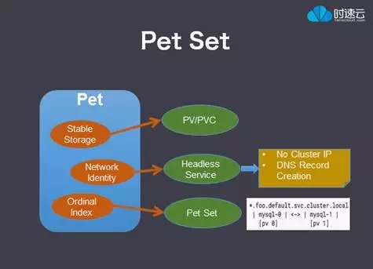
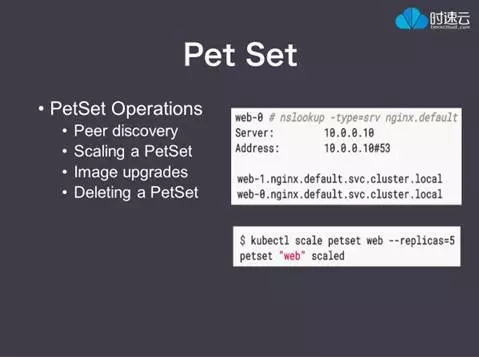

# 什么是有状态应用
在 K8S 运行的服务，从简单到复杂可以分成三类：无状态服务、普通有状态服务和有状态集群服务。下面分别来看 K8S 是如何运行这三类服务的。

无状态服务，K8S 使用 RC（或更新的 Replica Set）来保证一个服务的实例数量，如果说某个 Pod 实例由于某种原因 Crash 了，RC 会立刻用这个 Pod 的模版新启一个 Pod 来替代它，由于是无状态的服务，新启的 Pod 与原来健康状态下的 Pod 一模一样。在 Pod 被重建后它的IP地址可能发生变化，为了对外提供一个稳定的访问接口，K8S 引入了 Service 的概念。一个 Service 后面可以挂多个 Pod，实现服务的高可用。
普通有状态服务，和无状态服务相比，它多了状态保存的需求。Kubernetes 提供了以 Volume 和 Persistent Volume 为基础的存储系统，可以实现服务的状态保存。
有状态集群服务，与普通有状态服务相比，它多了集群管理的需求。K8S 为此开发了一套以 Pet Set 为核心的全新特性，方便了有状态集群服务在 K8S 上的部署和管理。具体来说是通过 Init Container 来做集群的初始化工作，用 Headless Service 来维持集群成员的稳定关系，用动态存储供给来方便集群扩容，最后用Pet Set来综合管理整个集群。
要运行有状态集群服务要解决的问题有两个，一个是状态保存，另一个是集群管理。 我们先来看如何解决第一个问题：状态保存。Kubernetes 有一套以Volume插件为基础的存储系统，通过这套存储系统可以实现应用和服务的状态保存。
>  参考 [K8S 弹药库 | Kubernetes 有状态集群服务部署与管理（上）](http://mp.weixin.qq.com/s?__biz=MzU1OTAzNzc5MQ==&amp;mid=2247483722&amp;idx=2&amp;sn=a8ec119efcf1a5a9c8ab9c04185df1e1&amp;chksm=fc1c2d7acb6ba46cffa1e1c77ac632aa4661de1fd1c48323986463882c971e6a2922a4bc2aa0&amp;mpshare=1&amp;scene=1&amp;srcid=04212ZmcJoz5fSQhSljVunu4#rd)

什么是Pet Set？在数据结构里Set是集合的意思，所以顾名思义Pet Set就是Pet的集合，那什么是Pet呢？我们提到过Cattle和Pet的概念，Cattle代表无状态服务，而Pet代表有状态服务。具体在K8S资源对象里，Pet是一种需要特殊照顾的Pod。它有状态、有身份、当然也比普通的Pod要复杂一些。

具体来说，一个Pet有三个特征。

一是有稳定的存储，这是通过我们前面介绍的PV/PVC 来实现的。

二是稳定的网络身份，这是通过一种叫 Headless Service 的特殊Service来实现的。要理解Headless Service是如何工作的，需要先了解Service是如何工作。我们提到过Service可以为多个Pod实例提供一个稳定的对外访问接口。这个稳定的接口是如何实现的的呢，是通过Cluster IP来实现的，Cluster IP是一个虚拟IP，不是真正的IP，所以稳定。K8S会在每个节点上创建一系列的IPTables规则，实现从Cluster IP到实际Pod IP的转发。同时还会监控这些Pod的IP地址变化，如果变了，会更新IP Tables规则，使转发路径保持正确。所以即使Pod IP有变化，外部照样能通过Service的ClusterIP访问到后面的Pod。

普通Service的Cluster IP 是对外的，用于外部访问多个Pod实例。而Headless Service的作用是对内的，用于为一个集群内部的每个成员提供一个唯一的DNS名字，这样集群成员之间就能相互通信了。所以Headless Service没有Cluster IP，这是它和普通Service的区别。

Headless Service为每个集群成员创建的DNS名字是什么样的呢？右下角是一个例子，第一个部分是每个Pet自己的名字，后面foo是Headless Service的名字，default是PetSet所在命名空间的名字，cluser.local是K8S集群的域名。对于同一个Pet Set里的每个Pet，除了Pet自己的名字，后面几部分都是一样的。所以要有一个稳定且唯一的DNS名字，就要求每个Pet的名字是稳定且唯一的。

三是序号命名规则。Pet是一种特殊的Pod，那么Pet能不能用Pod的命名规则呢？答案是不能，因为Pod的名字是不稳定的。Pod的命名规则是，如果一个Pod是由一个RC创建的，那么Pod的名字是RC的名字加上一个随机字符串。为什么要加一个随机字符串，是因为RC里指定的是Pod的模版，为了实现高可用，通常会从这个模版里创建多个一模一样的Pod实例，如果没有这个随机字符串，同一个RC创建的Pod之间就会由名字冲突。

如果说某个Pod由于某种原因死掉了，RC会新建一个来代替它，但是这个新建里的Pod名字里的随机字符串与原来死掉的Pod是不一样的。所以Pod的名字跟它的IP一样是不稳定的。

为了解决名字不稳定的问题，K8S对Pet的名字不再使用随机字符串，而是为每个Pet分配一个唯一不变的序号，比如 Pet Set 的名字叫 mysql，那么第一个启起来的Pet就叫 mysql-0，第二个叫 mysql-1，如此下去。

当一个Pet down 掉后，新创建的Pet 会被赋予跟原来Pet一样的名字。由于Pet名字不变所以DNS名字也跟以前一样，同时通过名字还能匹配到原来Pet用到的存储，实现状态保存。

这些是Pet Set 相关的一些操作：

Peer discovery，这和我们上面的Headless Service有密切关系。通过Pet Set的 Headless Service，可以查到该Service下所有的Pet 的 DNS 名字。这样就能发现一个Pet Set 里所有的Pet。当一个新的Pet起来后，就可以通过Peer Discovery来找到集群里已经存在的所有节点的DNS名字，然后用它们来加入集群。
更新Replicas的数目、实现扩容和缩容。
更新Pet Set里Pet的镜像版本，实现升级。
删除 Pet Set。删除一个Pet Set 会先把这个Pet Set的Replicas数目缩减为0，等到所有的Pet都被删除了，再删除 Pet Set本身。注意Pet用到的存储不会被自动删除。这样用户可以把数据拷贝走了，再手动删除。
以上，与有状态服集群服务相关的K8S特性就介绍完了。

> 参考  [K8S 老司机 | Kubernetes 有状态集群服务部署与管理（下）](http://mp.weixin.qq.com/s?__biz=MzU1OTAzNzc5MQ==&amp;mid=2247483727&amp;idx=3&amp;sn=485f783756f9539ba8659ee265d2905f&amp;chksm=fc1c2d7fcb6ba46908b2078bed06b34a6aafeb67d2fe50bde3979baaa4d60eaaa67bf7bc2da9&amp;mpshare=1&amp;scene=1&amp;srcid=0424tZbUNKEy8lozNbfHnwEv#rd)

# 创建一个有状态应用
Pet的三个特性： 稳定的存储， 稳定的网络身份， 序号命名规则。 把这些特性和有状态集群服务关联起来串一下，我们可以用Pet Set来管理一个有状态服务集群，Pet Set里每个Pet对应集群的一个成员，集群的初始化可以用 Init Container来完成。集群里每个成员的状态由Volume, Persistent Volume来存储，集群里每个Pet 唯一的DNS名字通过Headless Service来提供，集群里的成员之间就可以通过这个名字，相互通信。
# 常见问题
# 参考文献
- [K8S 弹药库 | Kubernetes 有状态集群服务部署与管理（上）](http://mp.weixin.qq.com/s?__biz=MzU1OTAzNzc5MQ==&amp;mid=2247483722&amp;idx=2&amp;sn=a8ec119efcf1a5a9c8ab9c04185df1e1&amp;chksm=fc1c2d7acb6ba46cffa1e1c77ac632aa4661de1fd1c48323986463882c971e6a2922a4bc2aa0&amp;mpshare=1&amp;scene=1&amp;srcid=04212ZmcJoz5fSQhSljVunu4#rd)
- [K8S 老司机 | Kubernetes 有状态集群服务部署与管理（下）](http://mp.weixin.qq.com/s?__biz=MzU1OTAzNzc5MQ==&amp;mid=2247483727&amp;idx=3&amp;sn=485f783756f9539ba8659ee265d2905f&amp;chksm=fc1c2d7fcb6ba46908b2078bed06b34a6aafeb67d2fe50bde3979baaa4d60eaaa67bf7bc2da9&amp;mpshare=1&amp;scene=1&amp;srcid=0424tZbUNKEy8lozNbfHnwEv#rd)
- [《Kubernetes与云原生应用》系列之Kubernetes的系统架构与设计理念](http://www.infoq.com/cn/articles/kubernetes-and-cloud-native-applications-part01?utm_source=tuicool&utm_medium=referral)  ＊＊＊＊＊
- [对话李春龙：如何用Kubernetes管理有状态服务](http://www.tuicool.com/articles/n6Jbiez)
- [使用Kubernets Pet Set部署上千个Cassandra实例](http://dockone.io/article/1577)
- [kubernetes尝试有状态服务](http://blog.decbug.com/2016/08/03/k8s_stateful/)
- [官方文档之petset](http://kubernetes.io/docs/user-guide/petset/)
- [Running a Replicated Stateful Application](https://kubernetes.io/docs/tutorials/stateful-application/run-replicated-stateful-application/)
- [StatefulSet Basics](https://kubernetes.io/docs/tutorials/stateful-application/basic-stateful-set/)
- [StatefulSets](https://kubernetes.io/docs/concepts/abstractions/controllers/statefulsets/)

