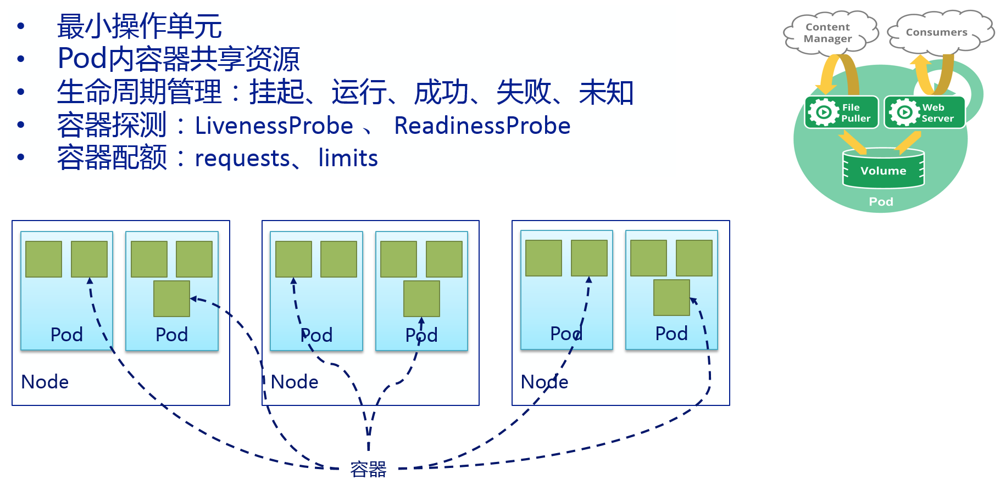
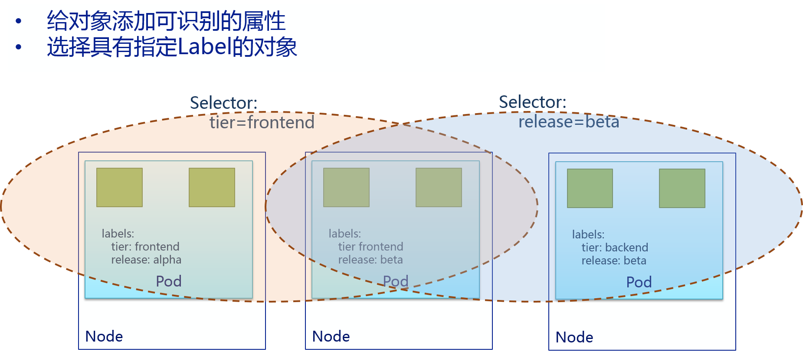
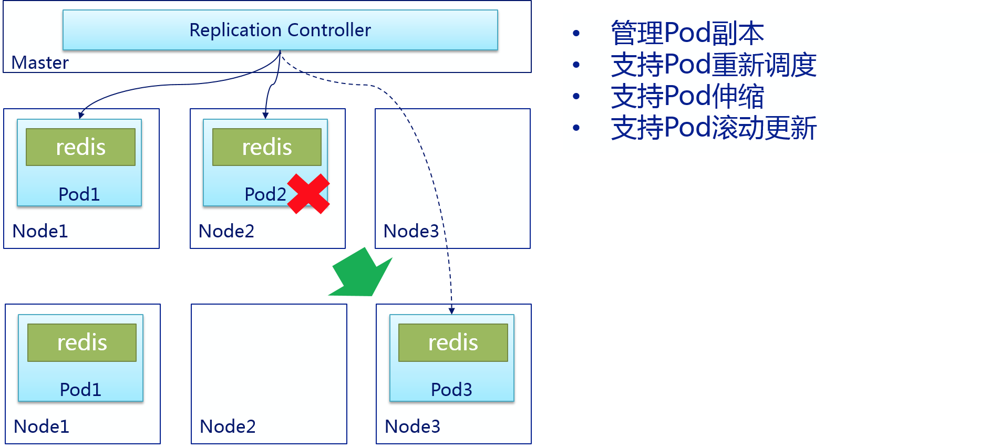
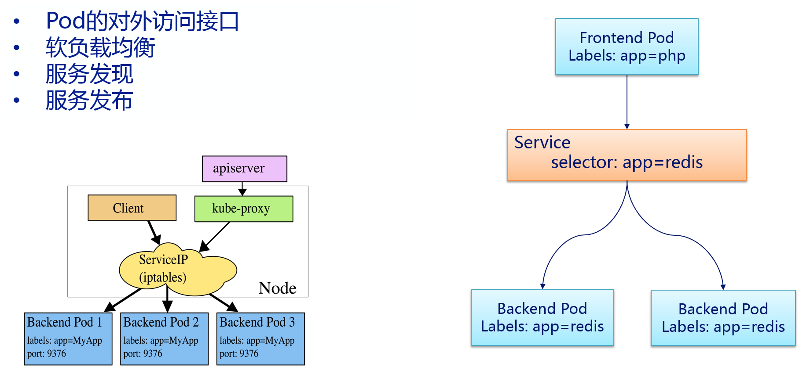
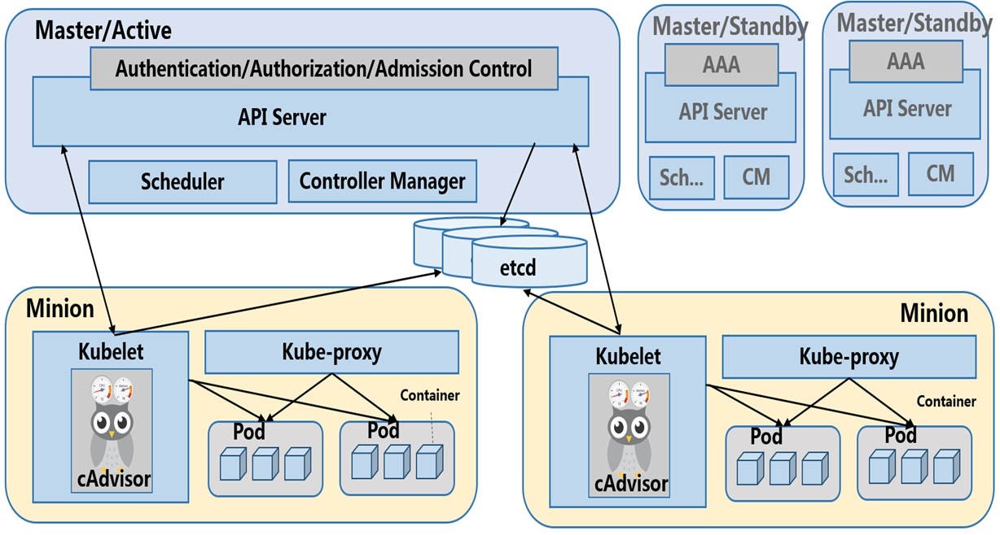
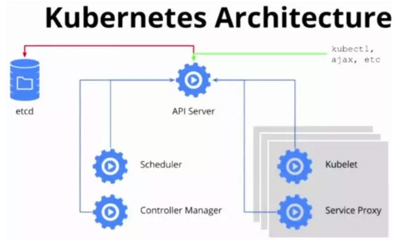
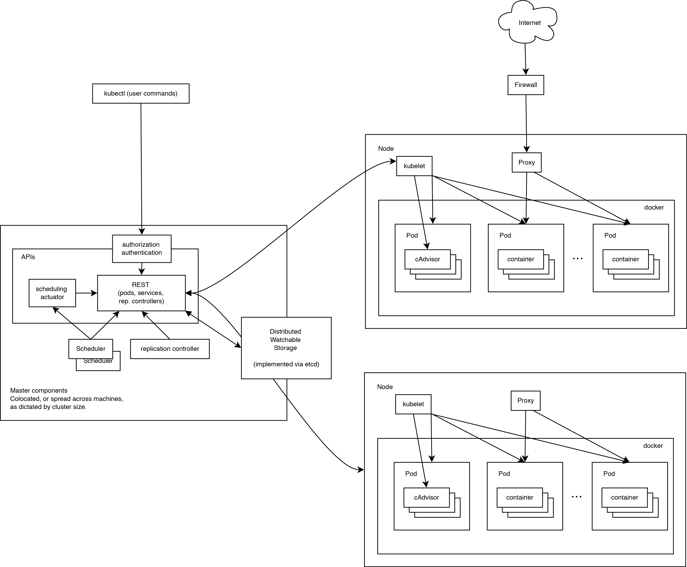

# Kubernetes简介
Kubernetes一个用于容器集群的自动化部署、扩容以及运维的开源平台。 目前支持docker和rkt作为容器引擎。 
使用Kubernetes，你可以快速高效地响应客户需求：

动态地对应用进行扩容。
无缝地发布新特性。
仅使用需要的资源以优化硬件使用。
它有如下特性：

简洁的：轻量级，简单，易上手
可移植的：公有，私有，混合，多重云（multi-cloud）
可扩展的: 模块化, 插件化, 可挂载, 可组合
可自愈的: 自动布置, 自动重启, 自动复制

使用Kubernetes可以：
- 自动化容器的部署和复制
- 随时扩展或收缩容器规模
- 将容器组织成组，并且提供容器间的负载均衡
- 很容易地升级应用程序容器的新版本
- 提供容器弹性，如果容器失效就替换它，等等

Kubernetes不提供：
- 中间件（例如消息总线）、数据处理框架（如Spark）、数据库（如MySQL），也不提供集群存储系统（如Ceph）。
- 源代码到镜像的处理，即不部署源代码也不会构建的应用，持续集成(Continuous Integration: CI)的工作也需要由用户按自己项目决定。
- 不提供应用配置系统。
- 不提供机器配置、维护、管理。

ps： 如何向技术小白解释什么是kubernetes？使用最通俗易懂的解释，可以参见插图漫画《*闺女也能看懂的插画版Kubernetes指南*》
# 概念和术语
## 主要概念说明
```table
|名词| 描述|
|cluster|集群， 一组物理机或虚拟机（或两者）与使用Kubernetes运行应用程序等基础资源的总和|
|etcd|所有的持久状态数据存储在etcd集群中。它提供了一种分布式的方式来可靠地存储配置数据|
|namespace|命名空间, 一个资源名称的前缀, 命名空间帮助不同的项目，环境（例如，开发和生产），团队或客户共享同一个集群。它能够阻止名称冲突。|
|kubctl|操作整个调度系统使用的命令行工具|
| pod  |  一组容器的集合，pod内的容器一起被部署,是Kubernetes管理最小部署单元， 所有在Pod的应用使用相同的网络命名空间，IP地址及端口空间  |
| volume  | Pod中能够被多个容器访问的共享目录  |
| label  |  组织和选择基于键值对的对象组， 它们被用于每一个Kubernetes组件。例如：复制控制器使用他们做服务发现  |
| replication controller  | 复制控制器， 管理Pod的生命周期， 用以保证集群内的容器在任何时刻都有指定数据的副本在运行   |
|service   | 服务为一组Pod提供单一稳定的名称和地址。他们作为基本负载均衡器而存在。  |
| Secret  |  存储敏感的数据并可以被容器所访问  |
```

## 概念详细介绍之Pod

Pod是Kubernetes的里可部署的和管理的最小单元，一个或多个容器构成一个Pod，通常Pod里的容器运行相同的应用。Pod包含的容器都运行在同一个宿主机上，看作一个统一管理单元。

每个Pod中都有一个pause容器，pause容器做为Pod的网络接入点，Pod中其他的容器会使用容器映射模式启动并接入到这个pause容器。属于同一个Pod的所有容器共享网络的namespace。

一个Pod可以被一个容器化的环境看做是应用层的逻辑宿主机(Logical Host)，每个Pod中有多个容器，同一个Pod中的多个容器通常是紧密耦合的。同一个pod中的容器共享如下资源：

PID 名字空间：Pod中不同应用程序可以看到其它应用程序的进程ID。 
网络名字空间：Pod中的多个容器访问同一个IP和端口空间。 
IPC名字空间：Pod中的应用能够使用SystemV IPC和POSIX消息队列进行通信。

UTS名字空间：Pod中的应用共享一个主机名。

Volumes：Pod中的各个容器应用还可以访问Pod级别定义的共享卷。

Pod的生命周期，通过模板定义Pod，然后分配到一个Node上运行，在Pod所包含的容器运行结束后Pod也结束。

在整个过程中，Pod的状态：

挂起 ︰ Pod已被提交到Master，但一个或多个容器镜像尚未创建。包括调度和下载镜像，可能需要一段时间。

运行 ︰ Pod已绑定到的节点，和所有容器镜像已创建完成。至少一个容器是仍在运行，或正在启动或重新启动。

成功 ︰ Pod的所有容器已经成功的终止，并不会重新启动。

失败 ︰ Pod的所有容器已经都终止，至少一个容器已都终止失败 （以非零退出状态退出）。

未知 ︰ 出于某种原因的Pod状态无法获得，通常由于在与主机的Pod通信错误。

容器探测的诊断方式：

ExecAction ：在Container中执行指定的命令。当其执行成功时，将其退出码设置为0；

TCPSocketAction ：执行一个TCP检查使用container的IP地址和指定的端口作为socket。如果端口处于打开状态视为成功；

HTTPGetAcction ：执行一个HTTP默认请求使用container的IP地址和指定的端口以及请求的路径作为url，用户可以通过host参数设置请求的地址，通过scheme参数设置协议类型(HTTP、HTTPS)如果其响应代码在200~400之间，设为成功。

探测的结果有：

Success ：表示通过检测 
Failure ：表示没有通过检测 
Unknown ：表示检测没有正常进行

探测的种类：

LivenessProbe ：表示container是否处于live状态。如果LivenessProbe失败，LivenessProbe将会通知kubelet对应的container不健康了。随后kubelet将kill掉container，并根据RestarPolicy进行进一步的操作。默认情况下LivenessProbe在第一次检测之前初始化值为Success，如果container没有提供LivenessProbe，则也认为是Success；

ReadinessProbe ：表示container是否以及处于可接受service请求的状态了。如果ReadinessProbe失败，endpointscontroller将会从service所匹配到的endpoint列表中移除关于这个container的IP地址。因此对于Service匹配到的endpoint的维护其核心是ReadinessProbe。默认Readiness的初始值是Failure，如果一个container没有提供Readiness则被认为是Success。

对容器实施配额，只要在Pod的定义文件中设定resources的属性就可以为容器指定配额，目前容器支持的CPU和Memory两种资源的配额。requests指定必须保证的最小资源，limits限制最大资源。

## 概念详细介绍之LabelandSelector


Label以key/value键值对的形式附加到各种对象上，如Pod、Node等。Label定义了这些对象的可识别属性，用来对它们进行管理和选择。Label可以在创建对象时指定也可以在对象创建后通过api进行添加。

在为对象定义好了Label后，其它对象就可以使用Label Selector来选择还有指定Label的对象。

有效的Label key有两个部分︰可选前缀和名称，以一个正斜杠（/）分隔。名称部分是必须的并且长度为 63 个字符或更少，开始和结束以字母数字字符 ([a-z0-9A-Z]) 中间可以有破折号（-），下划线 (_)，圆点（.）和字母数字。前缀是可选的。如果指定，前缀必须是 DNS 子域︰一系列的 DNS 标签分隔用点（.），不长于 253 个字符总数，其次是斜杠（/）。如果省略前缀，则标签键是须推定为私人用户。kubernetes.io/ 前缀为 Kubernetes 核心组件保留。

有效的Label value必须是 63 个字符或更少，必须为空或开始和结束以字母数字字符 ([a-z0-9A-Z])中间可以有破折号（-），下划线 (_)，圆点（.）和字母数字。 
有2种Label Selector：基于等式的(Equality-based requirement)和基于集合的(Set-based requirement)，在使用时可以将多个Label进行组合来选择。

基于等式的Label Selector使用等式的表达式来进行选择。

· name=Redis：选择所有包含Label中key=“name”且value=“redis”的对象。

· tier!=frontend：选择所有包含Label中key=“tier”且value!=“frontend”的对象。

基于集合的Label Selector使用集合操作的表达式来进行选择。

· name in(redis-master, redis-slave)：选择所有包含Label中key=“name”且value=“redis-master”或”redis-slave”的对象。

· tier notin(frontend)：选择所有包含Label中key=“tier”且value不等于”frontend”的对象。

可以将多个Label Selector进行组合，使用”,”进行分割。基于等于的Label Selector和基于集合的Label Selector可以任意组合。例如：

name=redis,tier!=frontend 
name in(redis-master, redis-slave), tier=backend

使用Label可以给对象创建多组标签，Service，RC组件通过Label Selector来选择对象范围，Label 和 Label Selector共同构成了Kubernetes系统中最核心的应用模型，使得对象能够被精细的分组管理，同时实现了高可用性。

## 概念详细介绍之ReplicationController


Replication Controller核心作用是确保在任何时候集群中一个RC所关联的Pod都保持一定数量的副本处于正常运行状态。如果该Pod的副本数量太多，则Replication Controller会销毁一些Pod副本；反之Replication Controller会添加副本，直到Pod的副本数量达到预设的副本数量。

最好不要越过RC直接创建Pod，因为Replication Controller会通过RC管理Pod副本，实现自动创建、补足、替换、删除Pod副本，这样就能提高应用的容灾能力，减少由于节点崩溃等意外状况造成的损失。即使应用程序只有一个Pod副本，也强烈建议使用RC来定义Pod。

当Pod通过RC创建后，即使修改RC的模板定义，也不会影响到已经创建的Pod。此外Pod可以通过修改标签来实现脱离RC的管控，该方法可以用于将Pod从集群中迁移、数据修复等调试。对于被迁移的Pod副本，RC会自动创建一个新副本替换被迁移的副本。需要注意的是，通过kubectl删除RC时会一起删掉RC所创建的Pod副本，但是通过REST API删除时，需要将replicas设置为0，等到Pod删除后再删除RC。

重新调度：如前面所说，不论是想运行1个副本还是1000个副本，Replication Controller都能确保指定数量的副本存在于集群中，即使发生节点故障或Pod副本被终止运行等意外情况。

伸缩：修改Replication Controller的replicas的属性值，可以非常容易的实现扩大或缩小副本的数量。例如，通过下列命令可以实现手工修改名为foo的RC副本数量为3：kubectl scale –replicas=3 rc/foo

滚动更新：副本控制器被设计成通过逐个替换Pod的方式来辅助服务的滚动更新。推荐的方法是创建一个新的只有一个副本的RC，若新的RC副本数量加1，则旧的RC副本数量减1，直到这个旧的RC副本数量为0，然后删除旧的RC。这样即使在滚动更新的过程中发生了不可预测的错误，Pod集合的更新也都在可控范围之内。在理想情况下，滚动更新控制器需要将准备就绪的应用考虑在内，保证在集群中任何时刻都有足够数量的可用的Pod（https://github.com/kubernetes/kubernetes/issues/1353）

## 概念详细介绍之Service


虽然每个Pod都会被分配一个单独的IP地址，但这个IP地址会随着Pod的销毁而消失。引出的一个问题是：如果有一组Pod组成一个应用集群来提供服务，那么该如何访问它们呢？

Service就是用来解决这个问题的，一个Service可以看作一组提供相同服务的Pod的对外接口，Service是通过LabelSelector选择一组Pod作用后端服务提供者。

举个例子：redis运行了2个副本，这两个Pod对于前端程序来说没有区别，所以前端程序并不关心是哪个后端副本在提供服务。并且后端Pod在发生变化时，前端也无须跟踪这些变化。Service就是用来实现这种解耦的抽象概念。

Pod的IP地址是由Docker Daemon根据docker0网桥的IP地址段进行分配的，但Service的Cluster IP地址是Kubernetes系统中的虚拟IP地址，由系统动态分配。

Service的Cluster IP相对于Pod的IP地址来说相对稳定，Service被创建时即被分配一个IP地址，在销毁该Service之前，这个IP地址都不会再变化了。而Pod在Kubernetes集群中生命周期较短，可能被Replication Controller销毁、再次创建，新创建的Pod就会被分配一个新的IP地址。

如何通过Service Cluster IP访问到后端的Pod呢？Kubernetes群集中的每个节点运行kube-proxy。该程序负责对Service实现虚拟IP的实现。在 Kubernetes v1.0，代理即是纯粹在用户空间。在Kubernetes v1.1添加了iptables代理，但是并不是默认的操作模式。在Kubernetes v1.2默认用iptables代理模式。在iptables代理模式下kube-proxy会观察Kubernetes Master节点添加和删除Service对象和Endpoint对象的行为，对于每个服务，kube-proxy会在本机的iptables中安装相应的规则，iptables通过这些规则将会捕获到该Service的流量并将他们重定向到一个后端的Pod。默认情况下后, 后端的选择是随机的。

但是也可以选择基于客户端IP的sessionaffinity，可以通过设置service.spec.sessionAffinity=ClientIP(默认值为“None”)来选择该方式。与用户空间的代理一样，客户端不知道Kubernetes或Service或Pod，任何对于Service的IP:Port的访问都会被代理到后端。但是iptables的代理比用户空间代理是更快、 更可靠。

Kubernetes支持两种主要的模式来找到Service：一个是容器的Service环境变量，另一个是DNS。在创建一个Pod时，kubelet在该Pod的所有容器中为当前所有Service添加一系列环境变量。

Kubernetes支持形如“{SVCNAME}SERVICE_HOST”和“{SVCNAME}_SERVICE_PORT”的变量。其中“{SVCNAME}”是大写的ServiceName，同时Service Name包含的“-”符号会转化为“”符号。例如，已存在名称为“redis-master”的Service，它对外暴露6379的TCP端口，且集群IP为10.0.0.11。kubelet会为新建的容器添加以下环境变量：

REDIS_MASTER_SERVICE_HOST=10.0.0.11 
REDIS_MASTER_SERVICE_PORT=6379 
REDIS_MASTER_PORT=tcp://10.0.0.11:6379 
REDIS_MASTER_PORT_6379_TCP=tcp://10.0.0.11:6379 
REDIS_MASTER_PORT_6379_TCP_PROTO=tcp 
REDIS_MASTER_PORT_6379_TCP_PORT=6379 
REDIS_MASTER_PORT_6379_TCP_ADDR=10.0.0.11

通过环境变量来创建Service会带来一个不好的结果，即任何被某个Pod所访问的Service，必须先于该Pod创建，否则和这个后创建的Service相关的环境变量，将不会被加入该Pod的容器中。

另一个通过名字找到服务的方式是DNS。DNS服务器通过Kubernetes API Server监控与Service相关的活动。当监控到添加Service的时，DNS服务器为每个Service创建一系列DNS记录。例如：有个叫做”my-service“的service，他对应的kubernetesnamespace为”my-ns“，那么会有他对应的dns记录，叫做”my-service.my-ns“。那么在my-ns的namespace中的pod都可以对my-service做name解析来轻松找到这个service。在其他namespace中的pod解析”my-service.my-ns“来找到他。解析出来的结果是这个service对应的cluster ip。

Service的ClusterIP地址只能在集群内部访问，如果集群外部的用户希望Service能够提供一个供集群外用户访问的IP地址。Kubernetes通过两种方式来实现上述需求，一个是“NodePort”，另一个是“LoadBalancer”。

每个service都有个type字段，值可以有以下几种：

· ClusterIP：使用集群内的私有ip —— 这是默认值。

· NodePort：除了使用cluster ip外，也将service的port映射到每个node的一个指定内部port上，映射的每个node的内部port都一样。

· LoadBalancer：使用一个ClusterIP & NodePort，但是会向cloud provider申请映射到service本身的负载均衡。

如果将type字段设置为NodePort，kubernetesmaster将会为service的每个对外映射的port分配一个”本地port“，这个本地port作用在每个node上，且必须符合定义在配置文件中的port范围（为–service-node-port-range）。这个被分配的”本地port“定义在service配置中的spec.ports[*].nodePort字段，如果为这个字段设定了一个值，系统将会使用这个值作为分配的本地port 或者 提示你port不符合规范。

## 概念详细介绍之Namespace


Kubernetes 支持在一个物理集群上创建多个虚拟群集。这些虚拟群集被称为命名空间。大多数Kubernetes资源(例如: pods, services, replication controllers, and others) 在名称空间中。但是namespace资源本身不在名称空间中。**还有一些底层资源如Node, PersistentVolumes不在名称空间中**。

Kubernetes集群启动后，会创建一个名为“default”的Namespace，如果不特别指明Namespace，则创建的Pod、RC、Service都将被创建到“default”的Namespace中。

当你创建一个服务时，它将创建相应的 DNS 条目。此条目是窗体..svc.cluster.local，这意味着如果一个容器只是使用 它将解析为命名空间的本地的服务。这是用于跨多个命名空间，比如开发、分期和生产使用相同的配置。如果你想要达到整个命名空间，您需要使用完全限定的域名称(FQDN)。

使用Namespace来组织Kubernetes的各种对象，可以实现对用户的分组，即“多租户”的管理。对不同的租户还可以进行单独的资源配额设置和管理，使得整个集群的资源配置非常灵活、方便。一个集群中的资源总是有限的，当这个集群被多个租户的应用同时使用时，为了更好地使用这种有限的共享资源，需要将资源配额的管理单元提升到租户级别，通过在不同租户对应的Namespace上设置对应的ResourceQuota即可达到目的。
# 系统架构







Kubernetes集群由2类节点组成：Master和Node。

**节点**
在Node上运行kubelet、kube-proxy、dockerdaemon三个组件，其中前2个组件负责对本节点上的Pod的生命周期进行管理，以及实现服务代理的功能。 
另外在所有节点上都可以运行kubectl命令行工具，它提供了Kubernetes的集群管理工具集。
一般一个节点是一个单独的物理机或虚拟机，其上安装了Docker来负责镜像下载和运行。

kubelet：负责本Node上的Pod创建、修改、监控、删除等全生命周期管理，以及Pod对应的容器、镜像、卷的管理，同时定时上报本Node的状态信息给kube-apiserver。

kube-proxy：实现了Service的代理以及软件模式的负载均衡器。

**控制中心**
在Master上运行etcd、kube-apiserver、kube-scheduler、kube-controller-magager四个组件，其中后3个组件构成了Kubernetes的总控中心，负责对集群中所有资源进行管控和调度。

控制中心负责节点的管理和调度工作。由以下几个组件组成：

etcd：是一个高可用的key/value存储系统，用于持久化K8s集群内中的所有资源对象，例如集群中的Node、Service、Pod、RC、Namespace等。

kube-apiserver：封装了操作etcd的接口，以REST的方式对外提供服务，这些接口基本上都是集群资源对象的增删改查以及监听资源变化的接口，如创建Pod、创建RC，监听Pod变化的接口。kube-apiserver是连接其它服务组件的枢纽。

kube-scheduler：集群中的调度器，负责Pod在集群节点中的调度分配。

kube-controller-manager：集群内部的管理控制中心，主要实现Kubernetes集群的故障检查和恢复自动化的工作。比如endpoints控制器负责Endpoints对象的创建，更新。node控制器负责节点的发现，管理和监控。复制控制器负责pod的数量符合预期定义。

# 参考文献
- [闺女也能看懂的插画版Kubernetes指南](http://www.yunweipai.com/archives/8056.html)
- [容器技术漫谈（3）-Kubernetes](https://github.com/ruizeng/blog/blob/master/Container/container-kubernetes.md)
- [Kubernetes基本要素介绍](http://dockone.io/article/1260)
- [ Kubernetes概念介绍和v1版本部署过程](http://blog.csdn.net/qq1010885678/article/details/48719923)
- [闲谈Kubernetes 的主要特性和经验分享](http://dockone.io/article/578)
- [Kubernetes基本架构和基本概念](http://www.dockerinfo.net/757.html)
- [Kubernetes架构设计与核心原理](http://www.dockerinfo.net/1048.html)
- [调度器之 Kubernetes](http://dockone.io/article/1240)
- [Kubernetes技术分析之入门](http://blog.csdn.net/wlhdo71920145/article/details/47036839)
- [ Kubernetes扫盲](http://blog.csdn.net/ztsinghua/article/details/52385376)
- [Kubernetes平台概述](http://mp.weixin.qq.com/s?__biz=MzA5OTAyNzQ2OA==&amp;mid=2649693888&amp;idx=1&amp;sn=ae0bc5f06692a2d95d08e9c2b30f3826&amp;chksm=889321a3bfe4a8b5aae0859f7af816cf6f72048f06440fbddfd4c579241ed1df84112fdaead9&amp;mpshare=1&amp;scene=1&amp;srcid=0425Nh2dHSy62mUHZu1ppJbn#rd)
- [周末精度：kubernetes入门](http://mp.weixin.qq.com/s?__biz=MzAxOTAzMDEwMA==&amp;mid=2652502675&amp;idx=1&amp;sn=34fbc7a350253427475d1cdbf9ab8af5&amp;chksm=802013a8b7579abed72906fe6e0ca5e153161f17757673dce1779e2b626160934f8bde697f48&amp;mpshare=1&amp;scene=1&amp;srcid=0423Je7TPGegGbTT8Lw2VPyB#rd)
- [同是容器管理系统，Kubernetes为什么那么火？](http://mp.weixin.qq.com/s?__biz=MjM5MzYwMTE5OQ==&amp;mid=2651766570&amp;idx=1&amp;sn=a7f06195d527a1adbf803f5718e399e3&amp;chksm=bd6e9cea8a1915fcfb5dc6047abd6bd70e6bc7e1f6e143e674114f4a8b3b32c27f41617959fd&amp;mpshare=1&amp;scene=1&amp;srcid=0313dbEbSBwyFqqHepTudXV4#rd)

