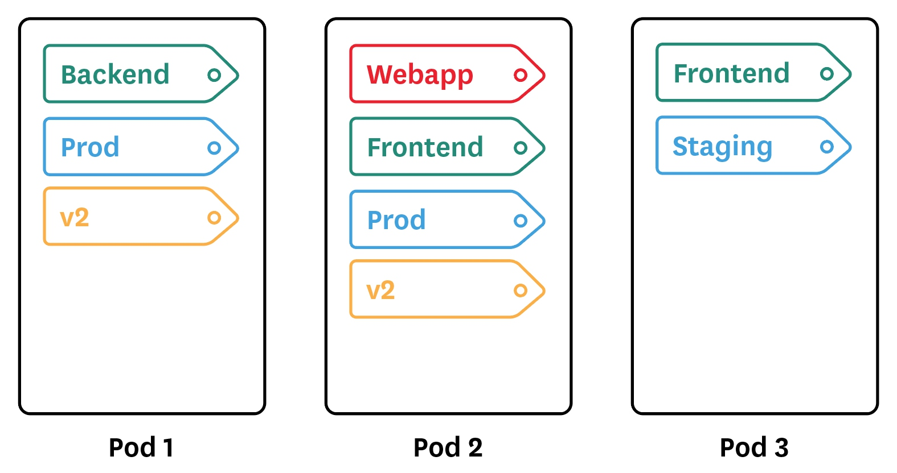
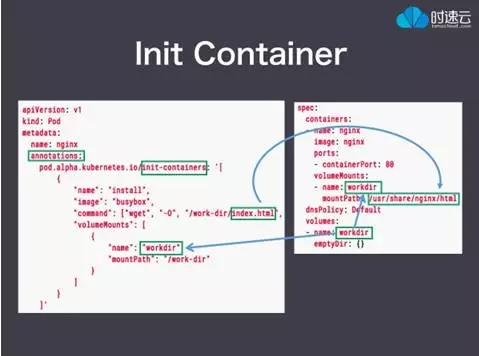
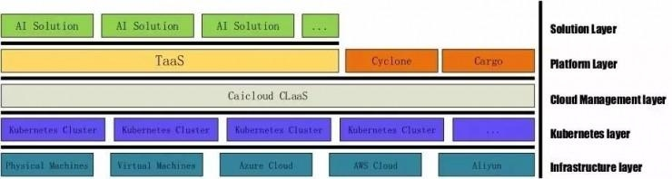
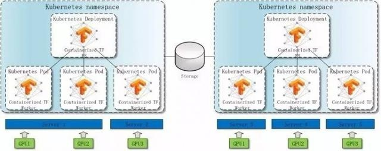
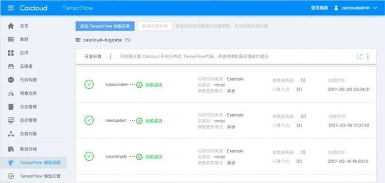
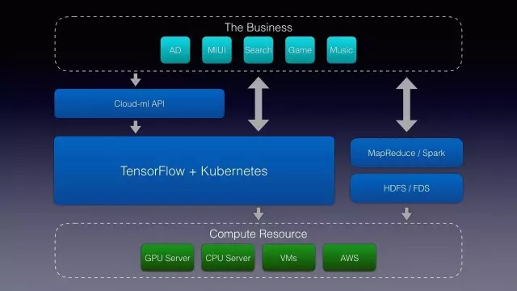
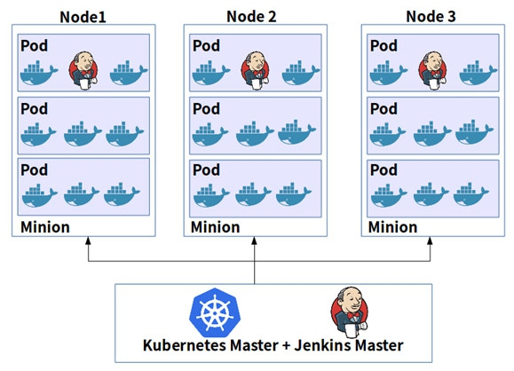
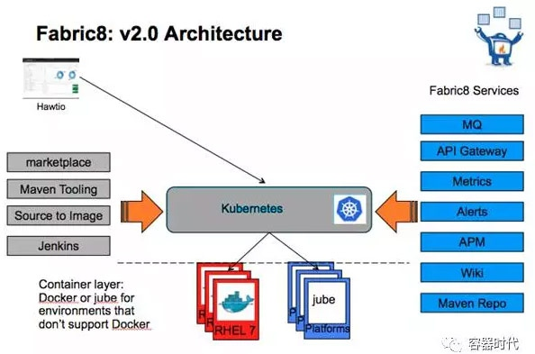
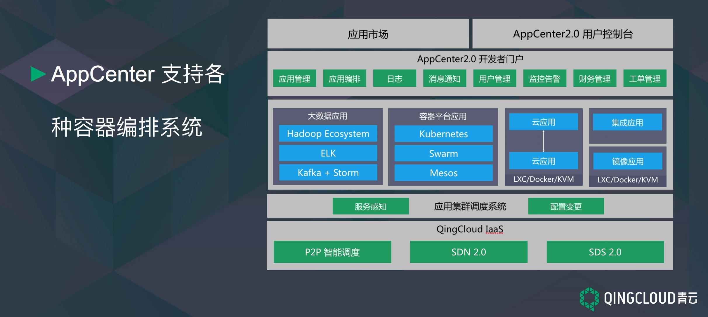
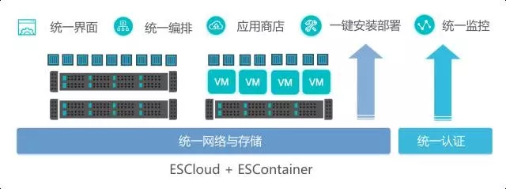

# 优化建议
## Pod和容器配置
当创建一个Pod的时候，你可以为运行在Pod中的容器请求CPU和RAM资源。你还可以设置CPU和RAM资源的限制。请求CPU和RAM资源，在配置文件里面包含**resources:requests字段**。设置CPU和RAM限制包含**resource:limits字段**。如果节点上具有**足够的CPU和RAM资源可用于所有容器要求的CPU和RAM总和**，Kubernetes将**把Pod调度在上面**。同样当容器运行在节点上时，Kubernetes不允许容器消耗的CPU和RAM资源超出指定的容器的限制。如果**容器超出他的RAM限制，他将结束**。**如果CPU超出限制，他将成为CPU节流的候选者**。
**了解CPU和RAM单元**
CPU资源以cpus为单位。允许小数值。你可以用后缀m来表示mili。例如**100m cpu等同于100 milicpu，意思是0.1cpu**。
RAM资源以bytes为单位。你可以将RAM表示为纯整数或具有这些后缀之一的定点整数： E, P, T, G, M, K, Ei, Pi, Ti, Gi, Mi, Ki。例如，以下代表大约相同的数值：
128974848, 129e6, 129M , 123Mi
如果你**不确定**需要请求多少资源，首先你可以发布应用不指定资源，**使用资源监控来确定**合适的值。
如果**容器超出他的RAM限制**，它将**从内存不足状态死亡**。你可以指定比你**期望稍高点的值**来提高可靠性。
如果指定了请求(request)，则保证了可以使用的资源。有关资源的限制和请求可以参考Resource QoS。
如果你没有指定限制和请求
如果没有指定RAM限制，Kubernetes对于容器可以使用的RAM没有上限。容器可以使用所在机器所有的可用RAM资源。类似，**如果没有指定CPU限制，Kubernetes对于CPU资源没有限制，容器可以使用所在机器所有的可用CPU资源**。
默认的限制应用参照默认命名空间的限制范围。你可以使用kubectl describe limitrange limits来查看默认的限制。
关于为什么要指定限制的相信信息，参考 Setting Pod CPU and Memory Limits。
关于如果没有指定CPU和RAM资源请求的发生情况，参考Resource Requests and Limits of Pod and Container。
> 参考- [文档解读 | K8S中的Pod和容器配置（二）](http://mp.weixin.qq.com/s?__biz=MzI4NDYxOTgwMw==&amp;mid=2247483755&amp;idx=1&amp;sn=418ed8bb83454ac158a2634b995cd4ff)


为你的容器应用label， 以便能够多维度的观察你的集群。 作为参考， 你可以为你的应用设置如下的标签：
- Frontend/Backend
- Application (website, mobile app, database, cache…)
- Environment (prod, staging, dev…)
- Team
- Version



关于nodePort的使用
尽量避免使用nodeport， nodeport在集群里是全局占用的，使用nodeport有可能导致调度失败， 可能的原因是：
1. 两个pod要声明占用主机上同样的端口

## init container 
什么是Init Container？

从名字来看就是做初始化工作的容器。可以有一个或多个，如果有多个，这些 Init Container 按照定义的顺序依次执行，只有所有的Init Container 执行完后，主容器才启动。由于一个Pod里的存储卷是共享的，所以 **Init Container 里产生的数据可以被主容器使用到**。

Init Container可以在多种 K8S 资源里被使用到如 Deployment、Daemon Set, Pet Set, Job等，但归根结底都是在Pod启动时，**在主容器启动前执行，做初始化工作**。

我们在什么地方会用到 Init Container呢？

第一种场景是等待其它模块Ready，比如我们有一个应用里面有两个容器化的服务，一个是Web Server，另一个是数据库。其中Web Server需要访问数据库。但是当我们启动这个应用的时候，并不能保证数据库服务先启动起来，所以可能出现在一段时间内Web Server有数据库连接错误。为了解决这个问题，我们可以在运行Web Server服务的Pod里**使用一个Init Container，去检查数据库是否准备好，直到数据库可以连接**，Init Container才结束退出，然后Web Server容器被启动，发起正式的数据库连接请求。

第二种场景是做初始化配置，比如**集群里检测所有已经存在的成员节点，为主容器准备好集群的配置信息**，这样主容器起来后就能用这个配置信息加入集群。

还有其它使用场景，如将pod注册到一个中央数据库、下载应用依赖等。

这些东西能够放到主容器里吗？从技术上来说能，但从设计上来说，可能不是一个好的设计。首先不符合单一职责原则，其次这些操作是只执行一次的，如果放到主容器里，还需要特殊的检查来避免被执行多次。


这个例子创建一个Pod，这个Pod里跑的是一个nginx容器，Pod里有一个叫workdir的存储卷，访问nginx容器服务的时候，就会显示这个存储卷里的index.html 文件。

而这个index.html 文件是如何获得的呢？是由一个Init Container从网络上下载的。这个Init Container 使用一个busybox镜像，起来后，执行一条wget命令，获取index.html文件，然后结束退出。

由于Init Container和nginx容器共享一个存储卷（这里这个存储卷的名字叫workdir），所以在Init container里下载的index.html文件可以在nginx容器里被访问到。

可以看到 Init Container 是在 annotation里定义的。Annotation 是K8S新特性的实验场，通常一个新的Feature出来一般会先在Annotation 里指定，等成熟稳定了，再给它一个正式的属性名或资源对象名。

>  参考 [K8S 老司机 | Kubernetes 有状态集群服务部署与管理（下）](http://mp.weixin.qq.com/s?__biz=MzU1OTAzNzc5MQ==&amp;mid=2247483727&amp;idx=3&amp;sn=485f783756f9539ba8659ee265d2905f&amp;chksm=fc1c2d7fcb6ba46908b2078bed06b34a6aafeb67d2fe50bde3979baaa4d60eaaa67bf7bc2da9&amp;mpshare=1&amp;scene=1&amp;srcid=0424tZbUNKEy8lozNbfHnwEv#rd)


## Service 
**targetPort的值可以是字符串类型，这是暴露port的名称**， 这个设计，为用户的应用部署升级提供了更多的灵活性， 比如用户可以在新版本的pod暴露新的端口（port名称不变）， 此时service就无需重新构建， 从而无需切断客户端连接， 提高应用的可用性。 
在deployment或者pod文件里定义暴露的containerPort的名称， 这样在service里的targetPort就可以使用这个名称了 。


有一类特殊的无选择器的service无需定义endpoint， 它是ExternalName Service
```yml
kind: Service
apiVersion: v1
metadata:
  name: my-service
  namespace: prod
spec:
  type: ExternalName
  externalName: my.database.example.com
```
当你访问这个service时， 会去通过集群dns， 集群的dns会返回一条CNAME的记录， 即my.database.example.com， **这个重定向是发生在dns层的， 没有任何的流量代理或者转发**。 也就是说不是通过主机上的kube-proxy和iptables。 
集群外部的一些服务， 建议以ExternalName的形式管理起来， 但有一点需要注意的是， 这个特性需要kubernetes的1.7版本支持， 或者高版本的kube-dns支持。 


直接用iptables转发， 好处是转发性能更好，更稳定。 缺点是如果一开始选择的pod没有响应，iptables无法选择另外一个pod发起重试。客户端和后端的pod的连接就可能会出现错误连接状态， 除非客户端能够断开连接进行重连。 **这个问题可以通过配置readiness probe来解决**。当你为一个应用配置了准备就绪探针（readiness probe）时，kubelet进程会使用这个探针来判断哪些pod可以开始接受网络请求流量，即是否处于准备就绪状态。 


## 集群部署
用static pod来部署kubernetes的kube-proxy,   kube-scheduler,  kube-controller-manager,  kube-apiserver等组件。其中部署kubernetes的kube-proxy,   kube-scheduler,  kube-controller-manager,  kube-apiserver组件的机器，最好设置为不可调度状态（使用kubectl cordon <node_name> ），防止其它不相干的pod调度到master节点机器上， 影响master的可用性。 

使用daemonset来运行一个需要在每个节点都起来的pod， 比如filebeat， rbd工具等

高可用的建议
- 把apiserver和etcd的数据目录放到可靠的存储上，防止数据丢失
- 主机宕机后能自动重启
- 应用能支持无预期的重启

## service account
- 为serviceaccount关联imagePullSecret，这样所有使用这个serviceaccount的pod， 会自动设置它的imagePullSecret 字段，就不要再一个个手动指定了
>  如何配置可以参考https://kubernetes.io/docs/tasks/configure-pod-container/configure-service-account/#adding-imagepullsecrets-to-a-service-account
# 应用场景
## 应用管理
> 参考  https://feisky.gitbooks.io/kubernetes/apps/ 

目前最常用的是手动管理manifest，比如kubernetes github代码库就提供了很多的manifest示例
- https://github.com/kubernetes/kubernetes/tree/master/examples
- https://github.com/kubernetes/contrib
- https://github.com/kubernetes/ingress
手动管理的一个问题就是繁琐，特别是应用复杂并且Manifest比较多的时候，还需要考虑他们之间部署关系。Kubernetes开源社区正在推动更易用的管理方法，如
- Helm提供了一些常见应用的模版
- operator则提供了一种有状态应用的管理模式
- Deis在Kubernetes之上提供了一个PaaS平台
- Draft是微软Deis团队开源的容器应用开发辅助工具，可以帮助开发人员简化容器应用程序的开发流程
- Kompose是一个将docker-compose配置转换成Kubernetes manifests的工具

## 应用生命周期管理
  -  理解Deployment， 并知道如何进行rolling update 和 rollback
>   滚动升级  kubectl set image deployment/<deployment name>  <container_name>=xxx:v2  ， 如果有一个pod升级失败， 升级会停止。 
>   回滚升级操作  kubectl rollout undo  deployments   <deployment name>
>   查看回滚状态  kubectl rollout status  deployments   <deployment name>
  - 知道各种配置应用的方式
>   kubectl run  --image=<images_name>  <deployment_name>  --port=8080
>   创建编排文件， 然后使用kubectl create -f  <文件名>  创建， 用kubectl replace -f  <文件名> 进行替换更新
  - 知道如何为应用扩容
>     kubectl scale deployments   <deployment name>  --replicas=4 
  - 理解基本的应用自愈相关的内容
>  应用会维持一个稳定的数量，deployment controller会持续监控应用pod的数量， 使其维护在一个设定的数量。 如果发现少于设定数量， 就会自动创建新的应用的pod

要了解这方面的内容， 可以尝试下新手训练营的交互式课程https://kubernetesbootcamp.github.io/kubernetes-bootcamp

### 一般准则
#### 一般准则
- 分离构建和运行环境
- 使用dumb-int等避免僵尸进程
- 不推荐直接使用Pod，而是推荐使用Deployment/DaemonSet等
- 不推荐在容器中使用后台进程，而是推荐将进程前台运行，并使用探针保证服务确实在运行中
- 推荐容器中应用日志打到stdout和stderr，方便日志插件的处理
- 由于容器采用了COW，大量数据写入有可能会有性能问题，推荐将数据写入到Volume中
- 不推荐生产环境镜像使用latest标签，但开发环境推荐使用并设置imagePullPolicy为Always
- 推荐使用Readiness探针检测服务是否真正运行起来了
- 使用activeDeadlineSeconds避免快速失败的Job无限重启
- 引入Sidecar处理代理、请求速率控制和连接控制等问题

#### 分离构建和运行环境

注意分离构建和运行环境，直接通过Dockerfile构建的镜像不仅体积大，包含了很多运行时不必要的包，并且还容易引入安全隐患，如包含了应用的源代码。
可以使用Docker多阶段构建来简化这个步骤。
```dockerfile
FROM golang:1.7.3 as builder
WORKDIR /go/src/github.com/alexellis/href-counter/
RUN go get -d -v golang.org/x/net/html
COPY app.go    .
RUN CGO_ENABLED=0 GOOS=linux go build -a -installsuffix cgo -o app .

FROM alpine:latest
RUN apk --no-cache add ca-certificates
WORKDIR /root/
COPY --from=builder /go/src/github.com/alexellis/href-counter/app .
CMD ["./app"]
```

#### 僵尸进程和孤儿进程

孤儿进程：一个父进程退出，而它的一个或多个子进程还在运行，那么那些子进程将成为孤儿进程。孤儿进程将被init进程(进程号为1)所收养，并由init进程对它们完成状态收集工作。
僵尸进程：一个进程使用fork创建子进程，如果子进程退出，而父进程并没有调用wait或waitpid获取子进程的状态信息，那么子进程的进程描述符仍然保存在系统中。
在容器中，很容易掉进的一个陷阱就是init进程没有正确处理SIGTERM等退出信号。这种情景很容易构造出来，比如
```shell
# 首先运行一个容器
$ docker run busybox sleep 10000

# 打开另外一个terminal
$ ps uax | grep sleep
sasha    14171  0.0  0.0 139736 17744 pts/18   Sl+  13:25   0:00 docker run busybox sleep 10000
root     14221  0.1  0.0   1188     4 ?        Ss   13:25   0:00 sleep 10000

# 接着kill掉第一个进程
$ kill 14171
# 现在会发现sleep进程并没有退出
$ ps uax | grep sleep
root     14221  0.0  0.0   1188     4 ?        Ss   13:25   0:00 sleep 10000

```
解决方法就是保证容器的init进程可以正确处理SIGTERM等退出信号，比如使用dumb-init
```shell
$ docker run quay.io/gravitational/debian-tall /usr/bin/dumb-init /bin/sh -c "sleep 10000"
```


##  大数据
##   深度学习
### 案例1



### 案例2
[2.12 K8S Meetup 回顾｜小米·陈迪豪《深度学习模型应用与实践》](https://mp.weixin.qq.com/s?__biz=MzIzMzExNDQ3MA==&amp;mid=2650093132&amp;idx=1&amp;sn=9d2e8685a665a8140b15ae8ce861a226)
目前主流的深度学习框架，无论是大家用的 TF，或者 Caffe，他们都是 library，没有解决分布式任务的调度和资源隔离问题，大部分应用也是运行在单机上的。我们认为。这可能是一种倒退，认为下一个阶段应该是云深度学习。我们需要一个云平台来解决我们深度学习框架本身的调度以及分布式计算。然后我们开发了 Cloud Machine Learning 平台。它大概的架构是这样的：



##  CI/CD





##  区块链
##  AppCenter


## 微服务

## 容器服务
### 案例1
[EasyStack发布容器，成为中国首个OpenStack+K8S专业开源企业](https://mp.weixin.qq.com/s?__biz=MzA3MjQxMjcxNQ==&amp;mid=2649232237&amp;idx=1&amp;sn=276abca704f42107adc461f7dbdf80db)
北京3月29日17点，中国开源云计算的领导者EasyStack（北京易捷思达科技发展有限公司）在德国柏林举行的CloudNativeCon+KubeCon容器大会上，正式发布基于Kubernetes技术的容器集群产品ESContainer。此举使得EasyStack同红帽、Mirantis一道成为全球三大同时具备OpenStack和Kubernetes（K8S）产品的专业开源企业，也是中国首个OpenStack+Kubernetes专业开源企业。
ESContainer 面向应用角度设计，自身提供应用管理服务，方便用户在平台中集中管理发布容器化应用；对于有状态应用场景进行优化，方便用户构建多层微服务化应用；支持无 Overlay 纯二层网络等多种网络方案，容器应用与虚拟化应用网络直通；增强监控与日志，面对庞大的容器集群，ESContainer还提供了增强的多级的监控、日志管理。

ESContainer 面向企业级容器化应用的管理和编排场景，产品提供包括自动化部署、强化的管理界面、应用商店，多级监控、支持虚拟机、可视化编排、物理机资源池的混合部署，并且与EasyStack的企业级OpenStack平台ESCloud 深度融合，无缝的使用 ESCloud 提供的计算、网络和存储资源以及丰富的软件基础设施，为云计算从以资源为中心到以应用为中心打通了最后一公里。

值得一提的是，EasyStack云计算内核ESCore 还专门为ESContainer进行裁剪与优化、提供适合容器运行的定制化操作系统，能够为容器集群带来更高密度的运行能力，同时提供了更加稳定高效的底层环境。
ESContainer最大的特色是能够让Kubernetes与OpenStack深度融合,带来1+1>2的能力：ESCloud 专注于数据中心基础设施的管理和支撑传统应用业务的运行，ESContainer专注于为企业新型应用的改造提供一站式平台，两者结合优势互补，成为新型的异构数据中心基础设施平台，为企业提供创新源动力。


1）ESContainer和ESCloud融合，Kubernetes 使用 OpenStack Keystone 作为用户管理系统，用 Keystone 作为统一用户管理平台，打通两个平台的认证体系。

2）ESContainer可使用 OpenStack Cinder 卷作为持久存储后端，这样能充分利用OpenStack 中已广泛支持的开源或主流商业存储设备，为容器提供持久存储能力，弥补目前 Kubernetes 对商业存储设备支持力度不够的问题。

3）ESContainer可使用Neutron LoadBalancer 作为服务的外部负载均衡器，充分提供对外服务的高可用性。

4）ESContainer可直接使用 Neutron 二层网络作为网络驱动，用 Neutron 统一管理虚拟机和容器网络，减少多层 Overlay 带来的性能损失；同时由于虚拟机和容器处于同一个子网中，可做到虚拟机和容器应用的二层网络直通，适用于企业中传统业务和云原生业务共存并需要直接数据交换的场景。

5）ESContainer可在裸金属以及虚机中部署容器集群，可根据容器集群的整体负载情况，快速弹性扩缩不同级别的资源池。

此外，ESContainer还可使用 Ceph 作为持久存储后端，为容器提供持久数据卷存储。

这是继今年1月EasyStack获得5000万美元C轮融资、创中国开源领域最大单笔融资之后的首次重大产品发布，使得EasyStack具备了Openstack+kubernetes的开源云计算能力，从而更好地满足企业用户的云计算需求。


# 公司列表
这部分内容统计在生产或者开发环境中使用kubernetes的公司或者机构
```table
|公司名称|产品|环境|参考来源|备注|
|普元|SEM|生产环境|[Flannel+K8s容器网络通信实践](http://chuansong.me/n/556535752235)||
|小米科技|Cloud Machine Learning 平台|生产环境|[2.12 K8S Meetup 回顾｜小米·陈迪豪《深度学习模型应用与实践》](https://mp.weixin.qq.com/s?__biz=MzIzMzExNDQ3MA==&amp;mid=2650093132&amp;idx=1&amp;sn=9d2e8685a665a8140b15ae8ce861a226)||
|  EasyStack   |   容器集群产品ESContainer  |  生产环境    | [EasyStack发布容器，成为中国首个OpenStack+K8S专业开源企业](https://mp.weixin.qq.com/s?__biz=MzA3MjQxMjcxNQ==&amp;mid=2649232237&amp;idx=1&amp;sn=276abca704f42107adc461f7dbdf80db)    |     |
|     |     |      |     |     |
|     |     |      |     |     |
|     |     |      |     |     |
|     |     |      |     |     |
|     |     |      |     |     |
|     |     |      |     |     |
|     |     |      |     |     |
|     |     |      |     |     |
|     |     |      |     |     |
|     |     |      |     |     |
|     |     |      |     |     |
|     |     |      |     |     |
```
# 参考文献
- [2.12 K8S Meetup 回顾｜小米·陈迪豪《深度学习模型应用与实践》](https://mp.weixin.qq.com/s?__biz=MzIzMzExNDQ3MA==&amp;mid=2650093132&amp;idx=1&amp;sn=9d2e8685a665a8140b15ae8ce861a226)
- [EasyStack发布容器，成为中国首个OpenStack+K8S专业开源企业](https://mp.weixin.qq.com/s?__biz=MzA3MjQxMjcxNQ==&amp;mid=2649232237&amp;idx=1&amp;sn=276abca704f42107adc461f7dbdf80db)
- [文档解读 | K8S中的Pod和容器配置（二）](http://mp.weixin.qq.com/s?__biz=MzI4NDYxOTgwMw==&amp;mid=2247483755&amp;idx=1&amp;sn=418ed8bb83454ac158a2634b995cd4ff)
- [K8S 老司机 | Kubernetes 有状态集群服务部署与管理（下）](http://mp.weixin.qq.com/s?__biz=MzU1OTAzNzc5MQ==&amp;mid=2247483727&amp;idx=3&amp;sn=485f783756f9539ba8659ee265d2905f&amp;chksm=fc1c2d7fcb6ba46908b2078bed06b34a6aafeb67d2fe50bde3979baaa4d60eaaa67bf7bc2da9&amp;mpshare=1&amp;scene=1&amp;srcid=0424tZbUNKEy8lozNbfHnwEv#rd)
-  [Kubernetes应用管理](https://feisky.gitbooks.io/kubernetes/apps/)
- 
[Kubernetes生产环境经验告诉你如何实现蓝绿部署和负载均衡](http://www.tuicool.com/articles/6R73qmn)
[基于kubernetes的docker集群实践](https://segmentfault.com/a/1190000002978115)
[搜狐基于Docker+Kubernetes的一站式运维管理实践](http://dockone.io/article/1195)
[中国移动Kubernetes多集群统一管理实践](http://mp.weixin.qq.com/s?src=3&timestamp=1473267083&ver=1&signature=OatXtRvD9i*enjvx5hjUzvcmO1eAHWhHM8Jl9jKCv-vGVHzW*Yl1pEji4Y1zgOEJZxqF-eZ9EeKo1vnOz2txzTO5L58nfYC9gEvaIEzDuMddTwolBCpLaTCKWDS1t5pgyNxrYG78qpTwetdJZE3WalehqdVO9433u-l4A-HQrIg=)
[为什么选择Kubernetes作为云平台的微服务治理框架](http://oicwx.com/detail/920759)
[7个选择Kubernetes作为你的Docker编排工具的理由](https://caicloud.io/article_detail/573d8b1a8241681100000029)
[Docker和容器云落地一年后的反思](https://caicloud.io/article_detail/579339561d51bc0000000001)
[Kubernetes 部署的最佳安全实践](http://golangtc.com/t/57e1f0dab09ecc16350001f3)
[kubernetes用户指南（三）--在生产环境中使用Pod来工作、管理部署](http://blog.csdn.net/qq1010885678/article/details/49156557)
[Kubernetes在企业中的场景运⽤及管理实践](https://mp.weixin.qq.com/s?__biz=MjM5MDE0Mjc4MA==&mid=2650994231&idx=2&sn=8dc1154c12deea310e0e3ab35b9f5bae&chksm=bdbf0e648ac88772b0243937e3a4ee7c0934df51a2a3b272613252ad8bcd7428b91c9fe65f61&scene=1&srcid=0925w2ldytrYLW212dj0VUrd&pass_ticket=2DOJESo0Kwd8Z%2FQ5jqP%2FpIi8ARv5iFYaQqX07CYhofpkljDdR3tj2hnwZGFSFdR9#rd)  ＊＊＊＊＊
[Kubernetes 落地案例｜在线课程平台 Descomplica 使用 Kubernetes 5 个月的体验](http://www.dockone.io/article/1720)
[Kubernetes在华为全球 IT 系统中的实践](http://mp.weixin.qq.com/s?src=3&timestamp=1475252740&ver=1&signature=hnfE5gSqelOHkKBJrHwnWQ-Xmh0l94N5-9pK-dJXorMaTEjlIkAtTZNP2nV25sCp2XM0-dkDbmvUeVLbjBTrEmZ1EwHzjrNPnMbLaWNXxQIxH0iz-qqdXYf2S5qAQLT*eYuRa6QOIXxkdBbo*DK0JjHzIP9c*DGCXqnYdwN6ppA=)
[使用Kubernetes快速部署Redis主从集群](http://www.dockerinfo.net/1062.html)
[惠普基于Kubernetes的容器私有云平台实践 | 视频](http://www.kubernetes.org.cn/308.html)
[Docker 与 Kubernetes（k8s） 在企业基础设施服务的应用](http://www.kubernetes.org.cn/361.html)
[编排管理成容器云关键，Kubernetes和Swarm该选谁](https://blog.c.163.com/2016/11/735/)
[基于万节点Kubernetes支撑大规模云应用实践](https://blog.c.163.com/2016/12/834/)
[乐视云基于Kubernetes的PssS平台建设](http://www.dockone.io/article/2077)
[百分点大规模Kubernetes集群实践](http://geek.csdn.net/news/detail/132869)
[how-to-easily-deploy-gitlab-on-kubernetes/](http://blog.lwolf.org/post/how-to-easily-deploy-gitlab-on-kubernetes/) ＊＊＊＊＊
[中小型团队的容器化之路](http://www.dockone.io/article/2145)
[如何在Kubernetes中部署一个高可用的PostgreSQL集群环境](http://www.dockone.io/article/2143)
[Kubernetes 架构浅析](http://mp.weixin.qq.com/s?__biz=MzA4NjgwMDQ0OA==&amp;mid=2652445483&amp;idx=2&amp;sn=d06260fde5720261319449d3c0b8819b&amp;mpshare=1&amp;scene=1&amp;srcid=1221OaXQmYu03Rny8xD8bKgr#rd)
[网易蜂巢基于万节点kubernetes支撑大规模云应用实践](http://mp.weixin.qq.com/s?__biz=MzI4MjE3MTcwNA==&amp;mid=2664335089&amp;idx=1&amp;sn=74e8dee47b1760828e1e487822a9859f&amp;chksm=f0a426a6c7d3afb01ebc5fb4615718785178fd1f29d4655965fc21fb1c6da36f517ce34e90b5&amp;mpshare=1&amp;scene=1&amp;srcid=1231ACwfFfSjo4YnhzSHURI9#rd)
[“Kubernetes 大咖秀” 来了！K8S 代码贡献＃6 美国 Google 工程师徐超与你面对面](http://mp.weixin.qq.com/s?__biz=MzIzMzExNDQ3MA==&amp;mid=2650092740&amp;idx=1&amp;sn=a7ea170190084983cfa024cb03ed50e5&amp;chksm=f08b0acdc7fc83dbd762d6434812555cbf7d00c4ccd484f41ffc6ae91f92e2e8f8c1fedd4573&amp;mpshare=1&amp;scene=1&amp;srcid=0105eJeCtCfFFJPqQh7N04j9#rd)
[一个适合 Kubernetes 的最佳网络互联方案](http://mp.weixin.qq.com/s?__biz=MzA5OTAyNzQ2OA==&amp;mid=401981281&amp;idx=1&amp;sn=c05ef3ff11f34069d644faca9624fc8f&amp;mpshare=1&amp;scene=1&amp;srcid=0319f4EPc2xDApml757SUKYA#rd)
[干货|你想要的百分点大规模Kubernetes集群的应用实践来了](http://mp.weixin.qq.com/s?__biz=MjM5MzI5NjY2MA==&amp;mid=2653782073&amp;idx=1&amp;sn=6db70559acabae67e35e13af7883e1d5&amp;chksm=bd4018428a37915415ffda36c4f9f5e31088063ef3ad83e325d3e4ecd4eccf8d202709ac9629&amp;mpshare=1&amp;scene=1&amp;srcid=0111IA2MIVm9sHcrkqtHWyXA#rd)
[百分点大规模Kubernetes集群实践](http://mp.weixin.qq.com/s?__biz=MjM5MjAwODM4MA==&amp;mid=2650687969&amp;idx=3&amp;sn=0c02e40daaa3ac3adbd6d3c1f159d83b&amp;chksm=bea6383289d1b12473eca5e26df47be4487f839078ec4df422a5a9a9d105c0a3e78a9b71b3bb&amp;mpshare=1&amp;scene=1&amp;srcid=010627DquL1Q0WvAPXErdSkm#rd)
[Kubernetes 有状态集群服务部署与管理](http://mp.weixin.qq.com/s?__biz=MzA5OTAyNzQ2OA==&amp;mid=2649693076&amp;idx=1&amp;sn=944d9f3d51e78f8a739e4a25e17d7a60&amp;chksm=889324f7bfe4ade11cc38ad03ef2bb30df1bb1cb9a1e3a94e873905654edf36694ed2452f689&amp;mpshare=1&amp;scene=1&amp;srcid=0118xeRPS88vQUBtZkh4gJFW#rd)
[百度研究院在 Kubernetes 上跑深度学习框架 PaddlePaddle](http://mp.weixin.qq.com/s?__biz=MjM5MzM3NjM4MA==&amp;mid=507197352&amp;idx=1&amp;sn=62086e16c0801fb994ee5cb34727e08f&amp;chksm=3d5866bb0a2fefad3c51d6ea87e9221852f2e9994aa59eccd245c8912f764fea965f15f283fe&amp;mpshare=1&amp;scene=1&amp;srcid=02093jemnvc30dGhkKnQ3JGp#rd)
[跑在Kubernetes上的开源深度学习，百度这次带来了哪些技术看点？](http://mp.weixin.qq.com/s?__biz=MjM5MDE0Mjc4MA==&amp;mid=2650995509&amp;idx=1&amp;sn=495eea059600f127f0e6ca0305438c7d&amp;chksm=bdbf03668ac88a70ecbd1fd83713234011d5b3a400cd2f74662dffe31a81395ed43510dbb6e2&amp;mpshare=1&amp;scene=1&amp;srcid=0227ZXFUrj4Ym5lHxouxmy7f#rd)
[京东从 OpenStack 改用 Kubernetes 的始末](http://mp.weixin.qq.com/s?__biz=MjM5MzM3NjM4MA==&amp;mid=2654681181&amp;idx=2&amp;sn=72f59d36cc2426c909a673bf32cb0561&amp;chksm=bd58694e8a2fe0589d8438199320b0a7835f4c556cacb857b4096b37cb27d3a019a08ec09b16&amp;mpshare=1&amp;scene=1&amp;srcid=0220rYGJJNskj6AYrFOcDRjf#rd)
[2016年容器技术思考: Docker, Kubernetes, Mesos将走向何方?](http://mp.weixin.qq.com/s?__biz=MzAwMDU1MTE1OQ==&amp;mid=2653548284&amp;idx=1&amp;sn=9243449fac7e86342f84da3a6a87453c&amp;chksm=813a7f64b64df6728b15072640657b9642aa87a0bc30107becffc890125d32d8ff4dd091c9bf&amp;mpshare=1&amp;scene=1&amp;srcid=0223VH60JzDOy6JaNBEvZOox#rd)
[Kubernetes和微服务的需求层次（马斯洛理论解读版）](http://mp.weixin.qq.com/s?__biz=MzIyMjQ2Mjc1NQ==&amp;mid=2247484333&amp;idx=1&amp;sn=a53332c51a440e1a744a14aa63c0a4d7&amp;chksm=e82c55e1df5bdcf7726ad01277a9dbae3a80c134a9526142125c11597c386fc9c6701ff0732d&amp;mpshare=1&amp;scene=1&amp;srcid=0227LoGZK8HbnCOU2Lgc3xE4#rd)
[【干货-容器系列】Kubernetes调度核心解密:从Google Borg说起](http://mp.weixin.qq.com/s?__biz=MzA3NzUwMDg1Mg==&amp;mid=2651292356&amp;idx=1&amp;sn=cac4ca388f2ae81ddcf62cc5196e4fb5&amp;chksm=84a23a1fb3d5b309485f5e1b91a82574a9be9851ccceec255c9dbbf4ad561c48a594ccc1107c&amp;scene=0#rd)
[才云工程师原创｜Kubernetes dynamic provisioning 及 glusterfs 对接](http://mp.weixin.qq.com/s?__biz=MzIzMzExNDQ3MA==&amp;mid=2650093216&amp;idx=1&amp;sn=a8f1e40987a2f28310d5d5c6765798c3&amp;chksm=f08b08a9c7fc81bf25dc4d71f81305bc470b62fd7c77d0290edb940dfe115d1c6b1da66dd882&amp;mpshare=1&amp;scene=1&amp;srcid=0302H5W5FEdFEVE2WElPlUBr#rd)
[容器、Docker与Kubernetes——什么是Kubernetes以及它是如何使得容器化基础设施变得简单](http://mp.weixin.qq.com/s?__biz=MzA5OTAyNzQ2OA==&amp;mid=2649693460&amp;idx=1&amp;sn=2be4b4a04fadbfd5cfcc66397c9c0e4e&amp;chksm=88932277bfe4ab61c997f5d9cf5d344ff4f8c5c372a1fb6c31655d28a8a803f6536816c60c58&amp;mpshare=1&amp;scene=1&amp;srcid=0303h8afXSG4fQOMjQlKUFUP#rd)
[一键部署基于 Kubernetes 的私有容器云](http://mp.weixin.qq.com/s?__biz=MjM5MzM3NjM4MA==&amp;mid=2654681408&amp;idx=3&amp;sn=3cfb06ec43315236288fd2240538fa18&amp;chksm=bd5868538a2fe14546aecb0a703c743ea01587e2db39311794ad371d28fe3e7f1081a55c6310&amp;mpshare=1&amp;scene=1&amp;srcid=0306IMDh0eQgox5WRf4puVT3#rd)
[管理数万个实例，服务上百个业务：kubernetes在腾讯游戏的使用及演进历程](http://mp.weixin.qq.com/s?__biz=MzAwMDU1MTE1OQ==&amp;mid=2653548329&amp;idx=1&amp;sn=492072ce2ec0242343a0aa8a1db06502&amp;chksm=813a7eb1b64df7a75c846cbdf009c59c8bf3c49d91534b79eaf4a7b974b83f0505c2a9e4ef1a&amp;mpshare=1&amp;scene=1&amp;srcid=0310Zh9bGbg23nftGi2oopLm#rd)
[Kubernetes集群中的网络](http://mp.weixin.qq.com/s?__biz=MzA5OTAyNzQ2OA==&amp;mid=2649693541&amp;idx=1&amp;sn=e15d24726408a7122a6fd232c3ec27f9&amp;chksm=88932206bfe4ab1052d45e0b102573d02e017ac2ea21ad29e2cf19c48a28eeffac97b34727aa&amp;mpshare=1&amp;scene=1&amp;srcid=0312gsgbPTQZLwPoPhhwBNot#rd)
[In or Out? Kubernetes一统江湖的野心 - 写在Kubernetes 1.6即将发布之际 · 极术](https://jishu.io/kubernetes/in-or-out/?nsukey=LwSAgecjCu1xH9OfKEolAyPUyR61oH4wRcA0qvw%2BtaOIyC64plg%2FXuHBOAS54Phbv3g1T0x0mC2QX7u2ruJn48NSvmmkWlSZB3fQ7%2BNHd1Qd9NQWwUOl91w8FIoDUEtd0M0rgv4s19Z5%2FX%2FBwv3qjI10SFg8wq4gYyZMBDV2STDmZzxd8tgyeaRbb0%2Fi2Dnn&amp;from=groupmessage&amp;isappinstalled=0)
[Kubernetes 1.6 正式发布：大规模处理多用户多工作负载！](http://mp.weixin.qq.com/s?__biz=MjM5MzM3NjM4MA==&amp;mid=507198243&amp;idx=1&amp;sn=6859acfecb2262b51b76a5c6c158fe15&amp;chksm=3d586a300a2fe3264074e838228409d6f98dcd424b75341d9aef124ee755eb0e52a51af53d81&amp;mpshare=1&amp;scene=1&amp;srcid=032949mux95IQyxN50hK2MW2#rd)
[Kubernetes Operators: Growing the Ecosystem With Rook, Elasticsearch, Kafka and More](https://coreos.com/blog/kubernetes-operators-ecosystem.html?from=timeline&amp;isappinstalled=0)
[Rook存储：Kubernetes中最优秀的存储](http://mp.weixin.qq.com/s?__biz=MzA5OTAyNzQ2OA==&amp;mid=2649693643&amp;idx=1&amp;sn=0a31f9c1ce50bb81a477ba8f92c4ba73&amp;chksm=889322a8bfe4abbe589d7e8410f674a0cedd02ee4db879cd434fd2a19bb157334b18c9f7fb73&amp;mpshare=1&amp;scene=1&amp;srcid=0327C0ul2OajJSE97cNr2UlC#rd)
[用Harbor和Kubernetes构建高可用企业级镜像仓库](http://mp.weixin.qq.com/s?__biz=MzAwNzUyNzI5Mw==&amp;mid=2730790450&amp;idx=1&amp;sn=227c979cbf8726f08c2a7bc87942c2b6&amp;chksm=bc4ce0208b3b6936a367cfcd72bf82a1745603a5b5543d07467c9998f491dcf3b0b2b328ff07&amp;mpshare=1&amp;scene=1&amp;srcid=0329f7MOEBFKq9hb27pYiUcf#rd)
[Kubernetes 1.6：大规模的多用户、多负载支持](http://mp.weixin.qq.com/s?__biz=MzA5OTAyNzQ2OA==&amp;mid=2649693672&amp;idx=1&amp;sn=a2cbf5fe41033cb04fc788967b681da0&amp;chksm=8893228bbfe4ab9d72bb02179a1aa94e1de428471e4ab46000e23d5d830eb045809c782d9486&amp;mpshare=1&amp;scene=1&amp;srcid=0330rmLev6tLErrKpwopPfcB#rd)
[技术干货|使用 Kubernetes 管理容器化的有状态应用](http://mp.weixin.qq.com/s?__biz=MzIzMzExNDQ3MA==&amp;mid=2650093469&amp;idx=1&amp;sn=17b2947800ad48b94b8245d02543c1fc&amp;chksm=f08b0994c7fc8082ce751859e7eb0dc4529435fae988821c9119082afad11158d0046fe0ef71&amp;mpshare=1&amp;scene=1&amp;srcid=0407VM4sXFdy79tGR4MOpqyr#rd)
[有一种信徒，叫 Kubernetes！](http://mp.weixin.qq.com/s?__biz=MzU1OTAzNzc5MQ==&amp;mid=2247483662&amp;idx=1&amp;sn=0e67fd9636877ad59f80fd49f02a5b07&amp;chksm=fc1c2d3ecb6ba428d934998d3a9a9828ecaaa84b9184e3a0d37ab7876f7e1b4d54af9ce90dc0&amp;mpshare=1&amp;scene=1&amp;srcid=0411ENZJYv7VlYyiZQXNLc7J#rd)
[管理5000个节点，Kubernetes的目标是星辰大海 - KubeCon核心精神回顾](http://mp.weixin.qq.com/s?__biz=MzIyOTgyMDMyMg==&amp;mid=2247483715&amp;idx=1&amp;sn=18b13d3ea84f2eb35734b859efcdd4e0&amp;chksm=e8bd938edfca1a988ec967322773d3a23ea681e4edeb4416d122bd0db1681b6a60cbe4e73d7c&amp;mpshare=1&amp;scene=1&amp;srcid=0411kyL1BTqGC28oTzDOSjF4#rd)
[【雷锋网】离开谷歌云回国创业，他们想将AI与Kubernetes结合革新传统行业-今日头条](https://m.toutiao.com/i6408029079865393666/?tt_from=weixin&amp;utm_campaign=client_share&amp;app=news_article&amp;utm_source=weixin&amp;iid=8972017290&amp;utm_medium=toutiao_ios&amp;wxshare_count=10&amp;pbid=1491905485&amp;from=timeline&amp;isappinstalled=0)
[CloudNativeCon和KubeCon大会摘要：Kubernetes 1.6、Docker、CoreOS、捐赠以及资格认证](http://www.infoq.com/cn/news/2017/04/cloudnativecon-kubecon-1?from=timeline&amp;isappinstalled=0)
[Kubernetes与微服务的层次要求](http://mp.weixin.qq.com/s?__biz=MzA5OTAyNzQ2OA==&amp;mid=2649693806&amp;idx=1&amp;sn=909fd61f8ee0046582690d4c8d5327e8&amp;chksm=8893210dbfe4a81ba75ecd127f15f58293b309da889fe0d581551c5457aa493d47c5d67b1888&amp;mpshare=1&amp;scene=1&amp;srcid=0416tLx8pUVk6rtXXhhFxjJb#rd)
[谁才有资格来装点 Kubernetes 这幢豪宅？](http://mp.weixin.qq.com/s?__biz=MzIzMzExNDQ3MA==&amp;mid=2650093496&amp;idx=1&amp;sn=daf220602e914e2dc2f46cb2b9572a51&amp;chksm=f08b09b1c7fc80a7328a8171966ac894a962b658e63a8a0ae45828ccac2f1e94476f1926504d&amp;mpshare=1&amp;scene=1&amp;srcid=0418VM7swENjA5IEeWiV8t82#rd)
[K8S 弹药库 | Kubernetes 有状态集群服务部署与管理（上）](http://mp.weixin.qq.com/s?__biz=MzU1OTAzNzc5MQ==&amp;mid=2247483722&amp;idx=2&amp;sn=a8ec119efcf1a5a9c8ab9c04185df1e1&amp;chksm=fc1c2d7acb6ba46cffa1e1c77ac632aa4661de1fd1c48323986463882c971e6a2922a4bc2aa0&amp;mpshare=1&amp;scene=1&amp;srcid=04212ZmcJoz5fSQhSljVunu4#rd)
[Kubernetes 1.6 | 企业的福音！](http://mp.weixin.qq.com/s?__biz=MzU1OTAzNzc5MQ==&amp;mid=2247483727&amp;idx=1&amp;sn=fd8a469fca92c9cadeeeb552a3aa6491&amp;chksm=fc1c2d7fcb6ba4691e262cd8130ddf92c3a42e94e4d02547d1d2194be0c1d268cfb6840b5742&amp;mpshare=1&amp;scene=1&amp;srcid=0424OrEF9ndDY55Yn5EkudX7#rd)
[一键部署kubernetes1.6高可用集群](http://mp.weixin.qq.com/s?__biz=MzIyMDUxMTY2MQ==&amp;mid=2247484399&amp;idx=1&amp;sn=f12785f8e26e2787a96f59dd4f72d9ea&amp;chksm=97cbaf2da0bc263b1439f9ffe0fd42df259a1715aba66dcf65653a56d203ecc1c3e240f934f9&amp;mpshare=1&amp;scene=1&amp;srcid=042425aeXHZAz4czEWYJZ2qr#rd)
[基于Neutron的Kubernetes SDN实践经验之谈](http://mp.weixin.qq.com/s?__biz=MzA5OTAyNzQ2OA==&amp;mid=2649693914&amp;idx=1&amp;sn=19fda53b4afd626bdc8ad0141e9f7a9b&amp;chksm=889321b9bfe4a8af3c4d9b78e8c299893e49d33e71d878d3fbb0324f468aebaf08efa7b35deb&amp;mpshare=1&amp;scene=1&amp;srcid=0428luoASGP9HYZD8M0mjgIW#rd)
[干货│Kubernetes Storage Management @eBay](http://mp.weixin.qq.com/s?__biz=MzA3MDMyNDUzOQ==&amp;mid=2650502815&amp;idx=1&amp;sn=fc48af922aec8adbf3b0539635bceeec&amp;chksm=87314ecbb046c7dd3ddac3e3922d32c1e00004bb1905355f93ceabf682e4cf5ad4fc777d7651&amp;mpshare=1&amp;scene=1&amp;srcid=0430D9f5BaP7lAOXHfVsKfXC#rd)
[企业新混合云时代，Docker 和 Kubernetes 是最佳伴侣！](http://mp.weixin.qq.com/s?__biz=MzU1OTAzNzc5MQ==&amp;mid=2247483790&amp;idx=1&amp;sn=912a2dc3ed87744e4ab71220f098c1b2&amp;chksm=fc1c2dbecb6ba4a8ebb11f5e59ec7a7bf272c83d11767f5628c6c58c5917b4c023d606910774&amp;mpshare=1&amp;scene=1&amp;srcid=0503m5NYhif8SdoulwZijzDm#rd)
[GitHub - rootsongjc/distributed-load-testing-using-kubernetes: Kubernetes的分布式负载测试](https://github.com/rootsongjc/distributed-load-testing-using-kubernetes)
[干货 | 青云QingCloud容器平台负责人王渊命：青云容器及Kubernetes实践](http://mp.weixin.qq.com/s?__biz=MzIxODQxMjc0MA==&amp;mid=2247485204&amp;idx=3&amp;sn=f5f5a936cc4fe780d99eaa19c1e578a4&amp;chksm=97eba4bfa09c2da9579fab1166e0ead1fdeca935adf5978fc08e05be1652dc27df602f9c02fa&amp;mpshare=1&amp;scene=1&amp;srcid=0505my84LIIvFbPpU4Meslcj#rd)
[在生产环境中使用Kubernetes部署可编程的基础设施](http://mp.weixin.qq.com/s?__biz=MzI0NjI4MDg5MQ==&amp;mid=2715290926&amp;idx=1&amp;sn=f4fe2e6e8a81977d003fa888232713b8&amp;chksm=cd6d0afafa1a83ec78329ba0e6d1079008c8a3919f75238ce2808877bf7055c4db5b8021adb8&amp;mpshare=1&amp;scene=1&amp;srcid=0507ovBzSxa8e3Ar4sQnl9uL#rd)
[Kubernetes 是如何实现资源共享的](http://mp.weixin.qq.com/s?__biz=MzA5OTAyNzQ2OA==&amp;mid=2649693983&amp;idx=1&amp;sn=df654aff302afb86e779c370bc9d6393&amp;chksm=8893207cbfe4a96a5ab578f85ab363a8699a9698cb8b24d76f8d86240439b773d571b1d66203&amp;mpshare=1&amp;scene=1&amp;srcid=0508hFTzqceOhqMUxXptmZ1d#rd)
[K8sMeetup 成都视频+PPT｜才云唐鹏程：用 Prometheus 来监控你的 Kubernetes 集群](http://mp.weixin.qq.com/s?__biz=MzIzMzExNDQ3MA==&amp;mid=2650093610&amp;idx=1&amp;sn=18e2ebf4a40147f189407c5bb40a224f&amp;chksm=f08b0623c7fc8f354799809fbbe3c3d98deccb7f7069e86ecf1715b4944a85490c9a48429a39&amp;mpshare=1&amp;scene=1&amp;srcid=0510DmHHeXzu6iXQmccdZZWs#rd)
[K8S Meetup成都站视频+PPT分享｜ IBM马达：Kubernetes 中基于策略的资源分配](http://mp.weixin.qq.com/s?__biz=MzIzMzExNDQ3MA==&amp;mid=2650093569&amp;idx=1&amp;sn=310c11d5b6243f81e45a728928959fc7&amp;chksm=f08b0608c7fc8f1e793643b488881e5d0fa183b891b6c49aaef348a11427ba3f263b003b27d9&amp;mpshare=1&amp;scene=1&amp;srcid=0508XS4ZJCwAy2enEOXMNGsc#rd)
[DTCC2017|黄东旭：《When TiDB Meets Kubernetes》](http://mp.weixin.qq.com/s?__biz=MzI3NDIxNTQyOQ==&amp;mid=2247484812&amp;idx=1&amp;sn=fed51cdf959eb342eb2ca11098f9c2fa&amp;chksm=eb1622e6dc61abf056f8ef8df4a37a78d19c4c4349135abd59816ec60f573c687a3d08bbc6c0&amp;mpshare=1&amp;scene=1&amp;srcid=0512e3ozQXDyMydQCVlIubd8#rd)
[使用Kubernetes-Jenkins实现CI/CD](https://www.kubernetes.org.cn/1791.html)
[Flannel+K8s容器网络通信实践](http://chuansong.me/n/556535752235)
[趋势科技基于Docker和Kubernetes的持续部署实践](http://www.infoq.com/cn/news/2016/08/sunqing-docker-kubernetes-CICD)