# 监控方案
关于Kubernetes的监控，有几种方案：
1. Prometheus + Influxdb + Grafana （强烈推荐）
2. Heapster + Influxdb + Grafana（推荐）
3. Satellite（不推荐）
4. Open-falcon + Grafana

## 容器监控
###  Satellite
Satellite是硅谷初创公司Gravitational公司旗下一个用Go写的开源项目，可用来收集Kubernetes集群的健康信息，它既是一个library，也是一个应用。作为library，可以用做监控方案。适合小的集群， 比如说8个节点。  

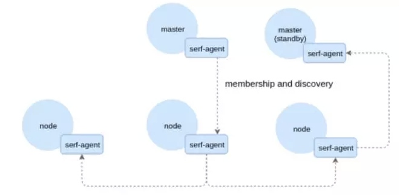

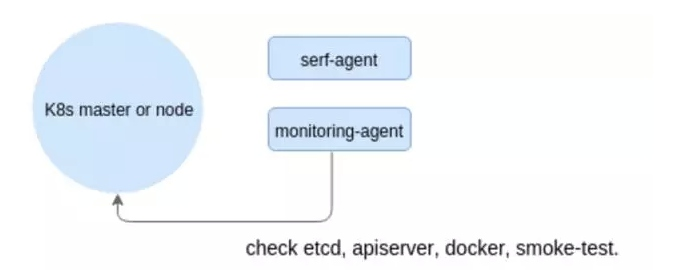
原理大致如下：
每个节点驻留一个agent， 它们互相之间通过一个Serf提供的gossip协议来交流。 Agent定期同步数据，这样每个节点都是随时更新关于集群作为一个整体的信息。 **Serf提供的一致性保证比较弱，导致更新信息也不是很严格**。
>  参考[“Satellite”：在生产过程中监控Kubernetes](http://dockone.io/article/1166)， 2016-03-27

### Prometheus
Prometheus是一个开源的监控解决方案，包括数据采集、汇聚、存储、可视化、监控、告警等。除了基本的监控数据，也支持通过自定义exporter来获取自己想要的数据。

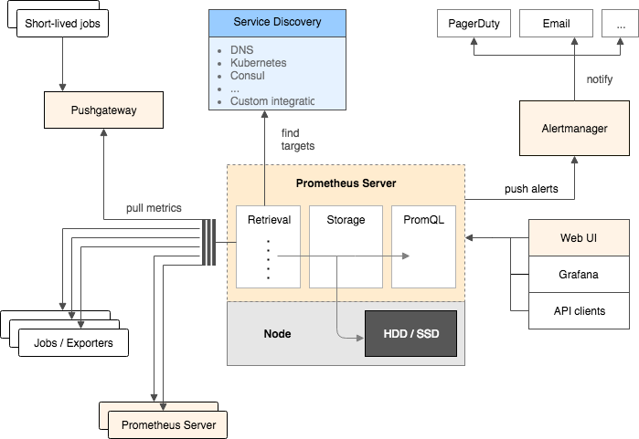

- Retrieval，这个里面定义的是什么？我这个 Prometheus 的服务器在哪里拉取数据，也可以从其他的 Prometheus 的服务器拉取数据。我们可能有很多会跑一些运行，然后就退出了，在这个 short lived jobs 里面，他就是在这个拉完之后运行到下面，这里面都是一些静态定义的拉取目标， Prometheus 还可以支持动态的，比如说 DNS 等，这一块是 Retrieval
- Storage，当然也有一些外挂存储的方式，这都是我们在做监控的环节下不需要的。
- PromQL，通过这个可以直接查询。

>  参考
> [Prometheus Repo](https://github.com/prometheus/prometheus)
> [用 Prometheus 来监控你的 Kubernetes 集群](http://mp.weixin.qq.com/s?__biz=MzIzMzExNDQ3MA==&amp;mid=2650093610&amp;idx=1&amp;sn=18e2ebf4a40147f189407c5bb40a224f)
> [用容器轻松搭建Prometheus运行环境](http://qinghua.github.io/prometheus/)

关于如何搭建Prometheus， 可以参考[用容器轻松搭建Prometheus运行环境](http://qinghua.github.io/prometheus/) 。 

### Heapster
Heapster是容器集群监控和性能分析工具，天然的支持Kubernetes和CoreOS。
Heapster是一个收集者，将每个Node上的cAdvisor的数据进行汇总，然后导到第三方工具(如InfluxDB)。

框架图：

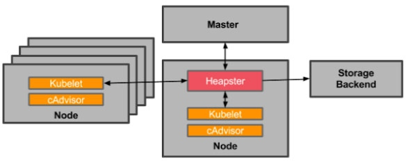
Heapster首先从K8S Master获取集群中所有Node的信息，然后通过这些Node上的kubelet获取有用数据，而kubelet本身的数据则是从cAdvisor得到。所有获取到的数据都被推到Heapster配置的后端存储中，并还支持数据的可视化。现在后端存储 + 可视化的方法，如InfluxDB + grafana。
>  参考[Kubernetes监控Heapster介绍](https://www.kubernetes.org.cn/932.html)

### Influxdb
InfluxDB是一款用Go语言编写的开源分布式时序、事件和指标数据库，无需外部依赖。
该数据库现在主要用于存储涉及大量的时间戳数据，如DevOps监控数据，APP metrics, loT传感器数据和实时分析数据。
InfluxDB特征：
- 无结构(无模式)：可以是任意数量的列
- 可以设置metric的保存时间
- 支持与时间有关的相关函数(如min、max、sum、count、mean、median等)，方便统计
- 支持存储策略:可以用于数据的删改。(influxDB没有提供数据的删除与修改方法)
- 支持连续查询:是数据库中自动定时启动的一组语句，和存储策略搭配可以降低InfluxDB的系统占用量。
- 原生的HTTP支持，内置HTTP API
- 支持类似sql语法
- 支持设置数据在集群中的副本数
- 支持定期采样数据，写入另外的measurement，方便分粒度存储数据。
- 自带web管理界面，方便使用(登入方式：http://< InfluxDB-IP >:8083)

关于Influxdb 关键概念， 高级概念， 基本语法， API， 使用示例及集群化的介绍，可以参考 [Kubernetes监控InfluxDB介绍](https://www.kubernetes.org.cn/936.html)

> 参考 [Kubernetes监控InfluxDB介绍](https://www.kubernetes.org.cn/936.html)  2016-12-07 

## 微服务监控
### Netsil
Netsil的应用程序，Application Operations Center (AOC，应用运维中心)，帮助用户观察并且收集跨Kubernetes集群运行的微服务应用程序的分析数据。服务本身是不可知的，因为它在网络上才能决定其实际上如何运行。随着时间的推移，并且实时地，它学习并且发现用户的环境，帮助用户逐渐搭建出SLA指标器，警报器等等。

AOC拓扑有两个主要组件。第一个是作为带有单个副本的Replication Controller的一部分运行的Pod。它运行AOC仪表盘和数据收集的平台。第二个组件是AOC收集器的DaemonSet。它告诉Kubernetes在环境的所有节点上运行一个带有收集器容器的Pod。这些收集器配置为向AOC Pod发送信息。

生成流量

我们将使用Sock Shop的更多工具来模拟网站上的购物行为。这让我们能看到AOC是如何学习流量模式以及我们的通用拓扑的。
随着load-test的运行，可以开始看到AOC随着数据的获得被点亮了：

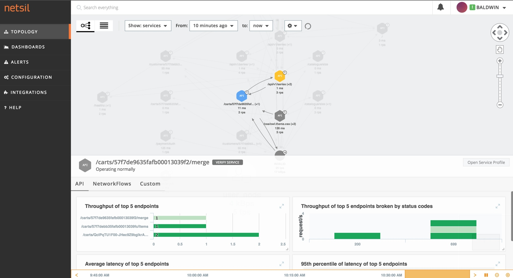
因为AOC作为DaemonSet部署，如果任意Pod销毁了并且在其他地方重新调度，AOC能够继续观测到拓扑，随着Kubernetes的变化而变化。

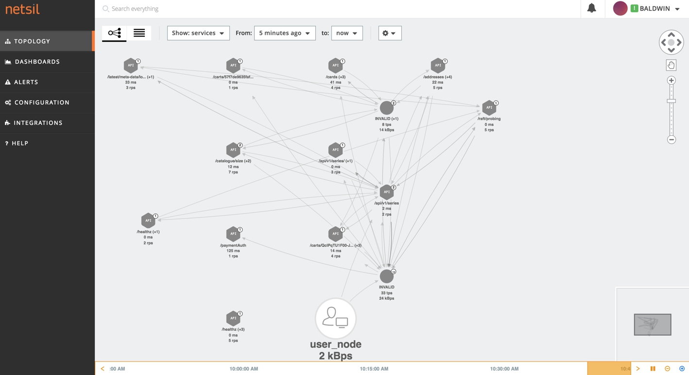
我很喜欢AOC的一个原因是部署通过服务来组织，并且我能够实时地观察到环境，并且开始深入不同的度量，为了那些可能影响到客户的事情搭建服务级别的警报。因此，当环境像下图一样变红时，我能够获得警报，知道某个服务处在紧急状态，比如Sock Shop里的信用卡和地址端点。

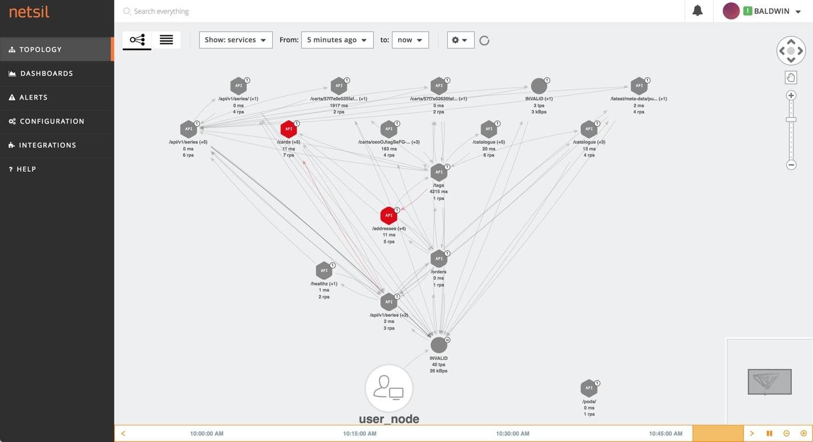

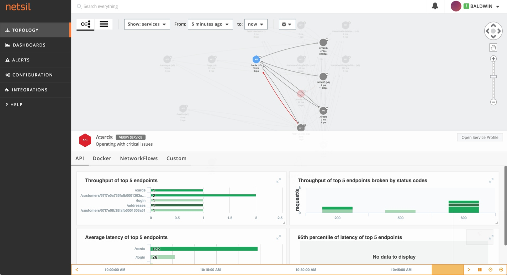

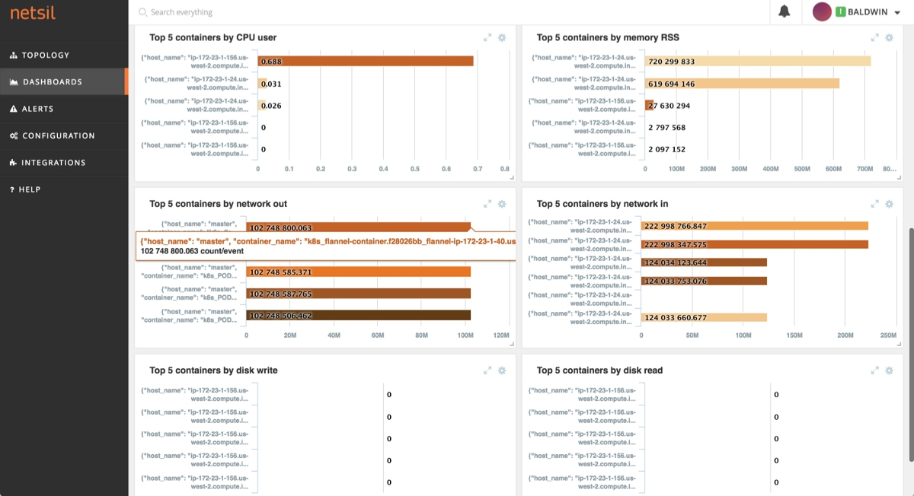
我甚至还可以深入仪表盘，知道承受最大压力的Pod和容器是什么。在本示例里，网络压力最大的容器是flannel Pod。这让我们能够了解最繁忙的服务是哪个，能够帮助我们重新思考配置或者Kubernetes里分发部署的方式。

总结

Netsil的AOC是非常棒的工具，可以帮助用户实时观察环境，随着使用模式的变化而更新。用户可以挖掘历史数据并且添加警报。应用程序随着添加更多的节点会自动扩展，新节点上线后就会在上面启动一个收集器，这样用户能够得到节点从上线到销毁的所有数据。
要部署Netsil到kubernetes上， 可以到这里下载相关编排文件：
https://github.com/netsil/manifests/tree/master/kubernetes

>  参考 [使用Netsil监控Kubernetes上的微服务](https://www.kubernetes.org.cn/939.html)  2016-12-07

### Istio
Istio 是一个由 IBM、Google 以及 Lyft 联合推出的开源软件，以无痛方式为运行在 Kubernetes 上的微服务提供流量管理，访问策略管理以及监控等功能。这一软件目前仅在 Kubernetes 上运行，今后可能会扩展到其他平台。本文会结合官方例子，完成安装和基础的监控内容。

架构和组件
总体架构如图所示。

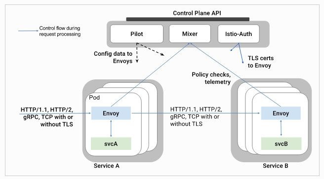
- Envoy
>  一个 C++ 编写的高性能代理服务器，这里做了扩展，在 Istio 中会以 Sidecar 方式跟应用运行在同一 Pod 内，一方面可以接收并执行关于规则、流量拆分等方面的指令，另一方面能够产生各种指标用于监控和跟踪。

- Mixer
>  Mixer 组件，主要进行访问控制以及策略控制，同时也负责从 Envoy 中获取各项指标。

- Pilot
> Pilot 是用户和 Isito 之间的桥梁，负责接收各种配置，并发送给各个组件。

- Istio auth
> 内置认证和凭证管理，利用 TLS 提供服务之间、用户和服务之间的认证。 可以用来将没有加密支持的服务升级为加密版本，并且在网络策略之外，提供服务级别的策略控制，今后还会增加更多的鉴权和审计方面的能力。

功能 & 特性

- 无需对现有服务进行变更
- 支持 http 1.1/2、gRPC 以及 TCP 流量的负载均衡和故障转移
- 可替换的组件
- 流量监控
- 可提供身份认证功能
- 可定制的路由规则
- 错误处理，例如超时、重试、访问量控制、健康检查和熔断器等。

 安装说明
参见 https://github.com/istio/istio  

运行应用
安装包内包含了一个叫 bookinfo 的小应用，由 Product（入口页）、Detail 和 Review 三部分组成，具体应用 YAML 在安装目录的samples/apps/bookinfo/bookinfo-v1.yaml文件中。打开文件我们会发现这是个很简单的小应用，无非是几个 Deployment 和 Service 的组合。

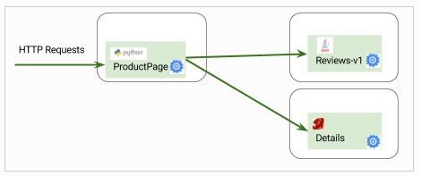
istio 提供了一个工具叫 istioctl，这个工具的功能之一，就是把普通的应用 YAML 注入为 istio 支持的应用模式，例如：istioctl kube-inject -f bookinfo-v1.yaml > bookinfo-istio-v1.yaml，比较新旧两个文件不难发现，**这一工具为每个 Pod 新增了一个名为 proxy 的容器，以此接管流量，给监控和管理打下基础**。

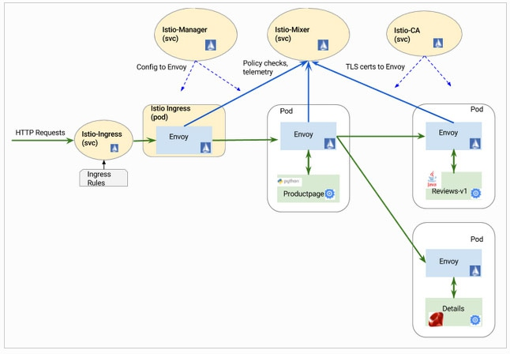
监控

**istio 内置了对 ServiceGraph、Prometheus 以及 Zipkin 的支持**，简单的运行一下kubectl create -f install/kubernetes/addons，就会启用这几个服务。注意这几个服务使用的也都是 Loadbalancer 模式，读者应根据集群情况自行修改。

>  参考 [Istio，Kubernetes 的微服务支持](https://www.kubernetes.org.cn/2350.html) ， 2017-07-16

# 日志方案

评估容器云平台日志系统的标准：

易扩展：能够支撑集群规模的增长
开销低：尽量占用较少的系统资源
入侵小：尽量不需要改动应用容器和云平台系统
大集中：将所有分布在各个主机节点上的日志集中在一起分析和查询
易部署：方便自动化部署到分布式集群中
易定制：方便处理不同日志格式，方便对接不同的存储方式
实效性：日志在产生之后需要能在短时间内即可以进行查看分析
社区活跃：方便未来的维护和更新，方便功能扩展

日志方案一般有几种选择
1. Fluentd + ElasticSearch + Kibana
2. Filebeat + ElasticSearch + Kibana
 
其中Fluentd或Filebeat打包成容器，以kubernetes的 daemonset的形式运行，每个node节点上都会启动一个Fluentd或Filebeat的Pod。 整体来说两种方案大同小异。
对于ElasticSearch 和  Kibana可以容器化，也可以用传统的ansible的方式部署。
先看方案一：Fluentd + ElasticSearch + Kibana 
Fluentd在Kubernetes集群中的部署架构
每个Node节点上都要有Fluentd-Elasticsearch这个Pod，有两种方式支持：1. 放在/etc/kubernetes/manifest下，用脚本自动启动；2. 用DaemonSet启动。这两种模式都是为了保证在每一个Kubernetes集群节点上都有一个Fluentd的驻留Pod运行来收集日志。Kubernetes中DaemonSet这个API对象就是为了驻留Pod而设计的。

整体日志管理系统的架构
在Kubernetes集群中的每个节点上运行一个Fluentd的容器，收集容器的日志发送给到ElasticSearch集群中。ElasticSearch集群会保存一周的日志作为热数据以供实时分析和查询，用户可以通过Kibana查看任意Node、Namespace、Service、Pod和容器的数据。对于超过一周的日志数据，ElasticSearch会自动备份到Swift对象存储的相应Bucket中。

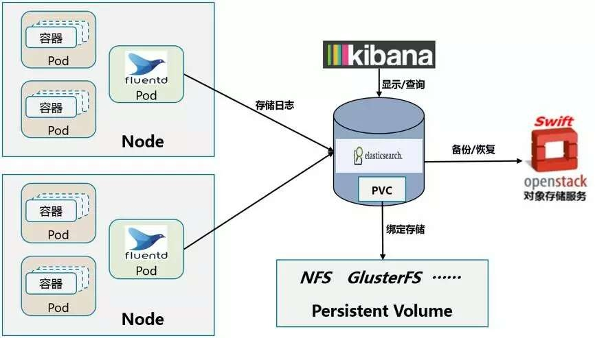

架构图中Swift是作为日志备份的后端存储。 可替代的方案有AWS S3， Google Cloud Storage， HDFS等
>  参考 [Kubernetes容器集群中的日志系统集成实践](http://www.yunweipai.com/archives/8797.html)

关于如何配置 Fluentd 来采集 Kubernetes 的日志， 可以参考 [Kubernetes Logging with Fluentd](http://docs.fluentd.org/v0.12/articles/kubernetes-fluentd)

# 参考文献
- [Kubernetes容器集群中的日志系统集成实践](http://www.yunweipai.com/archives/8797.html)
- [一张图读懂Kubernetes监控与日志](https://www.kubernetes.org.cn/993.html)
- [Kubernetes Logging with Fluentd](http://docs.fluentd.org/v0.12/articles/kubernetes-fluentd)
- [“Satellite”：在生产过程中监控Kubernetes](http://dockone.io/article/1166)
- [用 Prometheus 来监控你的 Kubernetes 集群](http://mp.weixin.qq.com/s?__biz=MzIzMzExNDQ3MA==&amp;mid=2650093610&amp;idx=1&amp;sn=18e2ebf4a40147f189407c5bb40a224f)
- [用容器轻松搭建Prometheus运行环境](http://qinghua.github.io/prometheus/)
- [Kubernetes监控Heapster介绍](https://www.kubernetes.org.cn/932.html)
- [Kubernetes监控InfluxDB介绍](https://www.kubernetes.org.cn/936.html)
- [Tools for Monitoring Compute, Storage, and Network Resources](https://kubernetes.io/docs/tasks/debug-application-cluster/resource-usage-monitoring/)
- [使用Netsil监控Kubernetes上的微服务](https://www.kubernetes.org.cn/939.html)
- [Istio，Kubernetes 的微服务支持](https://www.kubernetes.org.cn/2350.html)
