# 认证要求
- Networking 网络 11%
  -  理解在集群节点上配置网络
  -  理解pod的网络概念
  -  理解service networking
  -  部署和配置网络负载均衡器
  -  知道如何使用ingress 规则
  -  知道如何使用和配置cluster dns
  -  理解CNI

#  Docker原生网络
在docker 1.9之前主支持none/host/bridge/container四种网络模型。而在docker 1.9版本后实现了原本实验性的Networking组件的支持，可以在Swarm中使用它或者将其作为Compose 工具。创建虚拟网络并将其连接到容器实现多个主机上容器相互通讯。(kernel版本需要在3.19之上)

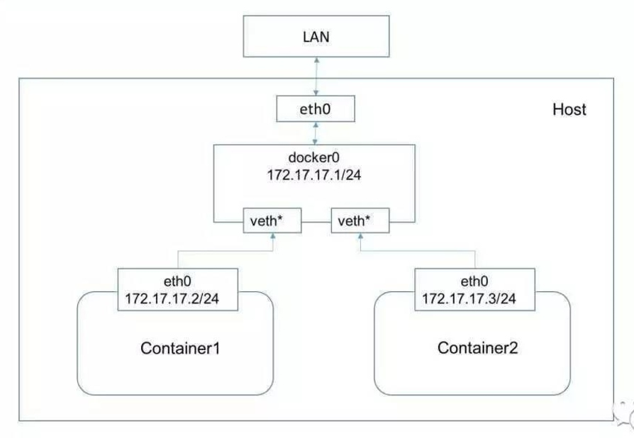
上图是docker使用bridge模式的经典网络图。docker启动默认使用bridge模式。 

Kubernetes为每个Pod都附属了gcr.io/google_containers/pause:latest，这个容器只接管Pod的网络信息，业务容器通过加入网络容器的网络来实现网络共享。这个使用的是docker的container模式。 

docker原生网络的问题在于：
- 无法满足容器间跨主机网络访问的问题
- 容器无法外部寻址
- 容器需要自行规划端口
- 容器无法跨主机进行编排


# CNI VS CNM
首先，向大家科普下Kubernetes所选择的CNI网络接口，简单介绍下网络实现的背景。

CNI即Container Network Interface，是一套容器网络的定义规范，包括方法规范、参数规范、响应规范等等。CNI只要求在容器创建时为容器分配网络资源、删除容器时释放网络资源。CNI与调用者之间的整个交互过程如下图所示：

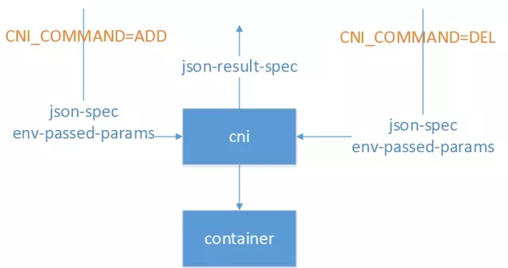
CNI实现与外界的交互都通过进程参数和环境变量传递，也只要求输出结果符合CNI规范即可，与实现语言也没什么特殊要求。比如Calico早期版本就使用Python实现了CNI规范，为Kubernetes提供了网络实现。常见的环境变量设置如下：

CNI_COMMAND：调用指定CNI动作，ADD表示增加网卡，DEL表示释放网卡

CNI_CONTAINERID：容器ID

CNI_NETNS：容器网络命名空间文件位置

CNI_ARGS：额外传递的参数

CNI_IFNAME：设置的容器网卡名称，如eth0

正因如此，CNI规范实现起来非常容易扩展，除了CNI自带的Bridge、Macvlan等基本实现以外，还有大量的第三方实现可供选择，包括Calico、Romana、Flannel等常用实现。同时CNI支持多种容器运行时，包括Docker、rkt、Mesos、Hyper等容器引擎都可以使用。这也是Kubernetes选择使用CNI的一大重要原因。

相对的，Docker提出的CNM（Cotainer Network Model）模型实现就比较复杂，但更为完善，比较接近传统的网络概念。如下图所示：


Sandbox就是容器的网络命名空间，Endpoint为容器连接到网络中的一张网卡，而网络则是一组相互通信的Endpoint的集合，比较接近Neutron中的网络定义。

在CNM中，docker engine通过HTTP REST API调用网络实现，为容器配置网络。这些API接口涵盖网络管理、容器管理、创建endpoint等十几个接口。同时CNM模型还隐含在docker自身附带的service机制、dns机制等附加约束，因此可以在一定程度上说，CNM模型只是专为docker容器实现的，对别的容器运行时并不友好。

由于上面这些技术上的原因以及一些商业上的原因，Kubernetes最终选择了CNI作为自己的网络接口。

当然，Kubernetes也提供一些取巧的方法，将CNI接口转化为对CNM模型的调用，从而实现两种模型的通用。例如to_docker，这个脚本就将Kubernetes对CNI的调用转换为Docker CNM网络的对应操作，从而实现CNI到CNM的转换。
>  参考 [基于Neutron的Kubernetes SDN实践经验之谈＊＊＊＊＊](http://mp.weixin.qq.com/s?__biz=MzA5OTAyNzQ2OA==&amp;mid=2649693914&amp;idx=1&amp;sn=19fda53b4afd626bdc8ad0141e9f7a9b&amp;chksm=889321b9bfe4a8af3c4d9b78e8c299893e49d33e71d878d3fbb0324f468aebaf08efa7b35deb&amp;mpshare=1&amp;scene=1&amp;srcid=0428luoASGP9HYZD8M0mjgIW#rd)

# POD的网络模型
每个Pod都会被分配一个唯一的IP地址。Pod中的所有容器共享网络空间，包括IP地址和端口。Pod内部的容器可以使用localhost互相通信。Pod中的容器与外界通信时，必须分配共享网络资源（例如使用宿主机的端口映射）。

# 网络方案
在网络概念上，Kubernetes中有两种核心IP：
- POD IP：有CNI实现提供，Kubernetes不管这个IP是否可达，只负责使用这个IP实现配置iptables、做健康检查等功能。默认情况下，这个IP在Kubernetes集群范围内都是可达的，并且可以进行ping等操作。
- cluster IP：即服务IP，这个IP在Kubernetes中只是用于实现服务交互通信，本质上只是iptables上的几条DNAT规则。默认情况下，这个IP上只能提供服务端口的访问，且不可ping。

k8s本身不集成网络， 它需要外部的插件支持。 它支持cni网络模型，基于cni网络模型的常用的解决方案有 weave，flannel， calico, openvswitch等。 各种技术方案的部署难易程度不通， 性能上也有所差别。 

k8s对集群的网络有如下要求：
1. 所有的容器都可以在不用nat的情况下和别的容器通信
2. 所有的节点都可以在不用nat的情况下同所有容器通信， 反之亦然
3. 容器的地址和别人看到的地址是同一个地址

kubernetes的网络通信中和原生的docker有些不一样， 它有四个问题要解决：
1. container-to-container， 容器到容器的访问（这个是由pod来解决， 同一个pod的容器共享同一网络空间）
2. Pod-to-Pod ， pod到pod的通信（这个由各种不同的网络方案，如flannel等来处理）
3. Pod-to-Service ， pod到service的通信（这个由service组件， 即kubeproxy处理）
4. External-to-Service（这个由service组件， 即kubeproxy处理）


支持kubernetes的网络方案是众多的， kubernetes的官网中列出了下述的方案（这个未来还有可能再涌现出更多的方案）：
Cilium
Contiv
Contrail
Flannel
Google Compute Engine (GCE)
L2 networks and linux bridging
Nuage Networks VCS (Virtualized Cloud Services)
OpenVSwitch
OVN (Open Virtual Networking)
Project Calico
Romana
Weave Net from Weaveworks
CNI-Genie from Huawei
> 参考[官方文档之网络篇＊＊＊＊＊](https://kubernetes.io/docs/concepts/cluster-administration/networking/)
>  这里值得一提的是华为出品的一套方案：CNI-Genie ， 这个cni 插件在同一运行时里可以同时支持多个cni插件， 比如flannel， weave， calico， romana。 它还支持给同一个pod分配多个ip地址， 每个ip地址来自不通的网络插件。 开源项目地址： https://github.com/Huawei-PaaS/CNI-Genie
>  在[黑客级Kubernetes网络指南](http://mp.weixin.qq.com/s?__biz=MzA5OTAyNzQ2OA==&amp;mid=2649693932&amp;idx=1&amp;sn=cd9ee642e6ca28c16595d987288df243&amp;chksm=8893218fbfe4a899583b78e19eff1ab807765e17cc5dfe2dd8dda9e1d514f4ed9192a31ee510&amp;mpshare=1&amp;scene=1&amp;srcid=05023NaBQHyPI39LJamSBKoB#rd)这篇文章中介绍了如何突破“每个POD只有一个CNI接口”的限制


Kubernetes社区中，比较常见的几种网络实现主要是以下两种：
- 基于Overlay网络：以Flannel、Weave为代表。Flannel是CoreOS为Kubernetes专门定制实现的Overlay网络方案，也是Kubernetes默认的网络实现。它基于VXLAN或者UDP整个集群的Overlay网络，从而实现容器在集群上的通信，满足Kubernetes网络模型的三大基本约束。由于在通信过程中存在数据包的封包解包等额外损耗，性能较差，但已经基本满足使用。
- 以L3路由为基础实现网络：以Calico、Romana为代表。其中，Calico是广泛流传的性能最好的Kubernetes网络实现，基于纯三层的路由实现网络通信，结合iptables实现的安全控制，可以满足大多数云的性能需求。但是由于它要求主机上必须打开BGP形成路由拓扑，在一些数据中心上可能不会被允许。同时，Calico还比较早地支持了Network Policy，并且可以将Calico自身的数据直接托管在Kubernetes中，从而实现与Kubernetes的深度集成。
>  参考 [基于Neutron的Kubernetes SDN实践经验之谈＊＊＊＊＊](http://mp.weixin.qq.com/s?__biz=MzA5OTAyNzQ2OA==&amp;mid=2649693914&amp;idx=1&amp;sn=19fda53b4afd626bdc8ad0141e9f7a9b&amp;chksm=889321b9bfe4a8af3c4d9b78e8c299893e49d33e71d878d3fbb0324f468aebaf08efa7b35deb&amp;mpshare=1&amp;scene=1&amp;srcid=0428luoASGP9HYZD8M0mjgIW#rd)


## flannel 
flannel支持的backend有vxlan， udp， aws-vpc,  host-gw等。 
不同的backend对数据的封装方式不一样， 性能也不一样。 下面主要对vxlan，udp两种backend的实现方式进行阐述。 
工作原理

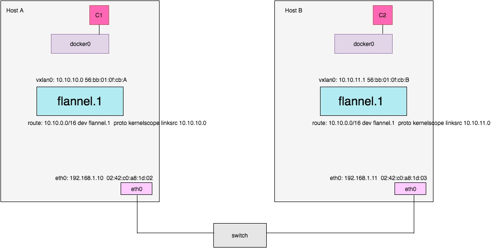

>  由于flannel agentd知道所有的网段分配信息以及每台host上的flannel.1设备的IP，MAC，因此每一个网段在进行vxlan fdb转发时，可以使用host上flannel.1的MAC地址。
> 如图c1 ping c2时，如果容器c1 IP(10.10.10.2), 容器c2 IP(10.10.11.2), 因为host－A 的邻居表里没有c2 IP到MAC表项，flannel agent会收到相应的l3 miss(netlink)消息，然后flannel agent会反应式的设置c2 的IP到MAC表项为10.10.11.2-56:bb:01:0f:cb:B，这样在fdb中MAC 56:bb:01:0f:cb:B就对应到host-B的flannel.1。
因为flannel知道必要的网络信息，所以flannel直接按段处理了L3 miss的消息，L2的fdb直接在启动时根据etcd信息静态配置好，这样整个网络就连通了。
> 参考[flannel vxlan implementation](https://wangtaox.github.io/2016/07/29/flannel-vxlan.html)

放另外一张更清晰的原理图

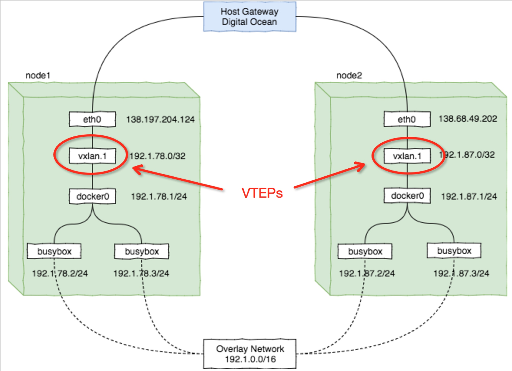


VXLAN本质上是一种tunnel（隧道）协议，用来基于3层网络实现虚拟的2层网络。泛泛地说，tunnel协议有点像今天电话会议，通过可视电话连接不同的会议室让每个人能够直接交谈，就好像坐在一个会议室里一样。很多tunnel协议，如GRE也有类似VXLAN中VNI的用法。 

tunnel协议的另外一个重要的特性就是软件扩展性，是软件定义网络（Software-defined Network，SDN）的基石之一。 

Flannel中有两个基于tunnel协议的backend：UDP（默认实现）和VXLAN，本质上都是tunnel协议，区别仅仅在于协议本身和实现方式。 
注意： 
使用vxlan backend时，数据是由Kernel转发的，Flannel不转发数据，仅仅动态设置ARP entry
而udp backend会承担数据转发工具（这里不展开介绍其实现），UDP backend自带了一个C实现的proxy，连接不同节点上的tunnel endpoints

这里讨论的源码基于最新稳定版v0.7.0。

vxlan backend启动时会动态启动两个并发任务： 
- 监听Kernel中L3 MISS并反序列化成Golang对象
- 根据L3 MISS和子网配置（etcd）来自动更新本地neighbor配置

关于源码，可以猛戳这里[flannel的原理和源码分析](https://github.com/yangyuqian/k8s-the-hard-way/blob/master/network/vxlan-flannel-cn.md)

最后，Flannel的实现中有一个小细节，在0.7.0中刚刚加入，即VTEP的IP加上了/32位的掩码避免了广播，此前的版本都是/16掩码，解决了VXLAN网络中由于广播导致的“网络风暴”的问题。 
>  参考[Flannel中vxlan backend的原理和实现](http://www.dockone.io/article/2216)
> 问题： 为什么加入 32为掩码之后，就能避免广播风暴呢， 如果在网络上解释？

flannel负责的是二层网络的管理， 包括网段管理和mac地址表的更新等。ip的分配还是由docker0来完成。 

简单的描述flannel vxlan或者udp方案中两个pod的通信过程如下： 
容器a的数据包pkg->宿主机A的docker0->路由到宿主机A的flannel0网卡->被封装->宿主机A的物理网卡->宿主机B的物理网卡->路由到宿主机B的flannel0网卡->被解封->通过暴露出来的目的容器IP找到docker0->docker0转给容器的虚拟网卡
>  参考[docker网络方案简介](https://segmentfault.com/a/1190000006594822)

对于aws-vpc , host-gw两种backend，简单介绍如下：
aws-vpc：在 Amazon AWS 实例表中注册新增机器子网。该实例表最多支持 50 项记录，这意味着，如果你使用 flannel + aws-vpc 方案，集群最多只能包含 50 台机器，集群也只能运行在 AWS 云平台。
host-gw：通过远程机器 IP ，创建到子网的 IP 路由。这要求运行 flannel 的不同主机在二层直接互通。
>  参考[一个适合 Kubernetes 的最佳网络互联方案](http://dockone.io/article/1115)

flannel的subnet 的租约时间是24小时， 这个是硬编码在local_manager.go这个文件里的
```go
const (
	raceRetries = 10
	subnetTTL   = 24 * time.Hour
)
```
在租约过期前的一个小时内， 会发起续约。可以通过启动参数--subnet-lease-renew-margin来修改发起续约的时间。 

flannel连接etcd或者k8s 的api server 获取和配置网段信息， **建议使用使用连接k8s api server 的方式替代etcd**。 启动参数：
```shell
--kube-subnet-mgr: Contact the Kubernetes API for subnet assignement instead of etcd or flannel-server.
```

## calico
  Project Calico 是纯三层的 SDN 实现，没有使用重载网络，它基于 BPG 协议和 Linux 自己的路由转发机制，不依赖特殊硬件，没有使用 NAT 或 Tunnel 等技术。能够方便的部署在物理服务器、虚拟机（如 OpenStack）或者容器环境下。同时它自带的基于 Iptables 的 ACL 管理组件非常灵活，能够满足比较复杂的安全隔离需求。
  所有的容器均通过配置使用calico-node实现网络互通及访问以太网。

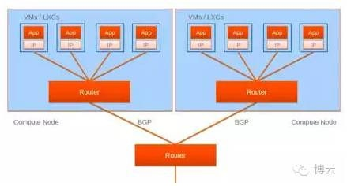
  模块间的关系（控制平面）：

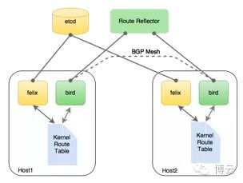
Calico把每个操作系统的协议栈认为是一个路由器，然后把所有的容器认为是连在这个路由器上的网络终端，在路由器之间跑标准的路由协议——BGP的协议，然后让它们自己去学习这个网络拓扑该如何转发。所以Calico方案其实是一个纯三层的方案，也就是说让每台机器的协议栈的三层去确保两个容器，跨主机容器之间的三层连通性。对于控制平面，它每个节点上会运行两个主要的程序，一个是Felix，它会监听ECTD中心的存储，从它获取事件，比如说用户在这台机器上加了一个IP，或者是分配了一个容器等。接着会在这台机器上创建出一个容器，并将其网卡、IP、MAC都设置好，然后在内核的路由表里面写一条，注明这个IP应该到这张网卡。绿色部分是一个标准的路由程序，它会从内核里面获取哪一些IP的路由发生了变化，然后通过标准BGP的路由协议扩散到整个其他的宿主机上，让外界都知道这个IP在这里，你们路由的时候得到这里来。
  由于Calico是一种纯三层的实现，因此可以避免与二层方案相关的数据包封装的操作，中间没有任何的NAT，没有任何的overlay，所以它的转发效率可能是所有方案中最高的，因为它的包直接走原生TCP/IP的协议栈，它的隔离也因为这个栈而变得好做。因为TCP/IP的协议栈提供了一整套的防火墙的规则，所以它可以通过IPTABLES的规则达到比较复杂的隔离逻辑。

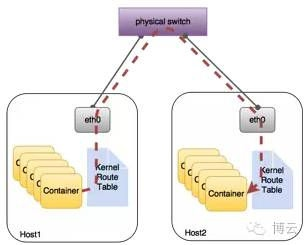
Calico已知问题
  （1）  只支持tcp,udp,icmp,icmpv6协议，如果需要支持其他L4协议，需要选择其他网络模式；
  （2）  没有对数据路径进行加密，因此对于不信任的网络是不安全的；
  （3）  在公众网络上需要使用-ipip选项，该选项采用IP-over-IP的效率很低；
  （4）  通常 跑在一个大二层的网络里，对于大二层网络其实就是没有任何三层的网关，所有的机器、宿主机、物理机在二层是可达的，此时任何一个都会有一定的硬件风险会让整个大二层瘫痪；
  （5）  Calico跑在了一个三层网关的物理网络上时，它需要把所有机器上的路由协议和整个物理网络里面的路由器的三层路由全部用BGP打通。这其实会带来一个问题，这里的容器数量可能是成千上万的，然后你让所有物理的路由学习到这些知识，这会给物理集群里的BGP路由带来一定的压力
Calico既可以单独配置也可以作为docker  libnetwork的一个驱动使用。
> 参考[程序猿成长日记 | Docker跨主机通信解决方案探讨](http://www.bocloud.com.cn/news/show-195.html)

## weave
一个Weave网络由一系列的'peers'构成----这些weave路由器存在于不同的主机上。每个peer都由一个名字，这个名字在重启之后保持不变.这个名字便于用户理解和区分日志信息。每个peer在每次运行时都会有一个不同的唯一标识符（UID）.对于路由器而言，这些标识符不是透明的，尽管名字默认是路由器的MAC地址。
Weave路由器之间建立起TCP连接，通过这个连接进行心跳握手和拓扑信息交换。这些连接可以通过配置进行加密。peers之间还会建立UDP连接，也可以进行加密，这些UDP连接用于网络包的封装，这些连接是双工的而且可以穿越防火墙。
Weave网络在主机上创建一个网桥,每个容器通过veth pari连接到网桥上，容器由用户或者weave网络的IPADM分配IP地址。
Weave网络有2种方法在不同主机上的容器间路由网路包：
- fast data path:
> 完全工作在内核空间，目的地址为非本地容器的数据包被内核捕获并交给用户空间的weave网络路由器来处理，weave路由器通过UDP转发到目的主机上的weave路由器，并注入到目的主机的内核空间，然后交给目的容器处理。

- weave路由学习(sleeve模式)
> weave网络路由器学习对端主机的特定MAC地址，然后将这些信息和拓扑信息结合起来进行路由决策，这样就避免了将数据包转发给所有的peer.  weave网络能够路由网络包通过拓扑交换，比如在下面的网络中，peer 1与2,3直连，但是如果1想要给4或者5发送网络包，它必须先发送给peer3.

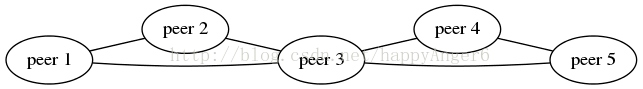

### Weave 网络怎样了解网络拓扑
在Peers之间交流拓扑
拓扑包括了peer是怎样与其它peer连接的信息。Weave peers将它所知道的拓扑与其它peers交流，所以所有的peers者知道整个拓扑的信息。
peers之间的交流是建立在TCP连接上的，使用下面的方法:
 a) 基于广播机制的spanning-tree
 b) 邻居gossip 机制.
拓扑消息在以下情况下被一个peer发送:
- 当加入一个连接时，如果远端peer对于网络是一个新连接，则将整个网络拓扑发送给新的peer。同时增量更新拓扑信息，广播包含新连接的两端的信息。
- 当一个连接被标记为已经建立，则意味着远端可以从本端接受UDP报文，然后广播一个包含本端信息的数据包。
- 当一个连接断开，一个包含本端信息的报文被广播。
- 周期性的定时器，整个拓扑信息被gossip给邻居，这是为了拓扑敏感的随机分布系统。.这是为了防止由于频繁的拓扑变化，造成广播路由表过时，而使前面提到的广播没有到达所有的peers。
收到拓扑信息后与本地拓扑进行merge.加入未知的peers,用更新的peers信息来更新peers的信息。 如果有新的或更新的peers信息是通过gossip而不是广播信息发送来的，那么就会gossip一个改进的更新信息。
如果接收者收到一个peer的更新信息，但不知道这个peer，那么整个更新就被忽略。

#### Fast Datapath 是如何工作的
Weave网络在Docker主机间实现了一种overlay网络。
如果不开启fast datapath, 每个数据包被添加相关的隧道协议头后发送到目的主机,然后在目的主机移除隧道协议头.
Weave路由器是一个用户态程序，这就意味着数据包和Linux内核中有一个曲折的进出路径:

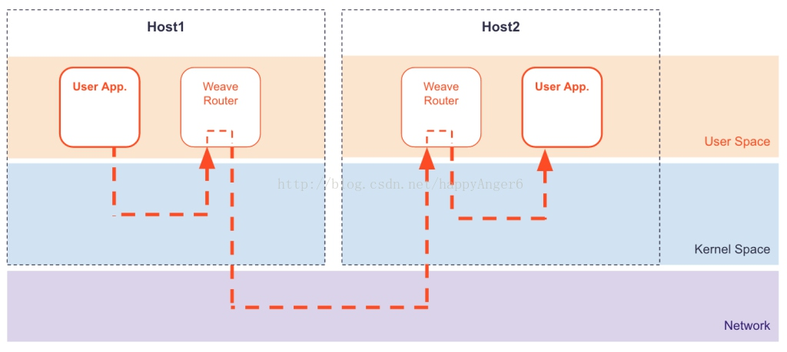
Weave网络中的fast datapath 使用了Linux内核的Open vSwitch datapath module. 这个模块允许Weave路由器告诉内核如何处理数据包:

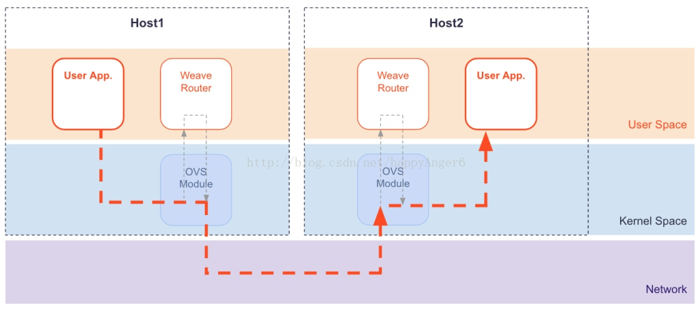
因为Weave网络直接在内核发布指令，上下文的切换就不需要了，所以通过使用 fast datapath CPU负载和延迟就会降低。
数据包直接从用户程序进入内核，并加入VXLAN头 (NIC会做这些如果提供了VXLAN加速功能). VXLAN是一个IETF标准的基于 UDP的隧道协议,这就可以是用户使用通用的类似Wireshark 的工具来监控隧道数据包。
之前的 1.2版本中, Weave网络使用一种特殊的封装格式. 而Fast datapath 使用 VXLAN，和特殊的封装格式一样, VXLAN也是基于UDP的，这就意味着不需要对网络进行其它特殊的配置。
注意: 依懒的open vSwitch datapath (ODP) 和VXLAN特性在 linux kernel 版本3.12和更新的版本中才支持。如果你的内核没有构建这些必要的特性，Weave网络将会使用 "用户态模式 "的数据包路径。

>  参考- [docker网络方案之weave原理篇](http://blog.csdn.net/happyanger6/article/details/71316188)

 
## openvswitch
## 方案对比

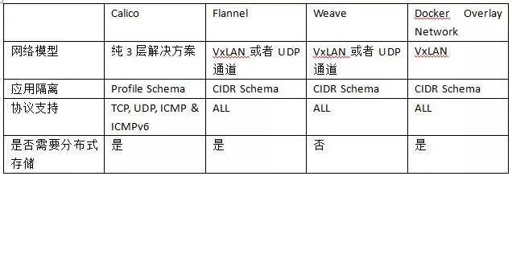
>  参考[程序猿成长日记 | Docker跨主机通信解决方案探讨](http://www.bocloud.com.cn/news/show-195.html)

#  网络配置
## flannel
关于具体配置， 这里有一篇参考的文章：
[Howto Configure flannel Overlay Network with VXLAN for Docker on Power Servers](http://cloudgeekz.com/1016/configure-flannel-docker-power.html)
##  weave 
关于具体配置， 这里有一篇参考的文章：
[ docker网络方案之weave实战篇](http://blog.csdn.net/happyanger6/article/details/71104577)
# 关于多租户网络隔离
Kubernetes的一个重要特性就是要把不同node节点的pod（container）连接起来，无视物理节点的限制。但是在某些应用环境中，比如公有云，不同租户的pod不应该互通，这个时候就需要网络隔离。幸好，Kubernetes提供了NetworkPolicy，支持按Namespace级别的网络隔离，这篇文章就带你去了解如何使用NetworkPolicy。
需要注意的是，使用NetworkPolicy需要特定的网络解决方案，如果不启用，即使配置了NetworkPolicy也无济于事。我们这里使用Calico解决网络隔离问题。

要想在Kubernetes集群中使用Calico进行网络隔离，必须满足以下条件：
1. kube-apiserver必须开启运行时extensions/v1beta1/networkpolicies，即设置启动参数：--runtime-config=extensions/v1beta1/networkpolicies=true
2. kubelet必须启用cni网络插件，即设置启动参数：--network-plugin=cni
3. kube-proxy必须启用iptables代理模式，这是默认模式，可以不用设置
4. kube-proxy不得启用--masquerade-all，这会跟calico冲突
注意：配置Calico之后，之前在集群中运行的Pod都要重新启动

>  参考 [容器编排之Kubernetes网络隔离 - 知乎专栏](https://zhuanlan.zhihu.com/p/26614324)

在基础的IP通信机制上，Kubernetes还通过Network Policy和Ingress提高网络安全性和响应性能。

Network Policy提供了网络隔离能力，它基于SIG－Network group演进而来，Kubernetes只提供内置的labelSelector和label以及Network Policy API定义，本身并不负责实现如何隔离。在Kubernetes使用的CNI网络实现中，目前只有Calico、Romana、Contiv等少少几个实现了Network Policy集成。一个典型的Network Policy定义如下所示：
```text
apiVersion: extensions/v1beta1
kind: NetworkPolicy
metadata:
name: test-network-policy
namespace: default
spec:
podSelector:
matchLabels:
role: db
ingress:
- from:
 - podSelector:
    matchLabels:
     role: frontend
ports:
 - protocol: tcp
   port: 6379
```
它指定约束，具有role:db标签的POD只能被具有role:frontend标签的POD访问，除此之外拒绝所有流量。从功能上来讲，Network Policy可以等价于Neutron的安全组。

# Service Networking
> 参考[Services](https://kubernetes.io/docs/concepts/services-networking/service/) 

理解service networking
service存在的意义： 在k8s里， pod的生命周期可能是很短暂的， pod的动态创建和销毁有可能是一个很频繁的操作，每次创建都会启动新的pod ip。 如果应用要让其它应用来访问， 要怎么办呢， 要如何追踪到这个应用有哪些后端pod呢。 service这个资源对象就是对pod的逻辑组合以及如何访问它们的策略的抽象。
## 如何定义一个service
```yml
kind: Service
apiVersion: v1
metadata:
  name: my-service
spec:
  selector:
    app: MyApp
  ports:
  - protocol: TCP
    port: 80
    targetPort: 9376
```

这里port是service上暴露的端口， targetPort是请求转发到pod上的端口， 如例子所示， 上述的service定义的是如果有一个访问service的80端口， 那么service会把请求转发到后端pod的9376端口上

如果 targetPort不指定， 则默认取port的值。 
**targetPort的值可以是字符串类型，这是暴露port的名称**， 这个设计，为用户的应用部署升级提供了更多的灵活性， 比如用户可以在新版本的pod暴露新的端口（port名称不变）， 此时service就无需重新构建， 从而无需切断客户端连接， 提高应用的可用性。 

service支持TCP，和UDP协议。 

## 无选择器的service
无选择器的service一般用于下面的集中场景：
1. 有个外部的数据库集群， 要通过自定义endpoint指向这个数据的访问
2. 想要把你的service指向另外一个命名空间下的service或者另外一个集群下的service
3. 你要把工作负载迁移到集群之外

无选择器的service除了要定义service之外，还要定义endpoint，如下例所示
service.yaml
```yml
kind: Service
apiVersion: v1
metadata:
  name: my-service
spec:
  ports:
  - protocol: TCP
    port: 80
    targetPort: 9376
```
endpoint.yaml 
```yml 
kind: Endpoints
apiVersion: v1
metadata:
  name: my-service
subsets:
  - addresses:
      - ip: 1.2.3.4
    ports:
      - port: 9376
```
二者通过metadata的name字段自动关联， 需要名称一致

有一类特殊的无选择器的service无需定义endpoint， 它是ExternalName Service
```yml
kind: Service
apiVersion: v1
metadata:
  name: my-service
  namespace: prod
spec:
  type: ExternalName
  externalName: my.database.example.com
```
当你访问这个service时， 会去通过集群dns， 集群的dns会返回一条CNAME的记录， 即my.database.example.com， **这个重定向是发生在dns层的， 没有任何的流量代理或者转发**。 也就是说不是通过主机上的kube-proxy和iptables。 

##  VIP 和服务代理
 Kubernetes的Services可以认为是工作在4层上（TCP/UDP over IP）。
每一个工作节点上都会运行kube-proxy进程，这个进程为service提供了某种形式的虚拟IP.
kube-proxy有两种代理模式： userspace proxy mode， iptables proxy mode。 
在1.0时，使用的是userspace模式， 在1.1时加入了iptables模式的支持，但没有作为默认模式， 1.2之后iptables模式作为默认的模式。 
两种模式的原理图如下：
userspace mode

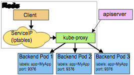
iptables mode

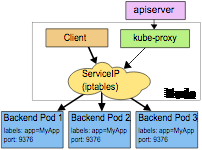

两种模式的共同点和差异
```table
模式   |   原理   |   共同点   |   差异点
usespace mode   |   1. kube-proxy进程负责watch apiserver的endpoint的增加和移除   2. 每个service都会在本地节点上随机侦听一个端口， 访问到这个proxy  port的流量会被转发到后端的pod上  3.  本地会建立iptables规则以捕捉和转发访问service ip：port的网络流量到kube-proxy侦听的对应的service的proxy port上   |   1. client访问service无需知道kubernetes的services和pods的细节  2. 默认支持轮询访问pod， 也支持ip hash的形式， 根据客户端ip的session来限定负载策略，需要将service.spec.sessionAffinity的值设为\"ClientIP\"   |   需要建立在系统的用户空间建立侦听端口，用于转发流量到后端的pod，这样做会让性能变差
iptables mode   |   1. kube-proxy进程负责watch apiserver的endpoint的增加和移除  2.  本地会建立iptables规则以捕捉和转发访问service ip：port的网络流量到kube-proxy侦听的对应的service的proxy port上   |   同上   |   直接用iptables转发， 好处是转发性能更好，更稳定。 缺点是如果一开始选择的pod没有响应，iptables无法选择另外一个pod发起重试。客户端和后端的pod的连接就可能会出现错误连接状态， 除非客户端能够断开连接进行重连。 **这个问题可以通过配置readiness probe来解决**。
```

## 发现服务
查找一个服务有两种方式： 环境变量和DNS. 
**环境变量**
当创建了一个service的时候， kubelet会为每一个活动的service增加一系列环境变量到pod里， 变量的格式如下：
{SVCNAME}_SERVICE_HOST ，    {SVCNAME}_SERVICE_PORT 

举个例子， 有个 Service "redis-master" 暴露了 TCP端口 6379， 并分配了cluster IP address 10.0.0.11 会产生下面的环境变量
```shell
REDIS_MASTER_SERVICE_HOST=10.0.0.11
REDIS_MASTER_SERVICE_PORT=6379
REDIS_MASTER_PORT=tcp://10.0.0.11:6379
REDIS_MASTER_PORT_6379_TCP=tcp://10.0.0.11:6379
REDIS_MASTER_PORT_6379_TCP_PROTO=tcp
REDIS_MASTER_PORT_6379_TCP_PORT=6379
REDIS_MASTER_PORT_6379_TCP_ADDR=10.0.0.11

```
这种方式的限制在于， service要先于POD创建， 相应的环境变量才能被加载到pod里。 例如如果有pod A要访问redis master的service， 就需要先创建redis master， 再创建pod A，这样pod A才能读取到redis master service的相关环境变量。 (ps： **新创建的service的环境变量不会别加载老的pod里**)

**DNS**
假设用户在命名空间my-ns下创建了一个名叫 my-service的service， 这时kube dns会自动增加一条dns记录： my-service.my-ns .  域名解析得到的ip是service的cluster ip。 

**假设用户在service上暴露了一个名叫http的TCP端口， 用户可以使用下面的方式获取到端口：**
"_http._tcp.my-service.my-ns"


## 无头service （headless service）
为spec.clusterIP指定值为None，此时就创建了一个无头service。 这个选项允许用户选择自己的服务发现方式， 和kubernetes进行解耦。 kubernetes不为无头service分配cluster ip， kube-proxy不为这些处理service的负载均衡和流量代理。 

无头service有selector和无selector时，dns配置不一样。 
有selector： endpoint controller会创建对应的endpoint， 并修改DNS的A记录直接指向POD 的 ip
无selector： 不会创建endpoint。 DNS 会为这两种情形做配置。 1. 为ExternalName类型的service创建C记录。 2. 为任何类型的service 匹配和servcie同名的endpoint。 


## 发布service的几种类型
```table
Type   |   描述
ClusterIP   |   以集群内部IP的形式暴露Service，这个cluster ip只能在集群内访问
NodePort   |   在集群的每个节点上IP的上绑定一个静态端口的方式来暴露Service。 集群外部可以通过<NodeIP>:<NodePort>的方式来访问这个Service
LoadBalancer   |   对接云供应商的负载均衡器，此时 ClusterIP或NodePort Service会被自动创建。
ExternalName   |   通过返回C记录的方式， 对接外部名称如（foo.bar.example.com）。 此时任何形式的流量代理都不会被创建。 这个特性需要kubernetes的1.7版本支持， 或者高版本的kube-dns支持。
```
NodePort类型
>  如果不指定spec.ports[*].nodePort的值， 那么会从node-range里随机选择（node port的范围有master指定分配， 默认是30000~32767）

LoadBalancer类型
>  负载均衡器的创建的是异步的， 且和负载均衡器配置相关的信息会在status.loadBalancer这个字段显示
```yml
kind: Service
apiVersion: v1
metadata:
  name: my-service
spec:
  selector:
    app: MyApp
  ports:
  - protocol: TCP
    port: 80
    targetPort: 9376
    nodePort: 30061
  clusterIP: 10.0.171.239
  loadBalancerIP: 78.11.24.19
  type: LoadBalancer
status:
  loadBalancer:
    ingress:
    - ip: 146.148.47.155
```

网络请求流量会直接从Loadbalancer到后端的pods。 
如果云供应商支持， 你还可以自己指定loadBalancerIP， 如果云供应商不支持， 你自行指定的这个字段的值会被忽略。 

问题： 
1. k8s和外部的loadbalancer是怎么交互的？
2. k8s需要在哪里指定外部loadbalancer？
3. k8s支持哪些外部loadbalancer？
4. 如果一个云供应商要把自己的loadbalancer产品对接k8s， 需要做哪些工作？

# 域名解析
>  参考 [官方文档之Using DNS Pods and Services](https://kubernetes.io/docs/concepts/services-networking/dns-pod-service/)

知道如何使用和配置cluster dns
## Services
从kubernetes1.3版本开始， dns作为一个内建服务， 通过插件插件管理器（add-on manager）的方式自动创建。 
域名解析格式：
同个namespace， 直接用<servicename>做域名访问
跨namespace， 用<servicename>.<namespace>做域名访问

普通的service（非无头service）： my-svc.my-namespace.svc.cluster.local ， 解析得到的是service的cluster ip
无头service： my-svc.my-namespace.svc.cluster.local， 解析得到的是**一组pod的ip**

SRV 记录：
>  普通和无头service的port 名称的域名格式： _my-port-name._my-port-protocol.my-svc.my-namespace.svc.cluster.local
>  对于普通的service， 还会得到一个CNAME记录my-svc.my-namespace.svc.cluster.local
>  对应无头service， 得到的CNAME记录的格式为auto-generated-name.my-svc.my-namespace.svc.cluster.local

备注： 原先老的DNS域名形式my-svc.my-namespace.cluster.local不再支持

## Pods
A记录
> 形式如 pod-ip-address.my-namespace.pod.cluster.local

基于hostname 和 子域名（subdomain）的A记录

```table
版本   |   指定hostname   |   指定POD的子域名   |   hostname-map
v1.2   |   在annotation里指定pod.beta.kubernetes.io/hostname的值   |   在annotation里指定pod.beta.kubernetes.io/subdomain的值   |   在ENDPOINT的对象annotation里指定endpoints.beta.kubernetes.io/hostnames-map的值， 如{“10.245.1.6”:{HostName: “my-webserver”}}
v1.3   |   pod的编排文件里指定hostname的值   |   pod的编排文件里指定subdomain的值   |   在ENDPOINT的编排文件的字段里指定hostname即可
```

对于pod的子域名， 做一个说明： 如果pod的hostname为foo， 子域名为bar，则pod的FQDN: foo.bar.my-namespace.svc.cluster.local,  这个域名解析得到的是pod的ip

例子：
```yml
apiVersion: v1
kind: Pod
metadata:
  name: busybox1
  labels:
    name: busybox
spec:
  hostname: busybox-1
  subdomain: default-subdomain
  containers:
  - image: busybox
    command:
      - sleep
      - "3600"
    name: busybox
---
apiVersion: v1
kind: Pod
metadata:
  name: busybox2
  labels:
    name: busybox
spec:
  hostname: busybox-2
  subdomain: default-subdomain
  containers:
  - image: busybox
    command:
      - sleep
      - "3600"
    name: busybox
```

备注： 在1.3版本里， 废除了pod.beta.kubernetes.io/hostname, pod.beta.kubernetes.io/subdomain, endpoints.beta.kubernetes.io/hostnames-map的annotation用法

## 检查DNS的可用性
检查dns是否可用
```shell
kubectl exec -ti busybox -- nslookup kubernetes.default
```
检查dns配置
```shell
kubectl exec busybox cat /etc/resolv.conf
```

DNS 策略
> 默认情况下， DNS 给pod的策略是ClusterFirst， 在这个策略下， 跑在hostNetwork的pod无法解析域名，需要给这类pod指定ClusterFirstWithHostNet策略， 编排文件例如：
```yml
apiVersion: v1
kind: Pod
metadata:
  name: busybox
  namespace: default
spec:
  containers:
  - image: busybox
    command:
      - sleep
      - "3600"
    imagePullPolicy: IfNotPresent
    name: busybox
  restartPolicy: Always
  hostNetwork: true
  dnsPolicy: ClusterFirstWithHostNet
```

## 快速诊断
如果出现nslookup: can't resolve 'kubernetes.default'错误， 如何快速诊断和排障呢，步骤如下：
1.  检查DNS pod是否运行？
```shell
kubectl get pods --namespace=kube-system -l k8s-app=kube-dns
```
>  NAME                                                       READY     STATUS    RESTARTS   AGE
...
kube-dns-v19-ezo1y                                         3/3       Running   0           1h
...
2. 检查dns pod是否有报错？
```shell
kubectl logs --namespace=kube-system $(kubectl get pods --namespace=kube-system -l k8s-app=kube-dns -o name) -c kubedns
kubectl logs --namespace=kube-system $(kubectl get pods --namespace=kube-system -l k8s-app=kube-dns -o name) -c dnsmasq
kubectl logs --namespace=kube-system $(kubectl get pods --namespace=kube-system -l k8s-app=kube-dns -o name) -c sidecar
```
3. 检查DNS的service是否正常
```shell
kubectl get svc --namespace=kube-system
```
> NAME                    CLUSTER-IP     EXTERNAL-IP   PORT(S)             AGE
...
kube-dns                10.0.0.10      <none>        53/UDP,53/TCP        1h
...
4. DNS的endpoint是否正常暴露？
```shell
kubectl get ep kube-dns --namespace=kube-system
```
> NAME ENDPOINTS AGE 
kube-dns 10.180.3.17:53,10.180.3.17:53 1h

## 工作原理
DNS的pod有三个容器： kubedns, dnsmasq 和  health check （ healthz）.

```table
组件   |   功能
kube-dns   |   watch master中endpoint和service的变化， 并在内存里维护查询结构，用来服务dns请求
dnsmasq   |   增加dns缓存，来提高性能
healthz   |   对kube-dns和dnsmaq的健康检查， 提供健康检查的唯一入口
```

dns会启动一个service， 并指定一个静态ip。 在每个节点的kubelet启动时要加上--cluster-dns=10.0.0.10，--cluster-domain=<default local domain>

## 从node继承dns配置
kubelet启动时使用--resolv-conf参数， 指定容器要使用的dns配置

## 已知问题
Linux’s libc 限制了dns server和 search 记录的数量（最大3个dns server， 6个search 记录）， kubernetes系统需要占用1个dns server和3个search记录。 
# 负载均衡
部署和配置网络负载均衡器
# 外部访问
知道如何使用ingress 规则
ingress 是k8s里的一种资源对象， 它定义了一系列的规则运行外部访问的集群里的应用服务。 
ingress的编排文件示例：
```yml
apiVersion: extensions/v1beta1
kind: Ingress
metadata:
  name: test-ingress
  annotations:
    ingress.kubernetes.io/rewrite-target: /
spec:
  rules:
  - http:
      paths:
      - path: /testpath
        backend:
          serviceName: test
          servicePort: 80
```

ingress 要配合ingress controller 才能正常工作，单纯创建ingress没有意义。

ingress支持导入TLS的证书，用法如下
```yml 
apiVersion: v1
data:
  tls.crt: base64 encoded cert
  tls.key: base64 encoded key
kind: Secret
metadata:
  name: testsecret
  namespace: default
type: Opaque
```
```yml
apiVersion: extensions/v1beta1
kind: Ingress
metadata:
  name: no-rules-map
spec:
  tls:
    - secretName: testsecret
  backend:
    serviceName: s1
    servicePort: 80
```
目前官方的ingress controller有nginx ， GCE等
非官方的有：
* [Dummy controller backend](/examples/custom-controller)
* [HAProxy Ingress controller](https://github.com/jcmoraisjr/haproxy-ingress)
* [Linkerd](https://linkerd.io/config/0.9.1/linkerd/index.html#ingress-identifier)
* [traefik](https://docs.traefik.io/toml/#kubernetes-ingress-backend)
* [AWS Application Load Balancer Ingress Controller](https://github.com/coreos/alb-ingress-controller)
* [kube-ingress-aws-controller](https://github.com/zalando-incubator/kube-ingress-aws-controller)
* [Voyager: HAProxy Ingress Controller](https://github.com/appscode/voyager)

> 参考https://github.com/kubernetes/ingress/blob/master/docs/catalog.md

ingress的几种替代方案
- Service.Type=LoadBalancer
- Service.Type=NodePort
- Port Proxy
- 部署Service loadbalancer

# 参考文献
- [官方文档之网络篇＊＊＊＊＊](https://kubernetes.io/docs/concepts/cluster-administration/networking/)
- [Kubernetes入门（三） - 网络 ＊＊＊＊](http://dockone.io/article/520)
- [Flannel+K8s容器网络通信实践](http://chuansong.me/n/556535752235)
- [一篇文章带你了解Flannel](http://dockone.io/article/618)
- [用 Flannel 配置 Kubernetes 网络](http://dockone.io/article/1186)
- [weave & flannel 的网络性能测试](http://www.generictestdomain.net/docker/weave/networking/stupidity/2015/04/05/weave-is-kinda-slow/)
- [Kubernets,Flannel,Docker网络性能深度测试](http://pangxiekr.com/kubernetsflannel-wang-luo-xing-neng-ce-shi-ji-diao-you/)
- [Howto Configure flannel Overlay Network with VXLAN for Docker on Power Servers](http://cloudgeekz.com/1016/configure-flannel-docker-power.html)
- [flannel源码分析](http://cizixs.com/2016/07/16/flannel-source-code-insight)
- [flannel vxlan implementation](https://wangtaox.github.io/2016/07/29/flannel-vxlan.html)
- [Flannel中vxlan backend的原理和实现](http://www.dockone.io/article/2216)
- [如果有10000台机器，你想怎么玩？（八）网络](http://qinghua.github.io/kubernetes-in-mesos-8/)
- [docker网络方案简介](https://segmentfault.com/a/1190000006594822)
- [一个适合 Kubernetes 的最佳网络互联方案](http://dockone.io/article/1115)
- [容器网络概述＊＊＊＊](http://www.dockone.io/article/2072)
- [Kubernetes集群中的网络 ＊＊＊＊](https://github.com/yangyuqian/k8s-the-hard-way/blob/master/network/summary-cn.md#)
- [程序猿成长日记 | Docker跨主机通信解决方案探讨](http://www.bocloud.com.cn/news/show-195.html)
- [容器编排之Kubernetes网络隔离 - 知乎专栏](https://zhuanlan.zhihu.com/p/26614324)
- [黑客级Kubernetes网络指南＊＊＊＊](http://mp.weixin.qq.com/s?__biz=MzA5OTAyNzQ2OA==&amp;mid=2649693932&amp;idx=1&amp;sn=cd9ee642e6ca28c16595d987288df243&amp;chksm=8893218fbfe4a899583b78e19eff1ab807765e17cc5dfe2dd8dda9e1d514f4ed9192a31ee510&amp;mpshare=1&amp;scene=1&amp;srcid=05023NaBQHyPI39LJamSBKoB#rd)
- [基于Neutron的Kubernetes SDN实践经验之谈＊＊＊＊＊](http://mp.weixin.qq.com/s?__biz=MzA5OTAyNzQ2OA==&amp;mid=2649693914&amp;idx=1&amp;sn=19fda53b4afd626bdc8ad0141e9f7a9b&amp;chksm=889321b9bfe4a8af3c4d9b78e8c299893e49d33e71d878d3fbb0324f468aebaf08efa7b35deb&amp;mpshare=1&amp;scene=1&amp;srcid=0428luoASGP9HYZD8M0mjgIW#rd)
- [利用听云Server和听云Network实测Kubernetes和Mesos在高并发下的网络性能](http://blog.tingyun.com/web/article/detail/406)
- [docker网络方案之weave原理篇](http://blog.csdn.net/happyanger6/article/details/71316188)
- [ docker网络方案之weave实战篇](http://blog.csdn.net/happyanger6/article/details/71104577)
- [官方文档之Services](https://kubernetes.io/docs/concepts/services-networking/service/)
- [官方文档之Using DNS Pods and Services](https://kubernetes.io/docs/concepts/services-networking/dns-pod-service/)
- [官方文档之ingress](https://kubernetes.io/docs/concepts/services-networking/ingress/)
- [官方文档之服务简介](http://kubernetes.io/docs/user-guide/services/)
- [KUBERNETES入门之KUBE-PROXY实现原理](http://www.cnblogs.com/xuxinkun/p/5799986.html) 
- [kubernetes中port、target port、node port的对比分析，以及kube-proxy代理](http://blog.csdn.net/xinghun_4/article/details/50492041)
- [ Kubernetes DNS服务的安装与配置](http://blog.csdn.net/bluishglc/article/details/52438917)
- [Understanding SkyDNS ](https://github.com/k8sp/issues/issues/32)
- [Kubernetes技术分析之DNS](http://dockone.io/article/543)
- [Kubernetes高级实践之集成DNS](https://www.zybuluo.com/dujun/note/83702)
- [Kubernetes(k8s)如何使用kube-dns实现服务发现](http://www.kubernetes.org.cn/273.html)
- [官方文档之负载均衡器](http://kubernetes.io/docs/user-guide/load-balancer/)
- [Consul + fabio 实现自动服务发现、负载均衡](http://dockone.io/article/1567)
- [Keepalived+LVS-DR模式配置高可用负载均衡集群](http://blog.csdn.net/m582445672/article/details/7670015)
- [Kubernetes 1.2 中利用 Ingress 简化复杂网络](http://blog.fleeto.us/translation/simplifying-advanced-networking-ingress)
- [Kubernetes 1.2 新功能介绍：Ingress 原理及实例](http://www.dockerinfo.net/1132.html) 
- [微服务动态路由实现：OpenResty与kubernetes](http://www.dockerinfo.net/1700.html)
- [Traefik Kubernetes 初试](https://www.kubernetes.org.cn/1237.html)
- [Ingress Resources](https://kubernetes.io/docs/user-guide/ingress/)
- [使用 NGINX 和 NGINX Plus 的 Ingress Controller 进行 Kubernetes 的负载均衡](http://mp.weixin.qq.com/s?__biz=MzA5OTAyNzQ2OA==&amp;mid=2649693301&amp;idx=1&amp;sn=b1a316cbb882e41906f0ff82cdd4bac3&amp;chksm=88932316bfe4aa005af924e7edb76337bd8ad067c907b71b0728d98bfb791fc4214616ca4781&amp;mpshare=1&amp;scene=1&amp;srcid=0213VOBUD0R21SrWHnNxVYLN#rd)
- [教程 | Kubernetes的边缘节点配置](http://mp.weixin.qq.com/s?__biz=MzI4NDYxOTgwMw==&amp;mid=2247483822&amp;idx=1&amp;sn=8f857113e21ab8097d51d1064d567187&amp;chksm=ebf9e4dadc8e6dccf1e9cb85bededc927deab129fd17b77b6163937276103ed5d02dac108488&amp;mpshare=1&amp;scene=1&amp;srcid=0510SJG4Xr6H1lDhYN4EcJAL#rd)
- [Kubernetes1.6 Ingress配置](http://mp.weixin.qq.com/s?__biz=MzUzMTA1NTM5NA==&amp;mid=2247483667&amp;idx=1&amp;sn=f976fddff0adc1c94865b09ac6dcd6d8&amp;chksm=fa49175ecd3e9e48db40168c312b12b51cc1cca4cb55051333907171c5319823215fcbc6defb&amp;mpshare=1&amp;scene=1&amp;srcid=0505RWMiNM7qdx0gvzfS4PqA#rd)
- [Kubernetes ingress解析 - Jimmy Song](http://rootsongjc.github.io/blogs/kubernetes-ingress-resource/?from=groupmessage&amp;isappinstalled=0)