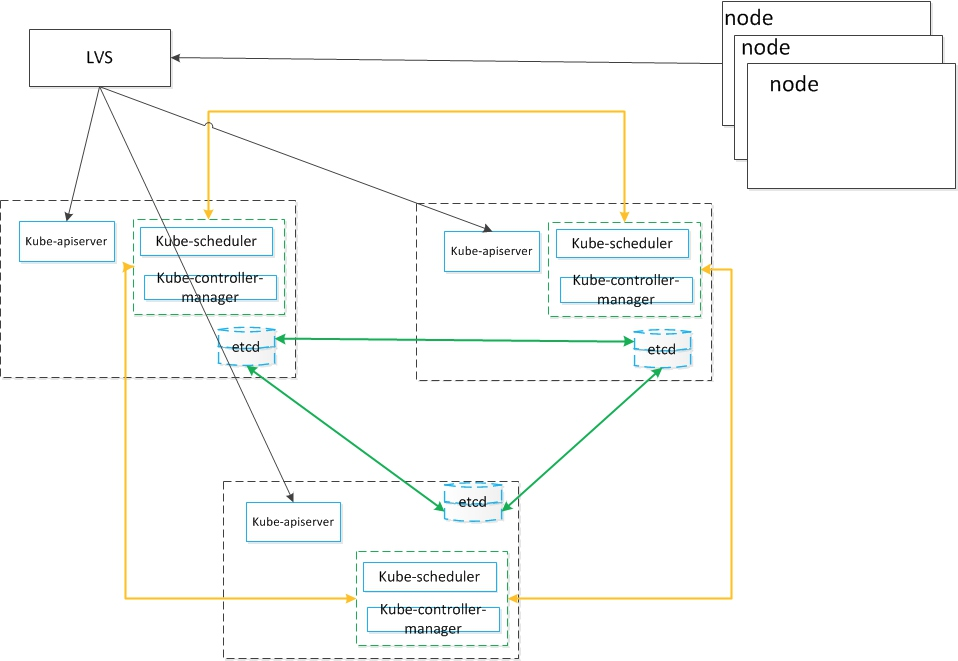

# 认证要求
- Installation, Configuration & Validation 安装，配置和验证12%
  -  设计一个k8s 集群
  -  安装k8s master 和 nodes
  -  配置安全的集群通信
  -  配置高可用的k8s集群
  -   知道如何获取k8s的发行的二进制文件
  -  提供底层的基础措施来部署一个集群
  -  选择一个网络方案
  -  选择你的基础设施配置
  -  在你的集群上配置端对端的测试
  -  分析端对端测试结果
  -  运行节点的端对端测试

# Installation, Configuration & Validation 安装，配置和验证
## 设计一个k8s 集群
>  参考[一键部署高可用kubernetes集群](https://zhuanlan.zhihu.com/p/26550959)
###  软件版本
```table
| 组件或系统 |  版本 |   备注
|       Kubernetes             |        1.6.0         |       1.6版本支持单集群5000节点， 15万容器（官方数据）         |
|         Docker            |      1.12.3           |       需要系统内核版本3.10以上支持         |
|           Etcd          |        3.1.5         |       Etcd3的性能优于etcd2，k8s1.6版本使用etcd3做为状态存储组件。         |
|          Flanneld          |     0.7            |      backend为vxlan网络， 需要系统内核版本3.7以上 支持        |
|          CentOS           |       7.2          |      建议系统内核3.10及以上          |
```
###  机器配置
> 下面的配置是POC环境的机器配置情况。 实际生产部署可以选择更好的机器，目前没有最优的建议， 可以根据成本预算和使用应用承载量而定。 


```table
| 组件 |机器配置 |  备注
|   ETCD          |     建议4核CPU,  4G内存及以上配置,  3台          |        可以和k8s master组件共用机器混合部署，如果机器资源充足，建议分开部署          |
|   K8S Master          |    建议4核CPU,  4G内存及以上配置， 3台          |       同上建议            |
|   LoadBalance          |    建议4核CPU,  4G内存及以上配置， 2台         |                  主备， 注意这个不要和master，node组件混合部署， 影响稳定性和可用性 |
|  Node         |     4核CPU,  4G内存， 1台以上         |       配置需求与运行的容器数量和应用类型相关            |
```
###  防火墙策略
>如果k8s不是在一个扁平的大二层网络里， 如果跨了多个网段， 且网段之间有防火墙隔离， 那么还需要考虑防火墙问题(以下不考虑加密传输的情况下，且使用默认启用的端口, 如果你修改了默认的端口，那么相应的修改防火墙即可)

```table
|  source        |      destination        |     port         |
|        kubelet / kube-proxy             |         api server         |       8080             |
|        controller-manager  / scheduler    |         api server         |       8080             |
|          api server           |                etcd                  |       2379             |
|         dockerd             |           docker registry                       |      5000              |
|         flanneld            |              etcd                    |        2379            |
|        flanneld             |             flanneld                     |       8285             |
```

###  集群规划
>  网络和端口规划， 以下针对的是单个k8s集群的情况

```table
|       变量         |         注解        |       配置            |        备注               |
|        FLANNEL_NET         |         flannel的网段              |       192.168.0.0/16            |         注意不要和现有的网段规划冲突，另外此处掩码为16， 意味着支持2^(26-16),约1024个node节点             |
|        FLANNEL_SUBNETLEN         |        flannel的子网掩码               |                26   |         掩码26，意味着单个主机可以最多分配2^(32-26) －2 ， 约62个容器              |
|       SERVICE_CLUSTER_IP_RANGE         |       service  的 ip 网段                |        10.10.1.0/22           |       假设每个应用占用1个service ip， 则可以支持约2^(32-22) －2 ，约1022个应用部署               |   
|        NODE_PORT_RANGE          |       node port的端口范围                |                 30000  ~ 32767  |        service的node port 可以使用主机上2767个端口              |
```

##  安装k8s master 和 nodes
### Master节点
部署考虑了master组件的高可用, 由三个节点构成一个集群。 
apiserver是无状态的，前端提供负载均衡，暴露vip
controller manager 和 scheduler 是有状态的，需要进行leader elect， 同一时间只能有一个实例对集群信息进行读写。

```table
|  组件名称 |  启动参数   |    参数说明|              
|       api server            |         --etcd-servers            |     以逗号分隔的etcd服务url列表, etcd服务以http://ip:port格式表示             |
|       api server            |         --insecure-bind-address            |        绑定不安全的ip地址， 默认且localhost， 设置为0.0.0.0就可以侦听所有网络接口          |
|       api server            |          --insecure-port           |       提供非安全认证的监控端口， 默认为8080           |
|       api server            |          --kubelet-port           |       kubelet侦听的端口           |
|       api server            |            --service-node-port-range         |        Service的node port 能使用的主机端口范围， 默认为30000 ～ 32767， 包括30000和32767          |
|       api server            |          --allow-privileged           |      允许pod允许具有系统特权的容器， 默认值为false            |
|       api server            |            --service-cluster-ip-range         |      service的cluster ip   (虚拟ip)池， 这个不能和集群所在物理网络重合            |
|        controller manager / scheduler          |        --master             |      api server的url地址            |
|        controller manager / scheduler        |        --leader-elect             |     设置为true时，表示进行leader选举， 一般用于master的高可用部署， 默认值是false             |
|       controller manager / scheduler          |        --leader-elect-lease-duration             |                 leader选举过程中非leader等待选举的时间间隔， 默认是15秒 |
|        controller manager / scheduler         |       --leader-elect-renew-deadline              |                 leader选举过程中在定制leading角色之前再次renew的时间间隔，应小于等于eader-elect-lease-duration， 默认为10秒 |
|        controller manager / scheduler        |        --leader-elect-retry-period             |                 leader选举过程中，获取leader角色和renew之间的等待时间， 默认为2秒 |


```
Tips建议和提示
> controller manager和scheduler的启动参数一致， 将 --leader-elect 设置为true，其它elect参数保持默认即可。 

###  Node节点

```table
|  组件名称 |  启动参数   |    参数说明|              
|       kubelet          |        --address             |       绑定主机的地址， 默认为0.0.0.0， 表示使用主机上的所有网络接口           |
|       kubelet          |        --port             |        进程侦听的端口          |
|       kubelet          |       --api-servers              |       api server地址列表， 以ip:port 格式表示，以逗号分隔           |
|       kubelet          |      -allow-privileged               |     是否允许以特权模式启动容器， 默认是false             |
|       kubelet          |     --cluster_dns                |       集群内dns服务的ip地址           |
|       kubelet          |        --cluster_domain             |     集群内dns服务所用域名             |
|       kubelet          |      --pod_infra_container_image               |       用于pod内网络命名空间共享的基础的pause镜像, 默认值为gcr.io/google_containers/pause-amd64:3.0           |
|        kube-proxy          |   --master                  |       api server的url地址                     |
|        flannel           |       -etcd-endpoints              |        以逗号分隔的etcd服务url列表, etcd服务以http://ip:port格式表示          |
|        flannel           |      -etcd-prefix               |       etcd的前缀， 默认是/coreos.com/network           |
|       docker            |      --insecure-registry               |     设置私有仓库url地址             |
|       docker            |      --bip             |      绑定的bridge网卡地址            |
|       docker            |       --ip-masq              |      启用ip伪装技术，一般用于NAT ， 默认为false           |
|       docker            |       --mtu              |       网络包的大小， 默认为 1450          |

```
Tips建议和提示
>  pause镜像默认是从gcr.io上拉取的， 但是由于gfw的缘故， 国内无法正常下载。 可以通过--pod_infra_container_image指定私有仓库或者可以访问的仓库镜像地址，让k8s到这些仓库去下载，而不是从gcr.io
> 如果集群中有的node节点位于非dmz区域， 有的node节点位于dmz网络区域, 那么dmz区的docker启动的时候一定要设置--ip-masq 为true， 同时flanneld启动的时候要指定-public-ip 为nat转换后的ip，否则无法和非dmz区的docker容器正常通信，具体原理涉及flannel和vxlan网络原理，限于篇幅，不在这里赘述


##  配置安全的集群通信
kubernetes 系统的各组件需要使用 TLS 证书对通信进行加密，本文档使用 CloudFlare 的 PKI 工具集 cfssl 来生成 Certificate Authority (CA) 和其它证书；

生成的 CA 证书和秘钥文件如下：

- ca-key.pem
- ca.pem
- kubernetes-key.pem
- kubernetes.pem
- kube-proxy.pem
- kube-proxy-key.pem
- admin.pem
- admin-key.pem
使用证书的组件如下：

- etcd：使用 ca.pem、kubernetes-key.pem、kubernetes.pem；
- kube-apiserver：使用 ca.pem、kubernetes-key.pem、kubernetes.pem；
- kubelet：使用 ca.pem；
- kube-proxy：使用 ca.pem、kube-proxy-key.pem、kube-proxy.pem；
- kubectl：使用 ca.pem、admin-key.pem、admin.pem；
kube-controller、kube-scheduler 当前需要和 kube-apiserver 部署在同一台机器上且使用非安全端口通信，故不需要证书。


>  参考 https://jimmysong.io/kubernetes-handbook/practice/create-tls-and-secret-key.html

关于数字证书和CA的扫盲
◇ 什么是CA？

CA是Certificate Authority的缩写，也叫“证书授权中心”。类似于现实中的公证处的角色。 


◇ 什么是CA证书？

CA 证书，顾名思义，就是CA颁发的证书。类似于介绍信上公证处的盖章。 

◇ 什么是证书之间的信任关系？

在俺的例子里谈到，引入中介后，业务员要同时带两个介绍信。第一个介绍信包含了两个公章，并注明，公章C信任公章A。证书间的信任关系，就和这个类似。就是用一个证书来证明另一个证书是真实可信滴。

◇ 什么是证书信任链？

实际上，证书之间的信任关系，是可以嵌套的。比如，C 信任 A1，A1 信任 A2，A2 信任 A3……这个叫做证书的信任链。只要你信任链上的头一个证书，那后续的证书，都是可以信任滴。

◇ 什么是根证书？
“根证书”的洋文叫“root certificate”，专业的解释看“这里”。为了说清楚根证书是咋回事，再来看个稍微复杂点的例子。
假设 C 证书信任 A 和 B；然后 A 信任 A1 和 A2；B 信任 B1 和 B2。则它们之间，构成如下的一个树形关系（一个倒立的树）。
　　处于最顶上的树根位置的那个证书，就是“根证书”。除了根证书，其它证书都要依靠上一级的证书，来证明自己。那谁来证明“根证书”可靠捏？实际上，根证书自己证明自己是可靠滴（或者换句话说，根证书是不需要被证明滴）。

★ 证书有啥用？

- 验证网站是否可信（针对HTTPS）
-  验证某文件是否可信（是否被篡改）

>  [数字证书及 CA 的扫盲介绍](http://blog.jobbole.com/104919/)

## 配置高可用的k8s集群
部署考虑了master组件的高可用, 由三个节点构成一个集群。 
apiserver是无状态的，前端提供负载均衡，暴露vip
controller manager 和 scheduler 是有状态的，需要进行leader elect， 同一时间只能有一个实例对集群信息进行读写。



##  知道如何获取k8s的发行的二进制文件
二进制文件的获取：
https://github.com/kubernetes/kubernetes/releases/  
## 提供底层的基础设施来部署一个集群
### 独立方案
-  使用[minikube](https://kubernetes.io/docs/getting-started-guides/minikube/)
>  minikube适用于快速体验和尝鲜的学习环境和开发环境。 它支持配置网络，持久化卷， services， 证书， ， dns， nodeport， configmap， ingress等。 需要注意的是minikube不支持依赖cloud的特性，如LoadBalancers， 和需要多节点的特性，比如高级调度策略。 
- 使用[kubeadm]()
>  
-  从零部署

### 托管方案
- Google Container Engine
-  Azure Container Service
-  IBM Blumix Container Service 
### 一站式云方案
-  On Google Compute Engine
-  On AWS EC2
-  On Azure
- On Alibaba Cloud(阿里云)
-  On CentureLink Cloud（世纪互联）
-  On IBM Blumix
-  On MultiCloud with Stackpoint.io 
### 定制方案
-  定制云方案
-  企业内网VM
## 选择一个网络方案
## 选择你的基础设施配置
# 端到端测试
## 什么是端对端测试
端到端测试（E2E）本身是一种专门的技术。端到端测试的概念和过程测试的概念非常相似。端到端测试有时也被称为技术过程（Technical Process）或是系统集成测试（System Integration Test），它其实就是对多个系统进行系统测试。在端到端测试中，业务流程是最重要的。
端到端测试中可能会发现一些"惊喜"。
　　-数据不一致（在不同的系统中出现的同一个人具有不同的地址）。
　　-错误（面向用户的）的数据解释（8-9-10究竟表示哪个日期？）。
　　-数据在一种情况下是强制的，而在另一种情况下却不是。
　　-定时和顺序问题（错误的消息顺序处理）。
对于分布式系统， 通过了单元测试和集成测试， 然后又可能出现不可预期的问题， 因此端对端测试对分布式系统的测试是必要的。 

## 在k8s集群上配置和运行端对端测试
构建kubernetes， 启动集群， 运行测试， 拆除
> go run hack/e2e.go -- -v --build --up --test --down

构建代码
> go run hack/e2e.go -- -v --build

创建一个新集群， 会先删除已经存在的集群
> go run hack/e2e.go -- -v --up

运行所有的测试
>  go run hack/e2e.go -- -v --test

在本地集群上运行特性性能测试， 通过--provider=local来指定本地集群
> go run hack/e2e.go -- -v --test --test_args="--ginkgo.focus=\[Feature:Performance\]" --provider=local

跳过匹配到Pods.*env的测试
>  go run hack/e2e.go -- -v --test --test_args="--ginkgo.skip=Pods.*env"

并行的跑测试， 但是跳过那些需要串行运行的测试
> GINKGO_PARALLEL=y go run hack/e2e.go -- -v --test --test_args="--ginkgo.skip=\[Serial\]"

并行的跑测试， 但是跳过那些需要串行运行的测试, 如果测试失败， 保留namspace
> GINKGO_PARALLEL=y go run hack/e2e.go -- -v --test --test_args="--ginkgo.skip=\[Serial\] --delete-namespace-on-failure=false"

调用kubectl命令， 在测试失败时查看事件和状态是很有用
> go run hack/e2e.go -- -v -ctl='get events'
go run hack/e2e.go -- -v -ctl='delete pod foobar'

拆除环境
>  go run hack/e2e.go -- -v --down


kubernetes的端对端测试还可以指定特定的kubernetes版本进行测试，或者使用现有集群测试
> 参考 - [kubernetes中的端对端测试](https://github.com/kubernetes/community/blob/master/contributors/devel/e2e-tests.md)

## 节点的端对端测试
Node e2e仅测试Kubelet的相关功能，可以在本地或者集群中测试

准备条件： 需要在机器上安装etcd， ginkgo

开始测试：  make  test-e2e-node, 这个命令会执行下面的这些动作
- 请求sudo权限
- 编译kubernetes代码
- 预拉取测试需要用到的docker镜像
- 启动etcd的一个本地实例
- 启动apiserver的一个本地实例
- 启动kubelet的一个本地实例
- 使用本地的进程运行测试
- 输出结果到标准输出
- 停止kubelet， apiserver， etcd实例

## 分析端对端测试结果


# 单机部署
创建Kubernetes cluster（单机版）最简单的方法是minikube:  支持mac， linux ， windows。 
具体方式请参考： https://github.com/kubernetes/minikube
中文安装指引，可以参考以下博文：
- https://feisky.gitbooks.io/kubernetes/deploy/single.html 

# 高可用方案
# 部署常见的坑
# 资源及工具列表
# 参考文献
- [ Kubernetes概念介绍和v1版本部署过程](http://blog.csdn.net/qq1010885678/article/details/48719923)
- [kubernetes 1.6.0 高可靠集群部署](https://addops.cn/post/kubernetes-deployment.html)
- [Kubernetes高可用Master节点安装](https://www.kubernetes.org.cn/1865.html)
- [Kubernetes集群安装文档-v1.6版本](https://www.kubernetes.org.cn/1870.html)
- [一键部署kubernetes 1.6高可用集群](https://zhuanlan.zhihu.com/p/26550959)
- [和我一步步部署 kubernetes 集群](https://github.com/opsnull/follow-me-install-kubernetes-cluster)
- [Kubernetes1.6集群部署完全指南 ——二进制文件部署开启TLS基于CentOS7发布 - Jimmy Song](http://rootsongjc.github.io/projects/kubernetes-installation-document/)
- [ Kubernetes用户指南（二）--部署组合型的应用、连接应用到网络中](http://blog.csdn.net/qq1010885678/article/details/49026825)
- [Kubernetes用户指南（三）--在生产环境中使用Pod来工作、管理部署](http://blog.csdn.net/qq1010885678/article/details/49156557)
- [kubernetes官方指南](http://kubernetes.io/docs/)
- [Sextant一小步，Kubernetes一大步！](http://mp.weixin.qq.com/s?src=3&timestamp=1473267136&ver=1&signature=4olKSipUP3ysjTJnJPgkfFH7b*bhsfxVRCTsRoypeKyP6iv-NLO8ZGv7GQv4vYmiLdyoxh1T08sHs03B8EDaqoz8KH6dVw46bsPH9CFWAgZrhDfj3colGXwWoRubIVgAksvVK0QUuC6etjTt-E5qRGkYm5zxwksfridilKqrEr0=)
- [Kubernetes的企业部署目标](http://mp.weixin.qq.com/s?__biz=MzA5OTAyNzQ2OA==&amp;mid=2649693898&amp;idx=1&amp;sn=3c2b6ab8a66381d1ec470e4b781c4fb0&amp;chksm=889321a9bfe4a8bf7c89be683499aca039135100d9cccb12a62ac9045a620c2e05bdead365db&amp;mpshare=1&amp;scene=1&amp;srcid=04260mmcz8dt53rEXQzc0WIQ#rd)
- [在阿里云上部署生产级别Kubernetes集群](http://mp.weixin.qq.com/s?__biz=MzI4MTQyMDAxMA==&amp;mid=2247483667&amp;idx=1&amp;sn=60ed79699044ebf44de85ebf61ad633f&amp;chksm=eba8c896dcdf41808c39ac1f208538b18d9a08afd317df3d5363ffedacf1905ef9dd574c4b31&amp;mpshare=1&amp;scene=1&amp;srcid=0302JP1QlAe6X85d4l4xzqbu#rd)
- [kubernetes中的端对端测试](https://github.com/kubernetes/community/blob/master/contributors/devel/e2e-tests.md)